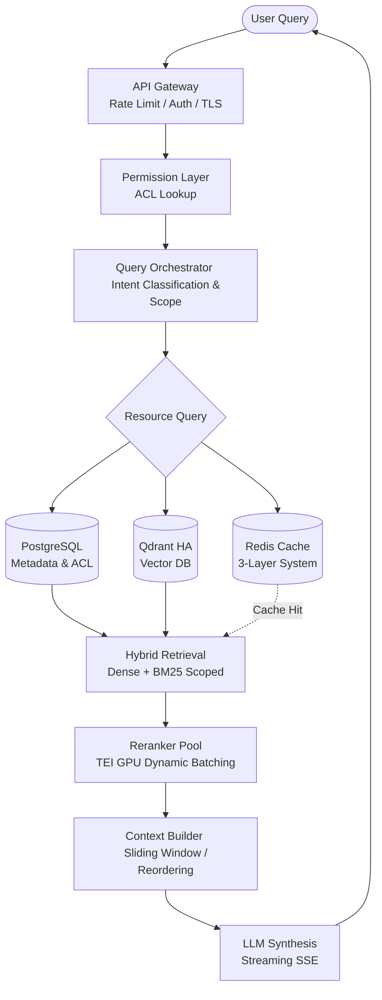
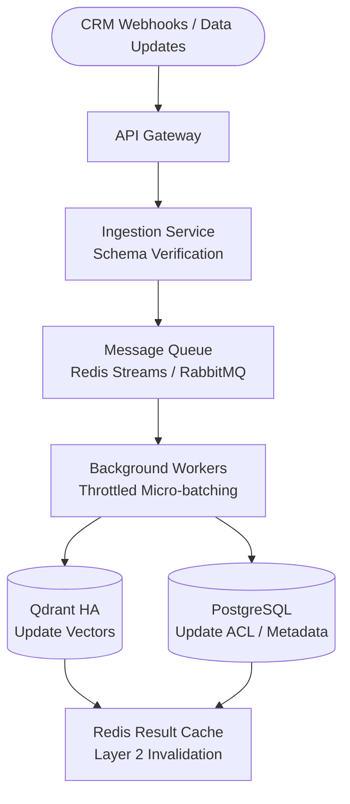
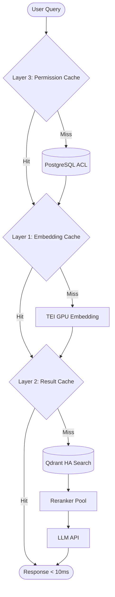

# BÁO CÁO ĐỀ XUẤT THIẾT KẾ KIẾN TRÚC
## HỆ THỐNG JAVIS MULTI-TENANT AI RETRIEVAL (RAG)

---

### THÔNG TIN TÀI LIỆU
* **Dự án:** Trợ lý ảo Javis (Virtual Assistant for Japanese Real Estate)
* **Đối tượng đề xuất:** Hệ thống Retrieval-Augmented Generation (RAG) đa chi nhánh (Multi-Tenant)
* **Phiên bản:** 2.0 (Enterprise Standard)
* **Trạng thái:** Đề xuất Đánh giá & Phê duyệt (Under Review)
* **Ngày cập nhật:** 25/05/2026

---

## EXECUTIVE SUMMARY (TÓM TẮT DỰ ÁN)

Hệ thống **Javis** là nền tảng AI Retrieval (RAG) đa chi nhánh (Multi-Tenant), phục vụ hoạt động quản lý, tra cứu và tổng hợp thông tin cuộc tư vấn bất động sản tại thị trường Nhật Bản. Nguồn dữ liệu đầu vào cốt lõi bao gồm biên bản tóm tắt cuộc họp (meeting summary transcripts) và hệ thống tài liệu doanh nghiệp (AJ/VJ documents).

Tài liệu này đề xuất mô hình kiến trúc tối ưu hóa hiệu năng, bảo mật và chi phí cho Javis dưới tải lớn (**100 QPS**), đồng thời khắc phục triệt để các rủi ro vận hành (SPOF, nghẽn Reranker, phình cửa sổ ngữ cảnh và tranh chấp tài nguyên khi cập nhật dữ liệu).

---

## 1. PHÂN TÍCH QUY MÔ DỮ LIỆU & TÀI NGUYÊN (CAPACITY PLANNING)

### 1.1. Ước tính quy mô dữ liệu hệ thống
* **Số lượng khách hàng (Tenants):** 20,000 tenants.
* **Số lượng bản ghi (Records):** Trung bình 30 records/tenant $\rightarrow$ Tổng số records: **600,000 records**.
* **Kích thước trung bình:** ~1,100 tokens/record $\rightarrow$ Tổng số token: **~660 triệu tokens**.
* **Chiến lược Chunking:** Kết hợp **Parent-Child Chunking** và **Section-aware Chunking** (~400–600 tokens/child chunk) $\rightarrow$ ~3-4 child chunks/record.
* **Tổng số chunks trong Vector DB:** **~1.8M - 2.4M chunks**.

### 1.2. Tính toán tài nguyên & Giải pháp High Availability (HA)
* **Mô hình Embedding:** BGE-M3 (1024 dimensions, định dạng float32).
* **Dung lượng vector thô:** 
  $$2,400,000 \times 1024 \times 4\text{ bytes} \approx 9.8\text{ GB}$$
* **Overhead chỉ mục HNSW:** Hệ số overhead từ 2x đến 3x để lưu trữ đồ thị tìm kiếm $\rightarrow$ Dung lượng RAM tối thiểu cần cho Vector DB: **20 GB - 30 GB**.
* **Thiết kế loại bỏ SPOF (Single Point of Failure):** 
  Để đảm bảo tính liên tục của dịch vụ cấp doanh nghiệp, hệ thống chuyển đổi từ mô hình Qdrant Single Node sang cụm **Qdrant HA (2 Nodes: 1 Primary - 1 Replica)**.
  * **Đồng bộ hóa:** Qdrant sử dụng giao thức Raft consensus để đồng bộ hóa và nhân bản dữ liệu thời gian thực (Replication Factor = 2).
  * **Failover tự động:** Load Balancer (LB) đặt trước cụm Qdrant liên tục giám sát sức khỏe (healthcheck). Nếu node Primary gặp sự cố, toàn bộ traffic truy vấn sẽ được định tuyến sang node Replica trong vòng vài mili-giây, cam kết không gây gián đoạn dịch vụ.

### 1.3. Chỉ tiêu SLA & Phân bổ Latency Budget (Target: 100 QPS)
Với tải đồng thời cao (**100 QPS**), việc đặt target P95 tổng thể < 500ms bao gồm cả LLM Synthesis là không thực tế do thời gian sinh token của LLM Cloud API (GPT-4o, Claude, Gemini) luôn dao động từ 400 - 800ms. Do đó, hệ thống phân tách SLA thành hai chỉ số độc lập:
1. **Retrieval Latency (Độ trễ truy xuất ngữ cảnh):** `< 300ms` (Cam kết hiệu năng mạng và phần cứng).
2. **Time-to-First-Token (TTFT - Thời gian xuất hiện ký tự đầu tiên):** `< 800ms` (Sử dụng cơ chế **Streaming SSE - Server Sent Events** để tối ưu hóa cảm giác phản hồi).

#### Bảng Phân bổ Latency Budget Chi tiết (Dưới tải 100 QPS)

| Chặng xử lý | Latency dự kiến (P95) | Yêu cầu tài nguyên & Giải pháp tối ưu |
| :--- | :--- | :--- |
| **1. Permission Check** | ~5ms | Truy vấn danh sách `allowed_tenants` từ Redis Cache Layer 3. |
| **2. Query Embedding** | ~30ms | Đòi hỏi chạy trên **GPU** (Sử dụng TEI - Text Embeddings Inference của HuggingFace để tự động Dynamic Batching). |
| **3. Qdrant Search** | ~20-50ms | Hybrid search (Dense + BM25) kèm filter cứng `tenant_id` và `status`. |
| **4. Reranker Pool** | ~50-100ms | **Điểm nghẽn vật lý lớn nhất**. Chỉ đưa **Top 30-50 candidates** vào Reranker (thay vì 100). Chạy GPU với TEI/Dynamic Batching. |
| **5. Context Builder** | ~10ms | Logic lọc trùng lặp và dựng context theo cửa sổ trượt (Sliding Window). |
| **TỔNG RETRIEVAL** | **~115 - 195ms** | **Đạt mục tiêu SLA Retrieval < 300ms**. |
| **6. LLM Synthesis (TTFT)** | ~400-800ms | Bắt buộc dùng **Streaming (SSE)** để trả trực tiếp các token từ API LLM về client. |
| **TỔNG TTFT** | **~500 - 900ms** | **Đạt mục tiêu SLA TTFT < 800ms (P90) và phản hồi tức thì cho người dùng**. |

---

## 2. SƠ ĐỒ KIẾN TRÚC TỔNG THỂ HỆ THỐNG

Hệ thống được thiết kế theo nguyên lý tách biệt luồng Đọc (Query Path) và luồng Ghi (Ingestion Path) để ngăn ngừa hiện tượng tranh chấp tài nguyên và đảm bảo SLA.

### 2.1. Luồng Truy Vấn (Query Path - Đọc)



### 2.2. Luồng Nạp Dữ Liệu (Ingestion Path - Ghi)



---

## 3. CÁC GIẢI PHÁP THIẾT KẾ CHI TIẾT & TỐI ƯU HÓA

### 3.1. Thiết kế Tầng Phân quyền & Cô lập Dữ liệu (Permission Layer)

> [!IMPORTANT]
> **Quy tắc cô lập dữ liệu cứng:** 
> Để ngăn chặn triệt để rủi ro rò rỉ dữ liệu nhạy cảm giữa các tenant (thông tin tài chính, thu nhập, lịch sử đàm phán...), việc kiểm tra quyền truy cập phải được thực hiện **trước khi thực hiện truy vấn vector** và điều kiện lọc tenant phải được áp dụng trực tiếp tại **Vector DB Layer**, tuyệt đối không lọc sau (post-filter) tại Application Layer.

#### Sơ đồ thực thể cơ sở dữ liệu phân quyền (PostgreSQL ACL Schema)
```sql
CREATE TABLE tenants (
    id          UUID PRIMARY KEY,
    name        TEXT NOT NULL,
    company     TEXT NOT NULL  -- Nhận giá trị: 'AJ' hoặc 'VJ'
);

CREATE TABLE users (
    id          UUID PRIMARY KEY,
    email       TEXT NOT NULL UNIQUE,
    role        TEXT NOT NULL CHECK (role IN ('admin', 'consultant', 'viewer')),
    tenant_id   UUID REFERENCES tenants(id)
);

CREATE TABLE access_control (
    user_id     UUID REFERENCES users(id) ON DELETE CASCADE,
    tenant_id   UUID REFERENCES tenants(id) ON DELETE CASCADE,
    scope       TEXT NOT NULL CHECK (scope IN ('read', 'write', 'admin')),
    granted_at  TIMESTAMP DEFAULT NOW(),
    PRIMARY KEY (user_id, tenant_id)
);

-- Index tối ưu hóa tốc độ kiểm tra quyền
CREATE INDEX idx_acl_user ON access_control(user_id);
```

#### Quy trình thực thi phân quyền bắt buộc
1. **Kiểm tra quyền trước (Pre-query Auth):** Khi nhận yêu cầu kèm theo `user_id`, Query Orchestrator sẽ kiểm tra danh sách `allowed_tenants` trong **Redis Layer 3**. Nếu cache miss, hệ thống truy vấn PostgreSQL bảng `access_control` để xác định danh sách Tenant ID được phép.
2. **Áp dụng Filter cứng tại Qdrant:** Mọi truy vấn gửi tới Qdrant bắt buộc phải nhúng điều kiện filter `tenant_id` và `status`. Qdrant sử dụng Payload Index trên trường này để thu hẹp không gian tìm kiếm ngay ở mức vật lý.
3. **Qdrant Filter DSL đại diện:**
```json
{
  "filter": {
    "must": [
      {
        "key": "tenant_id",
        "match": {
          "any": ["9b1deb4d-3b7d-4bad-9bdd-2b0d7b3dcb6d", "4a123e45-1234-1234-1234-123456789abc"]
        }
      },
      {
        "key": "status",
        "match": {
          "value": "available"
        }
      }
    ]
  }
}
```

---

### 3.2. Nhận dạng Ý định & Định tuyến Câu hỏi (Query Routing)
Để tối ưu hóa độ chính xác và tốc độ xử lý, hệ thống triển khai một **Query Intent Classifier** (sử dụng RegEx kết hợp với một LLM cục bộ kích thước nhỏ như Llama-3-8B hoặc Phi-3) để định tuyến truy vấn ngay khi tiếp nhận:

```
                                  [ User Query ]
                                        │
                         ┌──────────────▼──────────────┐
                         │   Query Intent Classifier   │
                         └──────────────┬──────────────┘
                                        │
         ┌─────────────────────────────┼─────────────────────────────┐
         │ (Type A)                    │ (Type B)                    │ (Type C)
┌────────▼────────┐           ┌────────▼────────┐           ┌────────▼────────┐
│ Single-Tenant   │           │ Corporate Docs  │           │ Cross-Tenant    │
│ Meeting Query   │           │ Query           │           │ Aggregation     │
└────────┬────────┘           └────────┬────────┘           └────────┬────────┘
         │                             │                             │
         │ * Route: summary_transcripts│                             │ * Route: transcripts
         │ * Filter: tenant_id = X     │ * Route: aj_docs            │ * Filter: user's
         │ * Weight: Semantic heavy    │ * Filter: company-level ACL │   allowed_tenants[]
         │                             │ * Weight: Keyword-heavy     │ * Weight: Hybrid
         ▼                             ▼                             ▼
```

1. **Type A: Truy vấn biên bản cuộc họp của một khách hàng cụ thể**
   * *Ví dụ:* "田中さんの予算はいくらですか？" (Ngân sách của ông Tanaka là bao nhiêu?)
   * *Định tuyến:* Trỏ tới collection `summary_transcripts` với điều kiện lọc cứng `tenant_id = <tanaka_uuid>`.
   * *Cấu hình:* Tăng trọng số tìm kiếm ngữ nghĩa (Dense Vector).
2. **Type B: Truy vấn tài liệu nội bộ công ty**
   * *Ví dụ:* "AJのプロジェクトXの詳細は？" (Chi tiết về dự án X của AJ?)
   * *Định tuyến:* Trỏ tới collection `aj_docs` kèm kiểm tra quyền truy cập cấp công ty (`company = AJ`).
   * *Cấu hình:* Tăng trọng số tìm kiếm từ khóa chính xác (BM25 Heavy) để nhận diện các thuật ngữ đặc thù.
3. **Type C: Truy vấn tổng hợp chéo nhiều khách hàng**
   * *Ví dụ:* "3LDKを希望している顧客は誰ですか？" (Ai là những khách hàng đang muốn tìm nhà 3LDK?)
   * *Định tuyến:* Tìm kiếm trên toàn bộ collection `summary_transcripts` với bộ lọc `tenant_id IN [allowed_tenants]`.
   * *Cấu hình:* Cân bằng Hybrid Search (Dense + BM25) để tổng hợp chính xác dữ liệu từ nhiều tệp khách hàng.

---

### 3.3. Làm giàu dữ liệu đầu vào (Metadata Enrichment) lúc Ingest
Hệ thống giảm thiểu Search Space (không gian tìm kiếm) của Qdrant thông qua việc chuẩn hóa và làm giàu siêu dữ liệu (Metadata) ngay tại thời điểm nạp dữ liệu (Ingestion time) bằng công cụ nhận dạng thực thể (NER):

```json
{
  "tenant_id": "9b1deb4d-3b7d-4bad-9bdd-2b0d7b3dcb6d",
  "company": "AJ",
  "meeting_date": "2026-05-25",
  "date_year_month": "2026-05",
  "section_category": "needs",
  "property_type": "3LDK",
  "budget_range": "50M-80M",
  "consultant_id": "4a123e45-1234-1234-1234-123456789abc",
  "status": "available"
}
```
* **`date_year_month`:** Phục vụ phân vùng (partitioning) dữ liệu theo thời gian để tối ưu tốc độ quét.
* **`section_category`:** Hỗ trợ pre-filter khi người dùng chỉ muốn tìm kiếm trong các phần cụ thể (ví dụ: `needs`, `proposal`, `action_items`).
* **`status`:** Trạng thái giao dịch (`available` - Đang mở bán, `deposit` - Đã đặt cọc, `closed` - Đã bán). Pre-filter trực tiếp tại Vector DB để bỏ qua các bất động sản đã bán, thu hẹp không gian tìm kiếm.
* **`property_type` & `budget_range`:** Thực thể trích xuất tự động bằng LLM/NER để hỗ trợ các câu truy vấn có cấu trúc chính xác (ví dụ: tìm kiếm khách hàng có ngân sách từ 50M-80M Yên).

---

### 3.4. Quản lý Context Window & Khắc phục hiện tượng "Lost in the Middle"
Khi hệ thống gom dữ liệu từ nhiều nguồn khác nhau (đặc biệt là trong các truy vấn chéo Type C), các chunks ngữ cảnh gửi đến LLM có nguy cơ bị phân tán và gây nhiễu. Context Builder được thiết kế nâng cao nhằm giải quyết hiện tượng này:

```
[Kết quả từ Reranker]
        │ (Top-10 Chunks phân tán)
        ▼
┌───────────────────────────────┐
│     Context Grouping          │ ──► Gom các chunks có cùng tenant_id & meeting_date lại
└──────────────┬────────────────┘
               ▼
┌───────────────────────────────┐
│     Hierarchical Context      │ ──► Định dạng theo cấu trúc phân cấp:
└──────────────┬────────────────┘     [Meeting Header: Khách hàng Tanaka - 25/05/2026]
                                      ├── Section [Needs]: Chunks nội dung tương ứng...
                                      └── Section [Actions]: Chunks nội dung tương ứng...
               ▼
┌───────────────────────────────┐
│    Conflict Resolution        │ ──► So khớp trùng lặp chunk_id, ưu tiên cập nhật
└──────────────┬────────────────┘     theo thời gian gần nhất (update_time)
               ▼
┌───────────────────────────────┐
│    Lost-in-the-Middle Cure    │ ──► Sắp xếp lại thứ tự (Reordering):
└───────────────────────────────┘     Đặt các chunks có độ liên quan cao nhất ở
                                      ĐẦU và CUỐI context window. Chunks phụ ở giữa.
```

---

### 3.5. Chiến lược Chunking hai tầng Parent-Child & Phòng chống tràn Context Window
Section-aware chunking đơn thuần có điểm yếu chí mạng là **cô lập ngữ cảnh**. Để giải quyết triệt để, hệ thống áp dụng cấu trúc **Parent-Child Chunking**:

* **Parent Document (~1,100 tokens):** Toàn bộ nội dung cuộc họp và metadata tổng quan.
* **Child Chunks (~400-600 tokens/chunk):** Các phần chia nhỏ theo Section (Needs, Proposal, Actions) được đánh chỉ mục vector.

```
                     ┌──────────────────────────────────────┐
                     │            Parent Document           │
                     │  (Full Meeting Summary & Metadata)   │
                     │  ID: parent_meet_tanaka_20260525     │
                     └──────────────────┬───────────────────┘
                                        │
         ┌──────────────────────────────┼──────────────────────────────┐
         │                              │                              │
 ┌───────▼──────────┐           ┌───────▼──────────┐           ┌───────▼──────────┐
 │   Child Chunk 1  │           │   Child Chunk 2  │           │   Child Chunk 3  │
 │  (Section Needs) │           │(Section Proposal)│           │ (Section Actions)│
 │  Vector Index    │           │  Vector Index    │           │  Vector Index    │
 └──────────────────┘           └──────────────────┘           └──────────────────┘
```

#### Cơ chế phòng chống tràn Context Window
Khi truy vấn chéo nhặt ra nhiều Child Chunks từ các Parent Documents khác nhau, việc kéo toàn bộ Parent Documents gốc nạp vào LLM sẽ làm kích thước Context phình to đột biến, gây tăng độ trễ và chi phí. 

> [!TIP]
> **Giải pháp vá lỗi:**
> 1. **Sliding Window Context:** Thay vì nạp toàn bộ Parent Document, hệ thống chỉ lấy **Child Chunk được tìm thấy + 1 Child Chunk liền trước + 1 Child Chunk liền sau** (khoảng ~300-400 tokens ngữ cảnh lân cận) để giữ tính liên tục của nội dung mà không gây quá tải context window.
> 2. **Local LLM Summary Fallback:** Đối với các truy vấn bao quát diện rộng, sử dụng một LLM nhỏ chạy local (Llama-3-8B) để tóm tắt nhanh Parent Document trước khi ghép vào Context Builder.

---

### 3.6. Giải quyết Bottleneck Vật lý của Reranker dưới tải 100 QPS
Ở mức tải **100 QPS**, nếu mỗi truy vấn yêu cầu Rerank Top 100 chunks, hệ thống phải thực hiện **10,000 lượt tính toán cross-encoder mỗi giây**, vượt quá khả năng xử lý của bất kỳ GPU đơn lẻ nào.

#### Giải pháp khắc phục:
1. **Giảm kích thước Candidate Pool (Top K):** Thu hẹp số lượng ứng viên đưa vào Reranker xuống **Top 30 hoặc Top 50 candidates** chất lượng nhất từ kết quả Hybrid Search của Qdrant.
2. **Triển khai TEI (Text Embeddings Inference):** Bắt buộc sử dụng công nghệ TEI của HuggingFace để chạy mô hình Embedding (BGE-M3) và Reranker. TEI hỗ trợ **Dynamic Batching** (tự động gom nhóm các yêu cầu xử lý đồng thời trên GPU) giúp tăng throughput lên gấp nhiều lần.
3. **Mở rộng Reranker Pool (Scale Out):** Tách biệt cấu phần Reranker thành một microservice độc lập. Triển khai cụm Reranker Pool gồm tối thiểu **2-3 GPU nodes** có cơ chế tự động mở rộng (auto-scale) dựa trên độ dài hàng đợi.

---

### 3.7. Tách biệt Luồng Ghi (Ingestion) và Luồng Đọc (Query) qua Message Queue
Để triệt tiêu hiện tượng tranh chấp tài nguyên (Resource Contention) trên DB/Vector DB khi có các sự kiện ghi dồn dập từ CRM cùng lúc với tải đọc 100 QPS, hệ thống sử dụng kiến trúc bất đồng bộ:

1. **Đệm qua Message Queue:** API Gateway tiếp nhận webhook từ CRM, kiểm tra sơ bộ định dạng (schema verification) và đẩy trực tiếp sự kiện vào **Redis Streams hoặc RabbitMQ**, sau đó phản hồi HTTP 202 Accepted ngay lập tức.
2. **Background Workers (Throttled Micro-batching):**
   * Các background workers sẽ tiêu thụ sự kiện từ queue theo cơ chế **micro-batch** (gom nhóm xử lý sau mỗi 30-60 giây hoặc khi đủ 20 bản ghi).
   * Giới hạn tốc độ xử lý (throttling) của worker để không tiêu tốn quá 15-20% tài nguyên hệ thống trong giờ cao điểm.
3. **Invalidate Cache:** Sau khi cập nhật thành công dữ liệu mới vào PostgreSQL và Qdrant, worker sẽ phát đi tín hiệu xóa (invalidate) các cache key liên quan tại **Redis Layer 2 (Result Cache)**.

---

### 3.8. Tối ưu hóa Chi phí Môi trường Dev/Staging
Để tránh lãng phí chi phí thuê phần cứng GPU cho môi trường phát triển (Local Dev) và Staging:

1. **Trừu tượng hóa bằng Interface (Provider Pattern):** Xây dựng Query Orchestrator độc lập với nhà cung cấp dịch vụ hạ tầng (Inference Providers).
2. **Cấu hình động theo môi trường (Environment Configs):**
   * **Môi trường Dev / Staging:**
     * *Embedding:* Trỏ tới Cloud API giá rẻ (ví dụ: OpenAI `text-embedding-3-small` hoặc Cohere Embed V3).
     * *Reranking:* Trỏ tới Cohere Rerank V3 API hoặc sử dụng thuật toán tính độ tương đồng Cosine gọn nhẹ trên CPU.
     * *LLM Synthesis:* Sử dụng các API Serverless chi phí thấp (ví dụ: Groq, DeepSeek, OpenRouter).
   * **Môi trường Production (Phase 3):**
     * Trỏ về cụm GPU nội bộ chuyên dụng chạy TEI (BGE-M3 & Reranker) và LLM Private/Enterprise để đảm bảo an toàn thông tin tuyệt đối và không bị giới hạn rate-limit ngoại vi.

---

### 3.9. Lớp Quan sát & Giám sát Hiệu năng (Observability)
Để dễ dàng định vị lỗi và kiểm soát hiệu năng của pipeline RAG đa lớp:

1. **Tích hợp OpenTelemetry (OTel):** Tự động đo lường thời gian thực thi (span time) của từng chặng trong pipeline (Auth Check $\rightarrow$ Embedding $\rightarrow$ Vector Search $\rightarrow$ Reranker $\rightarrow$ Context Builder $\rightarrow$ LLM).
2. **Truy vết đầu cuối (Distributed Tracing):**
   * Tạo `trace_id` duy nhất cho mỗi yêu cầu ngay từ API Gateway.
   * Truyền `trace_id` dọc theo context qua tất cả các thành phần xử lý.
   * Đẩy dữ liệu giám sát về các collector tập trung như **Phoenix** (môi trường local/dev) hoặc **Jaeger/Grafana** (môi trường production).
3. **Mục tiêu Giám sát:** Đo lường chính xác latency của từng cấu phần, kích thước Context (token count) và tỷ lệ cache hit/miss của hệ thống Redis.

---

## 4. CHIẾN LƯỢC CACHING PHÂN TẦNG VỚI REDIS

Hệ thống triển khai bộ nhớ đệm 3 lớp trên Redis nhằm đảm bảo tốc độ phản hồi tối ưu và bảo vệ hạ tầng cơ sở dữ liệu.



### 4.1. Lớp 3: Permission Cache (Giảm tải 90% PostgreSQL)
* **Khóa (Key):** `user_id`
* **Giá trị (Value):** Mảng JSON chứa danh sách `allowed_tenants`.
* **Thời gian sống (TTL):** 1 - 5 phút (tự động xóa khi bảng `access_control` có thay đổi quyền).
* **Hit Rate dự kiến:** ~90%.
* **Mục tiêu:** Chặn đứng việc quét bảng phân quyền PostgreSQL liên tục ở mỗi request.

### 4.2. Lớp 1: Embedding Cache (Tiết kiệm tài nguyên GPU)
* **Khóa (Key):** `hash(query_text)`
* **Giá trị (Value):** Vector embedding (1024 float32).
* **Thời gian sống (TTL):** 24 giờ.
* **Hit Rate dự kiến:** ~40%.
* **Mục tiêu:** Bỏ qua bước tính toán embedding đối với các câu hỏi trùng lặp hoặc tương tự.

### 4.3. Lớp 2: Result Cache (Phản hồi tức thì < 10ms)
* **Khóa (Key):** `hash(query_text + sorted_allowed_tenants_string + routing_strategy)`
* **Giá trị (Value):** Cấu trúc kết quả RAG hoàn chỉnh hoặc câu trả lời từ LLM.
* **Thời gian sống (TTL):** 5 - 15 phút.
* **Hit Rate dự kiến:** ~20% - 30%.
* **Mục tiêu:** Trả kết quả ngay lập tức cho các câu hỏi trùng lặp trong thời gian ngắn.
* **Cơ chế Invalidate thời gian thực:** Khi background worker cập nhật trạng thái bất động sản từ CRM vào database, hệ thống sẽ gửi tín hiệu chủ động xóa (invalidate) các key liên quan tại Lớp 2 ngay lập tức, đảm bảo người dùng luôn nhận được dữ liệu cập nhật mới nhất.

---

## 5. LỘ TRÌNH TRIỂN KHAI CHI TIẾT (IMPLEMENTATION ROADMAP)

Lộ trình triển khai được điều chỉnh để ưu tiên bảo mật thông tin và xử lý các điểm nghẽn vật lý cốt lõi trước tiên.

### Phase 0: Bảo Mật & Cô Lập Dữ Liệu (Bắt buộc & Ngay lập tức)
- [ ] Thiết lập cơ chế lọc cứng `tenant_id` tại mã nguồn backend (chặn truy vấn chéo không hợp lệ).
- [ ] Cấu hình bắt buộc filter tenant trong tất cả các lệnh gọi DB/Vector DB hiện tại.
- [ ] Thiết lập Qdrant payload index trên trường `status` và `tenant_id` để tối ưu hóa tốc độ search.

### Phase 1: MVP & Nền Tảng Dữ Liệu (Tuần 1–3)
- [x] Tạo ChromaDB client và chunking dữ liệu theo section-level (`build_db.py`).
- [x] Tạo 2 collection `aj_docs` và `summary_transcripts`.
- [x] Nạp dữ liệu mẫu bằng mô hình Multilingual Embedding.
- [ ] Thiết kế lại schema và nạp dữ liệu theo cấu trúc **Parent-Child Chunking** kết hợp metadata mở rộng (thêm trường `status`).
- [ ] Thay thế ChromaDB bằng cụm **Qdrant HA (2 Nodes: Primary-Replica)** hỗ trợ tìm kiếm Hybrid (Dense + Sparse/BM25) và cơ chế lọc cứng tenant tối ưu.
- [ ] Thiết lập PostgreSQL chứa metadata và bảng phân quyền ACL. Kiểm thử việc tích hợp lọc quyền khi truy vấn.
- [ ] Hoàn thiện bộ Test Cases tự động kiểm thử độ chính xác truy xuất (`test_cases.json`).

### Phase 2: Sẵn sàng cho Môi trường Production (Tuần 4–8)
- [ ] Cấu hình môi trường **Dev/Staging gọn nhẹ** sử dụng API Mock/Serverless (Cohere, Groq, OpenAI) để tăng tốc độ code logic và tối ưu chi phí phần cứng.
- [ ] Thiết lập **Message Queue (Redis Streams / RabbitMQ)** và các **Background Workers** để xử lý nạp dữ liệu CRM không đồng bộ dưới dạng micro-batch.
- [ ] Triển khai TEI (Text Embeddings Inference) chạy trên GPU phục vụ BGE-M3 và Reranking với Dynamic Batching (môi trường Staging/Prod).
- [ ] Tích hợp **OpenTelemetry** và **Phoenix** để tracing chi tiết latency từng bước của luồng Query/Ingestion.
- [ ] Phát triển CRM Webhook để chủ động invalidate Redis Result Cache (Layer 2) ngay khi có cập nhật.
- [ ] Triển khai bộ phân loại ý định truy vấn (**Query Intent Classifier**).
- [ ] Cài đặt hệ thống cache 3 lớp bằng **Redis**.
- [ ] Thiết lập API Server (FastAPI) tích hợp luồng Authentication, Permission Layer và fallback Reranker (giới hạn Top 30-50 candidates).

### Phase 3: Tối ưu hóa & Mở rộng Quy mô (Tuần 9–12)
- [ ] Thiết lập cụm Qdrant HA trên môi trường Prod và cấu hình auto-scale cho các GPU nodes của Reranker Pool (tách biệt thành microservice riêng).
- [ ] Tối ưu hóa Context Builder với thuật toán Sliding Window và Summary fallback cho cấu trúc Parent-Child để chống phình context.
- [ ] Áp dụng trích xuất thực thể (property_type, budget_range) bằng LLM tại thời điểm Ingestion để làm giàu metadata.
- [ ] Tích hợp cơ chế Streaming (SSE - Server Sent Events) từ API Gateway trả về Frontend để tối ưu trải nghiệm người dùng.
- [ ] Tiến hành Load test (wrk/k6) đảm bảo đạt chỉ tiêu 100 QPS với SLA: Retrieval Latency < 300ms và TTFT < 800ms.
