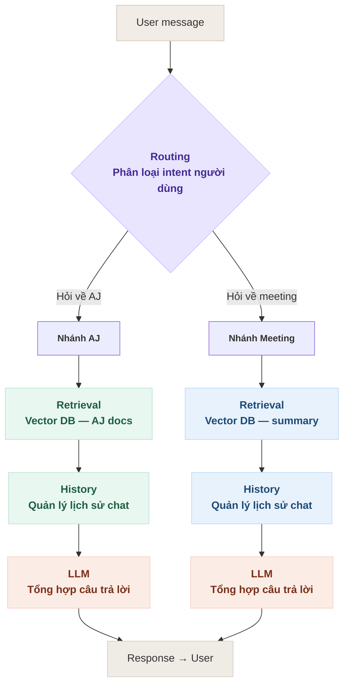

# Hướng Dẫn Thực Hiện & Mô Tả Chi Tiết 4 Tasks Dự Án Trợ Lý Ảo Javis

Tài liệu này mô tả chi tiết toàn bộ **4 Tasks (từ Task 2.1 đến Task 2.4)** của dự án **Trợ lý ảo Javis (Tro-li-ao-Javis)**. Các nội dung được xây dựng dựa trên việc phân tích các tài liệu tham khảo thực tế:

1. `AJ_technologies_ja.md`: Thông tin về công ty AJ Technologies (Nhật Bản) và các sản phẩm dịch vụ của họ (như nền tảng DX "ホムすん" - Homesun).
2. `sumary_mau.md`: Bản ghi chép tóm tắt mẫu (Meeting Summary Transcript) gồm 6 phần tiêu chuẩn của một buổi tư vấn nhà đất.

---

## Bảng Tổng Quan Lộ Trình Thực Hiện (Roadmap)

| Task ID | Tên Task | Nội dung chi tiết | Kết quả đầu ra | Tiêu chí nghiệm thu |
| :--- | :--- | :--- | :--- | :--- |
| **2.1** | Đọc hiểu nội dung AJ và summary transcript meeting | Đọc tài liệu AJ và các bản summary transcript để hiểu format dữ liệu cần lưu vào DB. | Ghi chú: cấu trúc dữ liệu AJ docs và summary transcript | Hiểu rõ format, xác định được các field cần index khi retrieval |
| **2.2** | Xây dựng DB cho summary transcript và AJ docs | Chunk, embed và lưu vào vector DB (Chroma): 1 collection cho AJ docs, 1 collection cho summary transcript. | Script setup DB, 2 collection đã được index với dữ liệu mẫu | DB khởi tạo không lỗi, truy vấn thử trả về kết quả đúng |
| **2.3** | Tạo test case | Xây dựng test case cho retrieval, tạo các câu hỏi liên quan đến dữ liệu trong DB nhằm test code retrieval | Bộ test case | *(Trống)* |
| **2.4** | Code retrieval dựa trên DB đã tạo | Viết hàm retrieval nhận query $\rightarrow$ tìm kiếm đúng collection dựa trên intent $\rightarrow$ trả về các đoạn liên quan. | Hàm retrieve(query, intent) $\rightarrow$ list[Document] | Retrieval đúng collection theo intent; trả về đúng document liên quan khi test |

---

## Chi Tiết Từng Task & Hướng Dẫn Triển Khai

### Task 2.1: Đọc hiểu nội dung AJ và summary transcript meeting

#### 1. Mục tiêu

Nghiên cứu tài liệu AJ và mẫu summary transcript để hiểu rõ định dạng dữ liệu thô, từ đó thiết lập cấu trúc lưu trữ và xác định các trường dữ liệu cần chỉ mục (indexing) để hỗ trợ quá trình truy xuất (retrieval).

#### 2. Phân tích cấu trúc dữ liệu & Các trường thông tin cần trích xuất

##### A. Tài liệu AJ Docs (`AJ_technologies_ja.md`)

* **Đặc điểm:** Chứa thông tin giới thiệu chung, cơ cấu tổ chức, ban điều hành và mô tả sản phẩm/tính năng dịch vụ của công ty AJ Technologies.
* **Các field đề xuất lập chỉ mục (metadata):**
  * `source_file`: Tên file gốc (`AJ_technologies_ja.md`).
  * `category`: Danh mục nội dung (`general_info`, `products`, `features`).
  * `product_name`: Tên sản phẩm cụ thể nếu chunk đó mô tả về sản phẩm (ví dụ: `ホムすん`, `ラクかりex`...).

##### B. Bản tóm tắt cuộc họp (Summary Transcripts - ví dụ: `sumary_mau.md`)

* **Đặc điểm:** Biên bản họp được cấu trúc thành 6 phần tiêu chuẩn bằng tiếng Nhật:
    1. **基本情報 (Thông tin cơ bản):** Tên nhân viên phụ trách, khách hàng, thời gian diễn ra cuộc họp.
    2. **商談の目的・背景 (Mục đích & Bối cảnh):** Lý do xây nhà, khu vực mong muốn, ngân sách tổng.
    3. **ヒアリング内容（顧客ニーズ）(Nhu cầu của khách hàng):** Các yêu cầu cụ thể (phòng ốc, phòng cách âm, không gian...).
    4. **提案内容・商談の進捗 (Đề xuất & Tiến độ thương thảo):** Giải pháp đề xuất, kế hoạch cuộc hẹn tiếp theo.
    5. **課題・懸念点 (Thách thức & Lo ngại):** Lo ngại về ngân sách, tiếng ồn hay biến động giá đất.
    6. **次回アクション (Hành động tiếp theo):** Các đầu việc cần làm kèm deadline của cả hai bên.
* **Các field đề xuất lập chỉ mục (metadata):**
  * `source_file`: Tên file gốc (`sumary_mau.md`).
  * `section_id`: ID của phần trong tài liệu (từ `1` đến `6`).
  * `section_name`: Tên tiếng Anh tương ứng (`basic_info`, `purpose`, `needs`, `proposals`, `concerns`, `next_actions`).
  * `customer_name`: Tên khách hàng (phục vụ lọc theo thực thể).

---

### Task 2.2: Xây dựng DB cho summary transcript và AJ docs

#### 1. Mục tiêu

Thiết lập cơ sở dữ liệu Vector sử dụng thư viện **ChromaDB**. Thực hiện phân đoạn (chunking), tạo embeddings và lưu trữ dữ liệu vào 2 collections riêng biệt cho AJ docs và summary transcripts.

#### 2. Kế hoạch triển khai

1. **Lựa chọn mô hình Embedding:** Sử dụng mô hình hỗ trợ đa ngôn ngữ (Multilingual Embedding) như `multilingual-e5` để xử lý văn bản chứa tiếng Nhật và tiếng Việt.
2. **Thiết kế Collections trong ChromaDB:**
    * `aj_docs`: Chứa các phân đoạn thông tin doanh nghiệp, dịch vụ và sản phẩm của công ty mẹ AJ Technologies.
    * `summary_transcripts`: Chứa thông tin chi tiết của các cuộc gặp khách hàng (được tách chính xác theo 6 phần chính trong biên bản cuộc họp để giữ nguyên ngữ cảnh).
3. **Quy trình xử lý dữ liệu (ETL Pipeline):**
    * **Chunking:** Đối với `summary_transcripts`, tách nội dung thành 6 đoạn văn tương ứng với 6 mục. Đối với `aj_docs`, phân tách theo các đề mục lớn.
    * **Indexing:** Sinh vector biểu diễn và lưu trữ kèm metadata tương ứng vào từng collection trong ChromaDB.

#### 3. Cấu trúc thư mục mã nguồn đề xuất

```text
Tro-li-ao-Javis/
│
├── database/
│   ├── __init__.py
│   ├── chroma_client.py     # Quản lý kết nối Client ChromaDB
│   ├── build_db.py          # Script chunking, embedding và khởi tạo dữ liệu mẫu vào DB
│   └── database.db          # Thư mục lưu trữ cơ sở dữ liệu ChromaDB (Persistent)
│
└── docs/
    ├── AJ_technologies_ja.md
    ├── sumary_mau.md
    └── tasks_description.md
```

---

### Task 2.3: Tạo test case

#### 1. Mục tiêu

Xây dựng tập hợp các câu hỏi thử nghiệm (Test Cases) có độ bao phủ cao nhằm kiểm thử hiệu năng và độ chính xác của chức năng truy xuất (retrieval) trên cơ sở dữ liệu đã lập.

#### 2. Danh sách Test Cases đề xuất

##### Nhóm 1: Câu hỏi về thông tin AJ Docs (Collection `aj_docs`)

* **Query 1:** "AJ Technologies là công ty gì và trụ sở ở đâu?"
  * *Intent dự kiến:* `company_info`
  * *Kết quả mong đợi:* Thông tin về trụ sở tại Nagoya, thành lập tháng 10/2022 và hoạt động trong mảng tài chính/bất động sản.
* **Query 2:** "Nền tảng DX ホムすん (Homesun) của AJ Technologies có những tính năng gì?"
  * *Intent dự kiến:* `company_info`
  * *Kết quả mong đợi:* Tự động làm hồ sơ ngân hàng bằng AI, AI chatbot hỗ trợ 24/7, nhận dạng giọng nói & tạo biên bản họp, quản lý tiến độ thi công, quản lý hồ sơ và đánh giá khoản vay.
* **Query 3:** "Dịch vụ OCR của AJ Technologies tên là gì?"
  * *Intent dự kiến:* `company_info`
  * *Kết quả mong đợi:* OCR mang tên "ラクかりex (AI-OCR)".

##### Nhóm 2: Câu hỏi về Tóm tắt cuộc họp (Collection `summary_transcripts`)

* **Query 4:** "Ngân sách tối đa của khách hàng trong cuộc họp là bao nhiêu?"
  * *Intent dự kiến:* `meeting_summary`
  * *Kết quả mong đợi:* Tổng ngân sách giới hạn khoảng 45 triệu Yên (4,500万円).
* **Query 5:** "Khách hàng có những điểm lo lắng (懸念点) nào?"
  * *Intent dự kiến:* `meeting_summary`
  * *Kết quả mong đợi:* Lo tiếng ồn hành lang ảnh hưởng con nhỏ; lo ngại ngân sách 4,500万円 không đủ làm phòng khách thông tầng (吹き抜け).
* **Query 6:** "Các hành động tiếp theo của nhân viên và khách hàng là gì?"
  * *Intent dự kiến:* `meeting_summary`
  * *Kết quả mong đợi:* Nhân viên tìm 3-4 khu đất gửi trước thứ Sáu, gửi brochure phòng khách thông tầng; khách gửi 3-4 ảnh bếp qua LINE trước Chủ Nhật; chuẩn bị tài liệu kế hoạch tài chính cho buổi họp 30/5.

---

### Task 2.4: Code retrieval dựa trên DB đã tạo

#### 1. Mục tiêu

Lập trình hàm `retrieve(query, intent)` nhằm tiếp nhận câu hỏi của người dùng, phân định collection đích dựa trên `intent` đầu vào, tiến hành truy xuất vector và trả về kết quả dưới dạng danh sách đối tượng `Document`.

#### 2. Thiết kế giải thuật phân loại Intent & Routing



#### 3. Định nghĩa Lớp Document & Mã giả hàm Retrieval (`retriever.py`)

Dưới đây là mã nguồn minh họa hàm truy xuất trả về định dạng `list[Document]`:

```python
import chromadb
from typing import List, Dict, Any, Optional

# Định nghĩa cấu trúc lớp Document tiêu chuẩn
class Document:
    def __init__(self, page_content: str, metadata: Optional[Dict[str, Any]] = None):
        self.page_content = page_content
        self.metadata = metadata if metadata is not None else {}

    def __repr__(self):
        return f"Document(page_content='{self.page_content[:50]}...', metadata={self.metadata})"


class JavisRetriever:
    def __init__(self, persist_directory: str):
        # Khởi tạo persistent client kết nối tới ChromaDB
        self.client = chromadb.PersistentClient(path=persist_directory)
        
        # Load các collection tương ứng
        self.aj_collection = self.client.get_collection("aj_docs")
        self.summary_collection = self.client.get_collection("summary_transcripts")

    def retrieve(self, query: str, intent: str) -> List[Document]:
        """
        Thực hiện tìm kiếm tương đồng trên Collection tương ứng dựa theo Intent.
        
        :param query: Câu hỏi truy vấn của người dùng.
        :param intent: Phân loại ý định ('company_info' hoặc 'meeting_summary').
        :return: list[Document] chứa ngữ cảnh và metadata tương ứng.
        """
        # Routing logic lựa chọn Collection đích
        if intent == "company_info":
            target_collection = self.aj_collection
        elif intent == "meeting_summary":
            target_collection = self.summary_collection
        else:
            raise ValueError(f"Intent không hợp lệ: '{intent}'. Chỉ chấp nhận 'company_info' hoặc 'meeting_summary'.")

        # Truy vấn tìm kiếm ngữ nghĩa (semantic search)
        # Mặc định lấy top 3 kết quả tương đồng nhất
        results = target_collection.query(
            query_texts=[query],
            n_results=3
        )

        # Chuyển đổi định dạng kết quả thô từ ChromaDB sang danh sách đối tượng Document
        document_list = []
        if results and 'documents' in results and len(results['documents']) > 0:
            for idx in range(len(results['documents'][0])):
                content = results['documents'][0][idx]
                metadata = results['metadatas'][0][idx] if 'metadatas' in results else {}
                
                # Khởi tạo đối tượng Document
                doc = Document(page_content=content, metadata=metadata)
                document_list.append(doc)
                
        return document_list


# Ví dụ sử dụng kiểm thử tích hợp
if __name__ == "__main__":
    # Khởi tạo retriever
    retriever = JavisRetriever(persist_directory="./database/database.db")
    
    # 1. Truy xuất thông tin công ty AJ Docs
    print("=== TEST RETRIEVAL: AJ DOCS ===")
    company_docs = retriever.retrieve(
        query="Nền tảng DX ホムすん có tính năng gì?",
        intent="company_info"
    )
    for doc in company_docs:
        print(f"Content: {doc.page_content}")
        print(f"Metadata: {doc.metadata}")
        print("-" * 40)

    # 2. Truy xuất thông tin tóm tắt cuộc họp
    print("\n=== TEST RETRIEVAL: MEETING SUMMARY ===")
    meeting_docs = retriever.retrieve(
        query="Khách hàng lo lắng điều gì và muốn mua nhà ở đâu?",
        intent="meeting_summary"
    )
    for doc in meeting_docs:
        print(f"Content: {doc.page_content}")
        print(f"Metadata: {doc.metadata}")
        print("-" * 40)
```

---

## Các Lưu Ý Quan Trọng Khi Triển Khai

1. **Đồng nhất định dạng ngôn ngữ:** Bản ghi `sumary_mau.md` và `AJ_technologies_ja.md` viết bằng tiếng Nhật, trong khi câu hỏi kiểm thử có thể viết bằng tiếng Việt. Bắt buộc phải cấu hình mô hình embedding hỗ trợ đa ngôn ngữ có hiệu năng tốt (như `multilingual-e5` hoặc `paraphrase-multilingual`) để đối sánh chính xác.
2. **Bảo toàn cấu trúc của Summary Transcript:** 6 phần của biên bản họp chứa các nhóm ngữ cảnh bổ trợ mật thiết cho nhau. Khi chunking, thay vì tách dòng ngẫu nhiên theo ký tự, hãy bóc tách chính xác theo tiêu đề từng mục để tránh việc thông tin của mục "Hành động tiếp theo" bị trộn lẫn hoặc mất liên kết với mục "Nhu cầu khách hàng".
