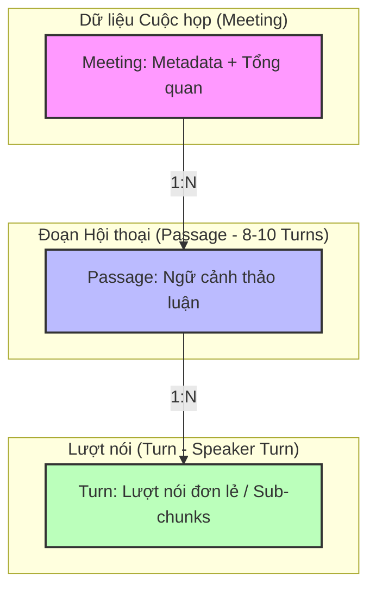
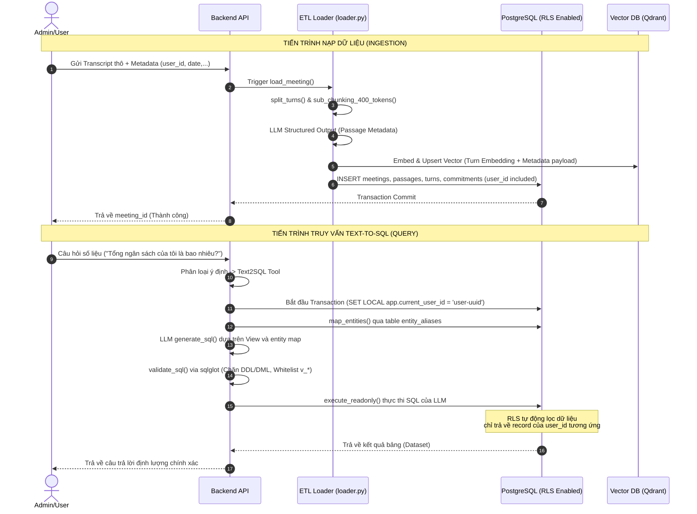

# Báo Cáo Phân Tích Hệ Thống DB Ingestion & Đánh Giá Tích Hợp Text2SQL
## Dự án: Trợ lý ảo Javis

Báo cáo này phân tích chi tiết sự tương thích, tính đúng đắn của thiết kế đường ống nạp dữ liệu (DB Ingestion Pipeline) 3 tầng và vai trò của module **Text-to-SQL** trong hệ thống. Đồng thời, tài liệu đối chiếu thiết kế này với mã nguồn thực tế trong phân hệ `javis-text2sql` để chỉ ra các lỗ hổng kiến trúc và đề xuất giải pháp khắc phục.

---

## 1. Đánh giá Thiết kế 3 Tầng Dữ liệu (Turn - Passage - Meeting)

Thiết kế phân tầng dữ liệu này là **rất chuẩn xác và tối ưu** cho hệ thống Hybrid RAG + Text2SQL phục vụ hội thoại cuộc họp (Conversational AI). 



### Chi tiết các tầng dữ liệu:

*   **Tầng 1 (Turn - Lượt nói):**
    *   *Mục đích:* Dành cho truy vấn ngữ nghĩa sâu, trích xuất thực thể cực kỳ chi tiết, hoặc Vector Search định vị chính xác vị trí phát ngôn.
    *   *Độ dài:* Rất ngắn, giữ nguyên cấu trúc `Speaker: Content`. Cơ chế sub-chunking khi vượt quá 400 tokens giúp hạn chế nhiễu và bảo toàn chất lượng biểu diễn Vector Embedding.
*   **Tầng 2 (Passage - Đoạn hội thoại 5-10 turns):**
    *   *Mục đích:* Dành cho các câu hỏi định tính cần ngữ cảnh rộng hơn (ví dụ: *"Mọi người tranh luận thế nào về ngân sách điện?"*). Lượt nói đơn lẻ không đủ thông tin để trả lời câu hỏi này.
    *   *Metadata Enrichment:* Tầng này là **cốt lõi phục vụ Text2SQL**. Việc LLM trích xuất có cấu trúc các thông tin như `amounts`, `commitments`, `dates_mentioned`, `open_questions` từ Passage và lưu vào PostgreSQL giúp phẳng hóa dữ liệu hội thoại thô thành các bảng quan hệ.
*   **Tầng 3 (Meeting - Cuộc họp):**
    *   *Mục đích:* Phục vụ truy vấn tổng hợp cấp cao (High-level queries) như *"Tháng này có bao nhiêu cuộc họp?"*, *"Tóm tắt nội dung cuộc họp ngày 25/5"*. Giúp giảm chi phí quét toàn bộ dữ liệu thô.

---

## 2. Bảng Đối Chiếu Thiết Kế vs Thực Tế Mã Nguồn

Dưới đây là bảng đánh giá chi tiết mức độ trùng khớp giữa sơ đồ thiết kế DB Pipeline của hệ thống và mã nguồn thực tế hiện tại trong `javis-text2sql`:

| Giai đoạn thiết kế | Trạng thái trong mã nguồn | Đánh giá & Khoảng cách (Gap) |
| :--- | :--- | :--- |
| **Giai đoạn 1: Nhận transcript thô**<br>- Meeting transcript<br>- Metadata: `user_id`, `meeting_id`, `date`, `participants[]` | **Đã triển khai một phần**<br>- Class `MeetingMeta` nhận `title`, `meeting_date`, `speaker_count`, `duration_seconds`, `summary`, `source_language`. | ❌ **Thiếu hụt nghiêm trọng**:<br>- Hoàn toàn thiếu `user_id` và `participants` để phân quyền đa người dùng (Multi-tenancy). |
| **Giai đoạn 2a: Chunk theo speaker turn**<br>- Mỗi lượt nói = 1 turn | **Đã triển khai**<br>- Trích xuất bằng regex trong `split_turns` (`chunker.py`). |  **Khớp hoàn toàn** |
| **Giai đoạn 2b: Sub-chunk turn dài**<br>- Nếu turn > 400 tokens, chia nhỏ theo câu, overlap 1-2 câu. | **Chưa triển khai**<br>- Mã nguồn `chunker.py` chưa đếm số token và chưa thực hiện sub-chunking. | ❌ **Thiếu sót**:<br>- Lượt nói quá dài sẽ gây nhiễu embedding và giảm chất lượng trích xuất. |
| **Giai đoạn 3: Gắn metadata**<br>- Payload: `user_id`, `meeting_id`, `meeting_date`, `speaker`, `minute_start`, `turn_id`, `chunk_index`, `text`. | **Đã triển khai một phần**<br>- Bảng `turns` chỉ lưu `id`, `passage_id`, `meeting_id`, `turn_index`, `speaker`, `content`, `timestamp`. | ⚠️ **Lệch pha nhẹ**:<br>- Thiếu định danh tenant (`user_id`).<br>- Dùng `timestamp` thay vì `minute_start` (offset tương đối). |
| **Giai đoạn 4: Embed và lưu vào DB**<br>- Lưu PostgreSQL (metadata + text).<br>- Lưu Vector DB (pgvector / Qdrant). | **Chỉ triển khai nhánh PostgreSQL**<br>- `loader.py` ghi nhận dữ liệu vào Postgres thông qua transaction.<br>- Nhánh Vector DB (pgvector/Qdrant) hoàn toàn chưa được viết. | ❌ **Thiếu sót lớn**:<br>- Phân hệ Vector RAG ở tầng Turn chưa thể hoạt động. |

---

## 3. Các Lỗ Hổng Bảo Mật & Rủi Ro Kiến Trúc Nghiêm Trọng

### Rủi ro 1: Rò rỉ Dữ liệu Đa Tenant trong Text2SQL (Cực Kỳ Nghiêm Trọng)

> [!CAUTION]
> **Nguy cơ rò rỉ chéo dữ liệu giữa các khách hàng (Multi-tenant Leakage)**
> 
> Hiện tại, bảng `meetings`, `passages`, `turns`, `commitments` trong `001_init.sql` **không có cột `user_id`**.
>
> Khi người dùng đặt câu hỏi: *"Tổng ngân sách dự án là bao nhiêu?"*, Text2SQL sinh câu lệnh:
> ```sql
> SELECT SUM(amount_value) FROM v_amounts WHERE amount_currency = 'JPY';
> ```
> Câu lệnh này sẽ cộng dồn ngân sách của **tất cả mọi cuộc họp của toàn bộ khách hàng** trong DB vì không có cơ chế lọc theo chủ sở hữu (`user_id`).

#### Tại sao không thể nhờ LLM tự viết `WHERE user_id = '...'`?
*   LLM có thể bị **Prompt Injection** bypass điều kiện lọc.
*   LLM có thể hallucinate (ảo tưởng) và quên không thêm điều kiện lọc.
*   Đây là lỗ hổng bảo mật mức độ High/Critical.

#### Giải pháp khắc phục: PostgreSQL Row Level Security (RLS)
Để cô lập dữ liệu tuyệt đối giữa các tenant mà không làm phức tạp hóa Prompt sinh SQL của LLM, chúng ta cần cấu hình **RLS** ở tầng cơ sở dữ liệu:

1.  **Cập nhật Migration:** Bổ sung cột `user_id UUID` vào bảng `meetings`.
2.  **Bật RLS trên bảng:**
    ```sql
    ALTER TABLE meetings ENABLE ROW LEVEL SECURITY;
    ```
3.  **Tạo Policy dựa trên Session Parameter:**
    ```sql
    CREATE POLICY tenant_isolation_policy ON meetings
    USING (user_id = NULLIF(current_setting('app.current_user_id', true), '')::uuid);
    ```
4.  **Khi thực thi truy vấn Text2SQL (trong `execute_readonly`):**
    Trước khi chạy câu SELECT của LLM, backend thiết lập ID người dùng hiện tại vào session:
    ```python
    async with conn.transaction():
        # Thiết lập context của user
        await conn.execute("SET LOCAL app.current_user_id = $1;", current_user_id)
        await conn.execute("SET TRANSACTION READ ONLY;")
        rows = await conn.fetch(sql)
    ```
    *Ưu điểm:* Ngay cả khi LLM viết `SELECT * FROM v_amounts;`, PostgreSQL sẽ tự động ẩn các bản ghi không thuộc về `app.current_user_id`. Không một truy vấn nào có thể đọc chéo dữ liệu.

---

### Rủi ro 2: Turn dài gây tràn Context và Lỗi Trích xuất (Token Overflow)

*   **Vấn đề:** Nếu một cuộc họp có lượt thoại (Turn) kéo dài liên tục (ví dụ: người trình bày đọc slide hoặc báo cáo tài chính dài 1500 tokens), việc không cắt nhỏ (Sub-chunking) sẽ dẫn tới:
    1.  Mô hình Embedding đại diện cho Turn đó bị loãng ngữ nghĩa (Diluted vector).
    2.  Khi trích xuất metadata bằng LLM Structured Output ở tầng Passage (chứa 10 turns liên tiếp, tương đương 15,000 tokens), context window sẽ bị mở rộng quá mức, tăng chi phí API và dễ làm trượt mất các thông tin tài chính/cam kết nhỏ lẻ ở giữa đoạn.
*   **Giải pháp:** Bắt buộc cài đặt logic đếm token (sử dụng thư viện `tiktoken` hoặc ước lượng `len(text) / 4`) trong `chunker.py`. Nếu `turn_tokens > 400`, thực hiện cắt nhỏ thành các Sub-chunks kèm overlap 1-2 câu, gán thuộc tính `chunk_index` tăng dần.

---

### Rủi ro 3: Trích xuất Dữ liệu Định lượng bị Phụ thuộc vào Ngôn ngữ (Ja/Vi Entities)

*   **Vấn đề:** Bảng `entity_aliases` đóng vai trò chuẩn hóa tên thực thể trước khi đưa vào prompt Text2SQL. Hiện tại, logic mapping thực thể (`map_entities` trong `pipeline.py`) đang dùng câu lệnh so khớp tương đối đơn giản:
    ```sql
    WHERE $1 ILIKE '%' || alias || '%' OR alias ILIKE '%' || $1 || '%'
    ```
*   **Điểm yếu:** Với tiếng Nhật, việc tìm kiếm fuzzy bằng `ILIKE` trên ký tự Kanji/Katana dễ bị sót do biến thể ngữ pháp hoặc cách viết.
*   **Giải pháp:** Tận dụng chỉ mục GIN trigram `idx_entity_aliases_trgm` đã có sẵn trong `001_init.sql` và chuyển sang câu lệnh so khớp khoảng cách chuỗi (Similarity/Fuzzy matching) bằng toán tử `%` của pg_trgm hoặc sử dụng thêm thư viện tokenize hỗ trợ tiếng Nhật (`SudachiPy`) để tách từ khóa trước khi map.

---

## 4. Mô hình Sơ đồ Kiến trúc Đề xuất (Toàn diện & An toàn)

Dưới đây là luồng xử lý hoàn chỉnh đảm bảo an toàn đa tenant (Multi-tenancy) và tích hợp đồng bộ giữa PostgreSQL và Vector DB (Qdrant):



---

## 5. Kế hoạch Hành động (Remediation Checklist)

Để đảm bảo hệ thống DB Ingestion và module Text2SQL vận hành đúng thiết kế, an toàn và sẵn sàng cho môi trường Productive, các đầu việc sau cần được thực hiện:

- [ ] **P0 (Security & Multi-tenancy):**
    *   Thêm trường `user_id UUID` vào bảng `meetings`.
    *   Bật Row Level Security (RLS) trên các bảng `meetings`, `passages`, `turns`, `commitments`.
    *   Cập nhật hàm `execute_readonly` trong `pipeline.py` để gán `app.current_user_id` trước khi chạy truy vấn SQL.
- [ ] **P1 (Ingestion Flow - Chunking & Vector DB):**
    *   Tích hợp thư viện `tiktoken` vào `chunker.py` để kiểm tra độ dài token của Turn.
    *   Viết logic Sub-chunking (cắt turn dài > 400 tokens) giữ overlap 1-2 câu.
    *   Tích hợp Client Qdrant hoặc `pgvector` vào ETL pipeline để lưu Vector Embeddings của các chunks phục vụ Vector RAG.
- [ ] **P2 (Quality & Optimization):**
    *   Cập nhật System Prompt trong `prompt.py` để bổ sung định nghĩa các trường dữ liệu quan hệ rõ ràng hơn.
    *   Tối ưu hóa hàm `map_entities` bằng các thuật toán fuzzy search mạnh mẽ hơn đối với thực thể tiếng Nhật.
    *   Thiết lập Redis Cache lưu kết quả truy vấn Text2SQL của các câu hỏi trùng lặp để tiết kiệm chi phí gọi LLM.
