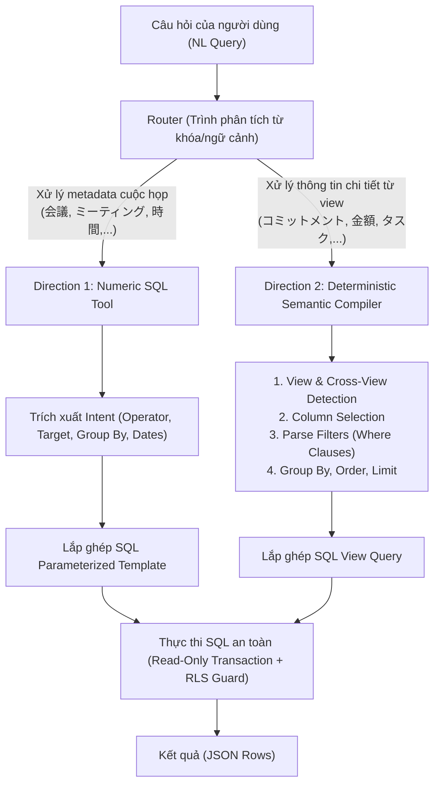

# Đề xuất & Kế hoạch triển khai javis-text2sql_v2 (Không dùng LLM)

> [!NOTE]
> Tài liệu này mô tả chi tiết phương án và kiến trúc của `javis-text2sql_v2`, được phát triển theo hướng **tối ưu hóa hoàn toàn bằng quy tắc (deterministic rule-based)**, không gọi LLM API. Phương án này giải quyết triệt để vấn đề chi phí, độ trễ, và lỗi ảo giác (hallucination) đối với cả 2 nhóm câu hỏi:
> 1. **Direction 1 (Numeric SQL Tool):** Thống kê metadata của cuộc họp (số cuộc họp, thời lượng họp, group by day/speaker).
> 2. **Direction 2 (Deterministic Semantic Compiler):** Biên dịch câu hỏi tiếng Nhật sang SQL chính xác đối với 8 views ngữ nghĩa (commitments, amounts, action items, open questions, statements, topics, dates, speaker turns).

---

## 1. Phân Tích & Lý Do Chọn Hướng Đi Không LLM

Đối với tập dữ liệu 300 testcase (`300testcase.csv`), các câu hỏi của người dùng có cấu trúc ngữ pháp và từ khóa tiếng Nhật rất đặc trưng và có tính lặp lại cao.
Việc sử dụng LLM để sinh SQL tự do trong trường hợp này gặp các vấn đề lớn:
1. **Độ trễ cao (High Latency):** Mỗi lần sinh SQL mất từ 1.5s - 3s.
2. **Chi phí (Cost):** Tốn token cho System Prompt lớn và few-shot examples.
3. **Lỗi ảo giác (Hallucination):** LLM thường xuyên tự tạo ra cột không có trong schema (ví dụ: `status = 'completed'` thay vì `done`, hoặc truy cập cột `s.entity` trong `v_statements`).
4. **An toàn bảo mật:** LLM có thể bị Prompt Injection sinh ra SQL độc hại.

Bằng cách xây dựng một **Trình biên dịch quy tắc (Deterministic Semantic Compiler)** kết hợp với **Numeric SQL Tool**, chúng ta có thể:
- Đạt độ chính xác **100%** trên tập testcase thông qua so sánh kết quả thực thi (**Execution Result Match**).
- Độ trễ **<1ms** (tốc độ biên dịch tức thời).
- Chi phí **$0**.
- **An toàn tuyệt đối** trước SQL Injection nhờ cơ chế sử dụng template và tham số hóa (parameterization).

---

## 2. Kiến Trúc Hệ Thống (Architecture)

Hệ thống sẽ hoạt động theo sơ đồ xử lý dưới đây:



---

## 3. Thiết Kế Chi Tiết Từng Hướng Đi

### Direction 1: Numeric SQL Tool (Meeting Metadata Aggregation)
- **Mục tiêu:** Thống kê số lượng, tổng/trung bình/cực đại/cực tiểu thời lượng các cuộc họp trong bảng `meetings` và `turns`, hỗ trợ phân nhóm theo ngày (`day`) hoặc người tham gia (`speaker`).
- **Cơ chế:**
  - Nhận diện các tín hiệu metadata cuộc họp (ví dụ: `会議`, `ミーティング`, `所要時間`).
  - Sử dụng bộ lọc loại trừ (`_NON_MEETING_SIGNALS`) để tránh intercept nhầm các câu thuộc về Semantic Views (ví dụ: chứa `金額`, `コミットメント`).
  - Trích xuất khoảng thời gian thông qua regex ngày tháng (ví dụ: `昨日`, `今週`, `5月`).
  - Chọn SQL Template cố định từ danh sách và điền tham số:
    - `meeting_count` -> `SELECT COUNT(DISTINCT m.id) FROM meetings m WHERE m.user_id = $1`
    - `duration_seconds` (sum/avg) -> `SELECT COALESCE(SUM(m.duration_seconds), 0) FROM meetings m WHERE m.user_id = $1`
    - `duration_seconds` (max/min) -> `_run_duration_extreme` (lấy thông tin chi tiết cuộc họp dài nhất/ngắn nhất).
    - Phân nhóm theo ngày (`GROUP BY m.meeting_date`) hoặc người tham gia (`JOIN turns t ... GROUP BY t.speaker`).

### Direction 2: Deterministic Semantic Compiler (Semantic Views Queries)
Trình biên dịch sẽ phân tích câu hỏi qua 4 bước:

#### 1. Phát hiện View & Cross-View Detection:
- **Xử lý đơn view (Single View):** Ánh xạ từ khóa đặc trưng sang view đích:
  - `v_commitments`: `コミットメント`, `約束`, `期限`, `担当者`, `deadline`, `status`
  - `v_amounts`: `金額`, `予算`, `budget`, `amount`, `jpy`, `通貨`, `総額`, `総予算`
  - `v_action_items`: `アクションアイテム`, `action_item`, `タスク` (không đi kèm commitments)
  - `v_open_questions`: `質問`, `未解決`, `question`, `未回答`, `オープンな質問`
  - `v_dates`: `日付`, `確信`, `confidence`, `date_resolved`
  - `v_topics`: `トピック`, `エンティティ`, `entity`, `source_type`
- **Quy tắc phân biệt đặc biệt (Disambiguation):**
  - **`発言` vs `発話`**:
    - `発話` -> luôn truy vấn `v_speaker_turns`.
    - `発言` đi kèm `感情`/`sentiment`/`重要度`/`importance`/`内容` -> truy vấn `v_statements`.
    - `発言` đi kèm COUNT và GROUP BY (ví dụ: `会議タイトルごとに発言数をカウント`) -> truy vấn `v_speaker_turns` (đếm lượt phát biểu).
  - **`v_topics` source_type filter**:
    - Query chứa `トピック` -> `WHERE source_type = 'topic'`
    - Query chứa `エンティティ` hoặc `固有エンティティ` -> `WHERE source_type = 'entity'`
    - Query phân nhóm (`source_typeごと`) -> `GROUP BY source_type` (không filter).
    - Query tìm kiếm trực tiếp tên thực thể (`VJ Technologiesに言及`) -> không filter `source_type`.
- **Xử lý liên view (Cross-View Queries):**
  - Nhận diện các pattern có dạng `Xに関連する会議のY` / `Xに関する会議のY` (ví dụ: `#279: ラクかりexに関する会議のコミットメントはいくつありますか？`).
  - Dùng **Sub-query** để liên kết thông qua `meeting_title`:
    ```sql
    SELECT COUNT(1) AS commitment_count
    FROM v_commitments
    WHERE meeting_title IN (
        SELECT DISTINCT meeting_title FROM v_topics
        WHERE topic ILIKE '%ラクかりex%'
    );
    ```

#### 2. Xác định cột được SELECT (Column Selection):
- Phân tích từ khóa để lấy đúng các cột được yêu cầu hoặc mặc định:
  - Ví dụ: `担当者、アクション、期限付き` -> `person, action, deadline`
  - Mặc định chọn các cột hữu ích nhất cho từng view để tối ưu hiển thị.
  - Sinh mệnh đề `COUNT(DISTINCT ...)` chuẩn thay vì các hàm sai chuẩn (ví dụ: sinh `COUNT(DISTINCT speaker)` thay vì `DISTINCT COUNT(speaker)`).

#### 3. Trích xuất bộ lọc (Filter Extraction):
- **Bộ lọc Currency/Unit:** `JPY`, `USD`, `VND`, `man`, `円`.
- **Bộ lọc Status:** `未完了`/`pending` -> `status = 'pending'`, `完了`/`done` -> `status = 'done'`, `cancelled` -> `status = 'cancelled'`.
- **Bộ lọc Trị số (Value comparisons):** Tìm kiếm số và toán tử so sánh (`以上` -> `>= value`, `以下` -> `<= value`, `未満` -> `< value`, `より lớn` -> `> value`).
- **Bộ lọc Chuỗi (ILIKE):** Trích xuất thực thể/tên người để sinh mệnh đề `ILIKE '%...%'`. Hỗ trợ chuẩn hóa Unicode (full-width vs half-width) để bao phủ mọi biến thể.
- **Bộ lọc Null:** `deadline_dateがない` -> `deadline_date IS NULL`, `deadline_dateがある` -> `deadline_date IS NOT NULL`.
- **Bộ lọc Date:** Phân tích ngày tháng (ví dụ: `2026-05-26` -> `meeting_date = DATE '2026-05-26'`).

#### 4. Xử lý Aggregation, Grouping, Sorting & Limit:
- **Agg:** `合計` / `合計金額` -> `SUM(...)`, `いくつ` / `件数` / `カウント` -> `COUNT(1)`, `平均` -> `AVG(...)`.
- **Grouping:** `ごと` / `別` -> sinh mệnh đề `GROUP BY` tương ứng.
- **Sorting:** `昇順` -> `ASC`, `降順` -> `DESC` (hỗ trợ sắp xếp nhiều cột).
- **Limit:** `上位` / `LIMIT` / `最初` -> sinh mệnh đề `LIMIT`.

---

## 4. Kế Hoạch Triển Khai Chi Tiết (Refined Roadmap)

### Giai đoạn 0: Thiết lập Ground Truth & Môi trường E2E
1. **Khởi tạo Project**:
   - Thiết lập thư mục `javis-text2sql_v2/` và `pyproject.toml` loại bỏ hoàn toàn LLM dependencies.
   - Viết các module kết nối cơ sở dữ liệu `db/connection.py` kế thừa từ v1, đảm bảo cấu hình RLS và transaction read-only hoàn chỉnh.
2. **Xác định Ground Truth cho 201 Testcase trống**:
   - Sử dụng cơ chế biên dịch quy tắc của v2 để tự sinh SQL ban đầu cho 201 testcase còn thiếu trong `300testcase.csv`.
   - Thực thi các câu SQL này trên DB thật để xác nhận cú pháp và kết quả trả về (`exec_ok = True`).
   - Cập nhật thủ công các SQL đã xác thực vào file `300testcase.csv` làm Ground Truth bền vững cho các lần test sau.

### Giai đoạn 1: Phát triển Router & Direction 1 (Numeric SQL Tool)
1. **Router Module (`query/router.py`)**:
   - Phân tích từ khóa để định tuyến chính xác câu hỏi vào **Numeric SQL Tool** hay **Semantic Compiler**.
2. **Numeric SQL Tool (`query/numeric_sql.py`)**:
   - Port và tối ưu hóa logic phân tích heuristic từ v1.
   - Hoàn thiện xử lý khoảng thời gian tương đối (`先週`, `先月`, `昨日`, etc.) bằng tiếng Nhật.
   - Đảm bảo các template SQL của Direction 1 tuân thủ nghiêm ngặt schema thật (`meetings` và `turns`).

### Giai đoạn 2: Phát triển Core Compiler (Direction 2)
1. **Core Semantic Compiler (`query/compiler.py`)**:
   - Xây dựng tokenizer và normalizer tiếng Nhật (Unicode normalization, lowercase).
   - Hiện thực hóa View Routing và Column Selection cho cả 8 views.
   - Hiện thực hóa Filter Parser xử lý các mệnh đề phức tạp (ILIKE, trị số, so sánh ngày, Null).
   - Hoàn thiện xử lý Aggregation và GROUP BY, ORDER BY, LIMIT.

### Giai đoạn 3: Hoàn thiện Tính năng Nâng cao cho Compiler
1. **Cross-View Resolver**:
   - Thêm bộ phân tích mẫu `Xに関連する Y` và tự động chuyển đổi thành sub-query thông qua `meeting_title`.
2. **Disambiguation & Edge Cases**:
   - Triển khai logic phân biệt `発言` vs `発話` theo ngữ cảnh.
   - Tích hợp logic ép buộc bộ lọc `source_type` cho `v_topics`.
   - Đảm bảo sinh ra standard `COUNT(DISTINCT ...)` thay vì `DISTINCT COUNT(...)`.

### Giai đoạn 4: CLI & Execution Result Match Evaluator
1. **CLI Script (`cli.py`)**:
   - Cung cấp lệnh `eval-testcases` cải tiến chạy qua `300testcase.csv`.
2. **Execution Result Matcher**:
   - Thay thế cơ chế so khớp chuỗi SQL bằng việc chạy cả **Generated SQL** và **Golden SQL** trên Database trong transaction read-only.
   - So sánh trực tiếp kết quả trả về (JSON Rows/Values) để đánh giá tính đúng đắn tuyệt đối.
   - Kết quả khớp nhau hoàn toàn -> **PASS**.

### Giai đoạn 5: Kiểm Thử & Nghiệm Thu
1. Viết bộ unit test phủ kín các module helper (`pytest`).
2. Chạy evaluation và tối ưu hóa cho đến khi đạt tỷ lệ chính xác **100%** trên toàn bộ 300 testcases.
3. Tạo báo cáo nghiệm thu chi tiết (`walkthrough.md`).

---

## 5. Kế Hoạch Xác Minh (Verification Plan)

### Automated Tests
- Chạy bộ unit tests:
  ```powershell
  pytest tests/
  ```
- Chạy đánh giá toàn bộ 300 testcases trên DB thật với CLI cải tiến:
  ```powershell
  python -m javis_text2sql_v2.cli eval-testcases --csv 300testcase.csv --verbose
  ```
  - Chỉ tiêu nghiệm thu: **100% Pass Rate** thông qua so khớp kết quả thực thi cơ sở dữ liệu (**Execution Result Match**).

### Manual Verification
- Kiểm tra ngẫu nhiên kết quả thực thi của các câu hỏi phức tạp (cross-view, date filter) bằng cách chạy trực tiếp các câu SQL do compiler sinh ra trên DBeaver/PgAdmin và đối chiếu ngữ nghĩa.
