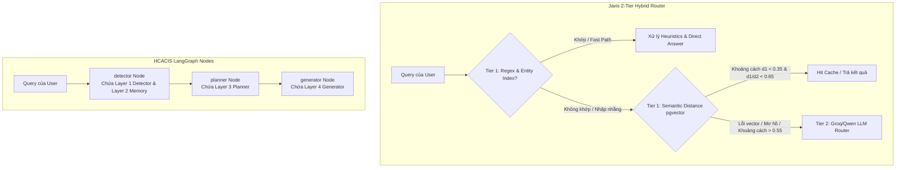

# Báo cáo So sánh Chi tiết: Javis Multi-Turn Context Manager vs. HCACIS
*Mã tài liệu: JAVIS-VS-HCACIS-COMP-01*  
*Tác giả: Antigravity AI Agent*  
*Ngày lập: 23/06/2026*  

---

## 🎯 Giới thiệu Tổng quan

Tài liệu này thực hiện so sánh đối chiếu sâu sắc và thực tế giữa hai hệ thống quản lý ngữ cảnh đa lượt (Multi-turn Context Management) phục vụ cho trợ lý ảo:
1. **Javis Multi-Turn Context Manager V3 (Nằm trong thư mục `multi-turn-context-manager`):** Hệ thống định tuyến hỗn hợp 2 lớp (2-Tier Hybrid Routing) tích hợp pgvector, Hot/Cold Cache và cơ chế Direct-Answer Path, vận hành trên PostgreSQL.
2. **HCACIS (Hierarchical Context-Aware Conversational Intelligence System - Nằm trong thư mục `follow-up conversation/hcacis`):** Hệ thống xử lý ngữ cảnh đa lớp dựa trên đồ thị tri thức Neo4j và kiến trúc LangGraph. *(Lưu ý: Tất cả file Python của HCACIS đặt ở root directory, không có cấu trúc `src/` như báo cáo trước đây mô tả.)*

Mục tiêu của báo cáo này là chỉ rõ các điểm vượt trội về hiệu năng, độ tin cậy và khả năng triển khai thực tế (Production Readiness) của từng hệ thống, đồng thời phân tích khách quan các điểm hạn chế và nợ kỹ thuật (Tech Debt) thực tế của cả hai bên để phục vụ cho các quyết định tối ưu hóa kiến trúc tiếp theo.

---

## 📊 Bảng So sánh Trực quan (Feature Matrix)

| Tiêu chí So sánh | Javis Multi-Turn Context Manager (V3) | HCACIS (Dự án Đối chiếu) | Đánh giá & Kết luận |
| :--- | :--- | :--- | :--- |
| **Kiến trúc luồng (Pipeline)** | Bộ điều phối tuần tự 8 bước (`IntelligentOrchestrator`) kết hợp kiểm định ảo giác. | Kiến trúc LangGraph chia làm 4 lớp logic, chạy trên **3 LangGraph nodes** (`detector` gộp L1+L2 → `planner` → `generator`). | **Javis** chặt chẽ hơn nhờ có bước kiểm duyệt kết quả (Verification Step) và Direct Path. |
| **Tầng định tuyến (Routing)** | **2-Tier Hybrid Routing**:<br>- Tier 1: Regex + Entity Index + pgvector (cho cache routing).<br>- Tier 2: LLM Router. | **Gần như 1-Tier LLM Routing**:<br>- L1 có `_rule_based_pronoun_check()` heuristic (check regex đại từ) nhưng chủ yếu dùng để gợi ý prompt, không phải fast path bypass LLM.<br>- Vẫn cần LLM Detector ở mỗi lượt. | **Javis vượt trội:** Tiết kiệm chi phí, quyết định định tuyến Tier 1 nhanh (target thiết kế < 15ms). HCACIS luôn mất thời gian gọi LLM ở detector node dù có heuristic hỗ trợ nhẹ. |
| **Phân giải Đại từ (Coreference)** | **Dynamic & Gender-Aware Heuristics**:<br>- Phân loại giới tính dựa trên DB và hậu tố tên Nhật (彼 / 彼女) ở Tier 1. | **Graph DB Lookup (Mockup/Stub)**:<br>- Chỉ là logic gán cứng trả về ID active gần nhất nếu query chứa đại từ. | **Javis thực chất hơn:** HCACIS chỉ mockup việc dùng Neo4j để phân giải đại từ; thực tế việc phân giải phụ thuộc vào LLM viết lại câu hỏi ở Detector layer. |
| **Trí nhớ dài hạn (Memory DB)** | PostgreSQL (`session_entity_index`) kết hợp GIN index cho tìm kiếm mảng tên nhanh. | Neo4j Graph Database (lưu nút Entity và quan hệ Directed Edge). | **Cả hai đều hoạt động:** Javis tối ưu hóa ACID trên PG. HCACIS lưu trữ đồ thị tri thức trên Neo4j tốt nhưng chưa khai thác thuật toán đồ thị để phân giải đại từ. |
| **Quản lý Cache & Session Persistence** | **Hot/Cold Cache phân tách** trên PostgreSQL, hỗ trợ **Transactional lock** (`FOR UPDATE`) và **LRU Eviction** (max 5 slots). | **3 Lớp Cache** (L1: Dict, L2: Redis, L3: ChromaDB). Không hỗ trợ Lock tương tranh. L1 và L3 không có eviction. | **Javis vượt trội ở Production:** Cache của Javis đảm bảo đồng bộ giữa các worker (out-of-process). L1 Cache (in-memory dict) của HCACIS mất đồng bộ trong môi trường đa tiến trình (multi-worker) và có nguy cơ Memory Leak ở L1/L3. |
| **Độ trễ (Latency)** | **End-to-End**: Trung bình ~11.8s (RAG + Verifier).<br>**Direct-Answer Path**: ~96ms - 1.5s.<br>**Tier 1 Routing Decision**: < 15ms (mục tiêu thiết kế). | **End-to-End**: Ước lượng lý thuyết/định tính từ log đạt ~6s đến ~15s+ (chưa có benchmark side-by-side). | **Javis tối ưu hơn:** Cho phép bypass LLM ở các câu hỏi đơn giản/lặp lại ngữ cảnh. Số liệu Javis dựa trên benchmark thực tế. |
| **Tương tranh (Concurrency)** | Sử dụng **Advisory Lock** giao dịch (`pg_try_advisory_xact_lock`) theo `session_id`. | Không tích hợp khóa tương tranh. | **Javis vượt trội:** Giảm đáng kể race condition trong cùng session khi người dùng gửi tin nhắn dồn dập (timeout lock 8s). |
| **Chống Ảo giác (Hallucination)** | Tích hợp **Separate verification step** (LLM verify chéo raw data, tự động sửa lỗi và retry 2 lần, chạy chung llm_manager). | Sử dụng chỉ dẫn prompt và khử nhiễm độc history. Không có Verifier riêng. | **Javis vượt trội:** Thiết kế bước kiểm duyệt độc lập hạn chế ảo giác (mặc dù vẫn có xác suất Verifier lỗi và tự bypass về True). |
| **Tự phục hồi lỗi (Fault Tolerance)** | **Circuit Breaker** cho từng Engine + Tự động hạ cấp sang `parametric_knowledge` khi lỗi. | Neo4j → fallback in-memory mode. Redis/ChromaDB → tự động bypass lớp đó. Không có Circuit Breaker riêng cho RAG/Web/LLM API. Fallback âm thầm (silent) — luồng vẫn chạy nhưng với dữ liệu rỗng hoặc mặc định. | **Javis vượt trội:** Hệ thống bền bỉ hơn trước các sự cố API ngoài. HCACIS có graceful degradation cho infrastructure services nhưng thiếu circuit breaker cho API calls. |
| **LLM Client & Thư viện** | Client gọi API trực tiếp tinh gọn, không thư viện trung gian. | Dựa vào LangChain (LangChain Google GenAI, LangChain Groq, LangChain Ollama).<br>**Detector**: Gemini 2.5 Flash (Google).<br>**Generator**: Qwen 2.5 7B (Ollama local). | **Javis tối ưu hơn:** Tránh overhead và rủi ro breaking change từ LangChain. HCACIS dùng Multi-LLM linh hoạt nhưng phụ thuộc LangChain nặng. |
| **Cơ chế RAG & Search** | PG chunks + local embedding + boosting từ khóa/transcript. Web Search mô phỏng. | ChromaDB (nomic-embed-text) + Tìm kiếm web thực tế (DuckDuckGo search run). | **Cả hai đều có ưu điểm:** HCACIS tích hợp web search thực tế; Javis tối ưu RAG chính xác hơn nhờ cơ chế boosting và phân bổ cân bằng chunk giữa các tài liệu. |
| **Mô hình hóa dữ liệu** | Dữ liệu động qua Python dicts, an toàn kiểu giới hạn. | Định nghĩa kiểu chặt chẽ bằng Pydantic Models (`TurnState`, `Entity`, `CachedResult`). | **HCACIS vượt trội:** Đảm bảo Type Safety tốt hơn cho luồng LangGraph. |

---

## 🔍 Phân tích Kiến trúc Chi tiết

### 1. Cơ chế Định tuyến & Xử lý Follow-up (Routing)


*   **Javis Context Manager:**
    *   Thiết kế **2-Tier** giúp tối ưu hóa chi phí vận hành ở môi trường sản xuất. Những câu hỏi tiếp theo dạng *"Yamada phát biểu bao nhiêu lần?"* sau khi đã hỏi về cuộc họp 15/5 sẽ được **Tier 1** giải quyết ngay bằng cách tra cứu index thực thể cục bộ và dịch SQL heuristic, không tiêu tốn token của mô hình lớn.
    *   **Làm rõ chỉ số độ trễ:** Con số **< 15ms** được nhắc tới trong thiết kế của Javis là **mục tiêu thiết kế cho thời gian đưa ra quyết định định tuyến của Tier 1** (chạy regex, tìm kiếm vector khoảng cách trên pgvector), chứ chưa có số liệu đo lường độc lập trong file test log. Khi đi vào luồng xử lý thực tế, độ trễ end-to-end sẽ phụ thuộc vào đường đi: Direct-Answer Path kết hợp SQL metadata fetch mất từ **~96ms đến 1.5s**, trong khi luồng RAG đầy đủ kèm LLM Generation và Self-Check Verifier mất trung bình **~11.8s**.
*   **HCACIS:**
    *   Định tuyến **gọi LLM Detector ở mỗi lượt hội thoại** (được chia vào node `detector` cùng với Layer 2 Memory). Mặc dù có tích hợp các gợi ý heuristics về đại từ (pronoun hint) vào prompt đầu vào của Detector (xem `layer1_detector.py` dòng 68-70) và một hàm `_rule_based_pronoun_check()` kiểm tra regex trước khi gọi LLM, nhưng các heuristic này **chỉ dùng để gợi ý prompt** chứ không phải cơ chế rẽ nhánh sớm (Fast Path) bỏ qua LLM hoàn toàn như Javis Tier 1. Luồng vẫn phải gọi LLM Detector.
    *   Số lần gọi LLM thực tế cao: Trong trường hợp truy vấn SQL phức tạp, HCACIS phải gọi LLM ở detector, planner (numeric SQL pipeline - external dependency `numeric_sql_tool_v2`), và generator, làm tăng chi phí vận hành và tăng đáng kể độ trễ phản hồi tổng thể (thường kéo dài từ ~6s đến hơn 15s+ dựa trên quan sát định tính từ log).

---

### 2. Trí nhớ Thực thể & Đồ thị Ngữ cảnh (Memory DB)

*   **Javis Context Manager:**
    *   Lưu trữ chỉ mục tại bảng `session_entity_index` trong PostgreSQL. Mỗi thực thể lưu kèm mảng `display_names` để đại từ hóa.
    *   **Nuance về GIN Index:** Mặc dù cơ sở dữ liệu có thiết lập chỉ mục GIN trên `display_names` (phục vụ khả năng mở rộng quy mô thực thể lớn), code `router.py` hiện tại vẫn **fetch toàn bộ thực thể theo session** về bộ nhớ Python rồi thực hiện so khớp regex/chuỗi con (`match_pronoun`). Do đó, GIN index chưa thực sự đóng vai trò là fast path truy vấn SQL-native trực tiếp cho tầng định tuyến.
*   **HCACIS:**
    *   Sử dụng **Neo4j** để biểu diễn đồ thị ngữ cảnh. Có cơ chế graceful degradation: nếu Neo4j offline (connection error), tự động chuyển sang in-memory mode (`self.is_connected = False`).
    *   **Bóc trần Mockup/Stub:** Tuy nhiên, khi đối chiếu hàm phân giải đại từ tại `context_graph.py` dòng 92-106, hàm phân giải đại từ chỉ kiểm tra sự xuất hiện của từ khóa đại từ và trả về trực tiếp ID thực thể đang active gần nhất:
        ```python
        def resolve_coreference(self, pronoun_or_reference: str, current_active_entity_id: Optional[str]) -> Optional[str]:
            references = ["その", "あの", "この", "彼", "彼女", "その人", "あの人", "その会議", "あの会議", "そこ", "それ", "その件", "nó", "ấy", "đó"]
            if any(ref in pronoun_or_reference.lower() for ref in references):
                if current_active_entity_id:
                    ...
                    return current_active_entity_id
            return None
        ```
        Logic follow-up chưa thực sự tận dụng các thuật toán duyệt đồ thị (Graph Traversal) trên Neo4j. Thực chất, việc phân giải đại từ và viết lại câu hỏi ngữ cảnh (Context-aware Rewrite) đều do LLM thực hiện ở node `detector`.

---

### 3. Chiến lược Caching, Session State & Persistence

*   **Javis Context Manager:**
    *   Áp dụng kỹ thuật **Hot/Cold Storage Partitioning**:
        *   **Hot Cache (`session_context_cache`)**: Lưu các thông tin gọn nhẹ phục vụ so sánh khoảng cách ngữ nghĩa ngữ âm bằng `pgvector`.
        *   **Cold Cache (`session_context_payload`)**: Lưu trữ JSONB thô dung lượng lớn. Chỉ tải lên RAM khi cache hit được xác nhận.
    *   **Persistence & Transaction Lock**: Cache slots và session state được lưu trực tiếp dưới database PostgreSQL. Điều này đảm bảo tính đồng bộ dữ liệu tuyệt đối giữa các worker process độc lập trong môi trường scaling (ví dụ: chạy Gunicorn/Uvicorn đa worker). Ngoài ra, Javis sử dụng cơ chế Transactional Lock (`FOR UPDATE`) và PostgreSQL Advisory Locks trên `session_id` để tuần tự hóa các yêu cầu đồng thời, giúp **giảm đáng kể race condition trong cùng session** (với timeout lock 8s).
    *   **LRU Eviction (Đuổi Cache thông minh):** Giới hạn tối đa 5 slot cache chủ đề cho mỗi phiên (`MAX_CACHE_SLOTS = 5`) để bảo vệ DB khỏi phình to và RAM khỏi quá tải.
*   **HCACIS:**
    *   **Kiến trúc Cache 3 Lớp**: L1 (in-memory dict), L2 (Redis), L3 (ChromaDB Semantic Cache). Cả L2 và L3 đều có fallback: nếu Redis/ChromaDB offline, hệ thống tự động bypass lớp đó và chạy với các lớp còn lại.
    *   **Làm rõ Cơ chế Semantic Cache (L3)**: Báo cáo trước ghi nhận sai rằng L3 bypass hoàn toàn detector/planner. Thực tế trong code, tìm kiếm L3 semantic cache diễn ra bên trong `RetrievalPlanner.execute_plan` (`layer3_planner.py`). Nghĩa là **luồng vẫn phải đi qua LLM Detector** trước đó để phân tích ý định và viết lại câu, sau đó Planner thực hiện kiểm tra L3. Nếu hit, Planner sẽ lấy payload từ cache và skip việc gọi SQL/RAG/Web engines, rồi chuyển tiếp sang **LLM Generator để sinh câu trả lời**. Như vậy, L3 chỉ **bypass engine retrieval**, chứ không bypass các node LLM Detector/Generator.
    *   **Nợ kỹ thuật về Session State & Eviction**:
        1. **Mất đồng bộ ở môi trường Production**: L1 Cache và session state (`active_entities`, `TurnState`) được quản lý bằng một biến Dict in-memory của tiến trình Python (`layer2_memory.py`). Khi chạy đa tiến trình (Gunicorn/Uvicorn với `workers > 1`), các worker độc lập không thể chia sẻ L1 cache này.
        2. **Nguy cơ rò rỉ bộ nhớ (Memory Leak)**: L1 Dict và L3 ChromaDB Semantic Cache lưu trữ dữ liệu tăng dần vô hạn theo thời gian trò chuyện mà không hề có cơ chế đuổi cache (Eviction). Duy nhất lớp L2 (Redis) được cấu hình `TTL = 3600` giây để tự giải phóng dữ liệu.

---

### 4. Khả năng Kiểm soát Ảo giác (Hallucination Control)

*   **Javis Context Manager:**
    *   Tích hợp **Separate verification step** (Bước kiểm duyệt kết quả riêng). Sau khi LLM sinh câu trả lời, hệ thống chạy một tác vụ LLM Verifier riêng để đối chiếu câu trả lời với dữ liệu thô ban đầu (Raw Payload). Bước này sử dụng chung thực thể `llm_manager` (cùng API backend) với Generator chứ không phải một service/mô hình độc lập.
    *   Nếu phát hiện lỗi, hệ thống tự động đưa ra chỉ thị sửa và thực hiện thử lại (Retry) tối đa 2 lần. Nếu Verifier chính nó gặp sự cố, hệ thống sẽ tự động bypass (`return True` trong `orchestrator.py` dòng ~649) để tránh nghẽn luồng, tạo ra rủi ro lọt ảo giác (fail-open) khi hệ thống quá tải.
*   **HCACIS:**
    *   Không có cơ chế kiểm định chéo (Verifier riêng) sau khi sinh câu trả lời. Hệ thống chủ yếu kiểm soát ảo giác bằng cách chèn chỉ dẫn trực tiếp vào prompt của Generator và lọc history để tránh gây nhiễu ngữ cảnh.
    *   **Giảm nhẹ History Bias**: Generator có hàm `_sanitize_history()` tự động loại bỏ các khối SQL debug (`[Pipeline Generated SQL]`, `[LLM Generated SQL]`) khỏi lịch sử trước khi đưa vào prompt, giảm nguy cơ rò rỉ text debug ra câu trả lời. Tuy nhiên, cơ chế này chỉ hoạt động trên `assistant` messages, không filter hoàn toàn tất cả dạng debug text.

---

### 5. Tối ưu hóa Luồng Phản hồi & SQL Engines

*   **Javis Context Manager:**
    *   **SQL Heuristics Bypass**: Đối với các câu hỏi cấu trúc đơn giản phổ biến (SUM, MAX, MIN, AVG, COUNT, date range, so sánh), `SQLEngine` của Javis sử dụng regex pattern matching để biên dịch trực tiếp câu hỏi thành SQL query mà không cần gọi LLM, tiết kiệm 100% chi phí gọi LLM ở bước này.
    *   **Direct-Answer Path**: Khi câu hỏi có kết quả cấu trúc đơn giản, hệ thống sẽ bypass hoàn toàn LLM Generator ở bước cuối, tự động định dạng dữ liệu qua template và trả về ngay lập tức (latency **~96ms**).
*   **HCACIS:**
    *   Không có Direct Path, mọi yêu cầu đều phải đi qua LLM Generator ở Layer 4.
    *   **Double-Generation rất kém tối ưu**: Khi người dùng hỏi một câu liên quan đến SQL, Planner đã thực thi SQL và lấy được kết quả. Nhưng ở Layer 4, hệ thống chạy LLM để viết câu trả lời, sau đó **gọi LLM thêm một lần nữa** chỉ để sinh ra khối mã lệnh SQL hiển thị cho người dùng. Điều này làm phát sinh thêm một tác vụ gọi API mô hình lớn bên ngoài, tăng thời gian phản hồi của người dùng cuối.

---

## 📈 Phân tích Số liệu Benchmark & Lỗi Thực tế (Errata & Analysis)

### 1. Phân tích Số liệu Benchmark từ Javis V3 (Lấy từ `test_results_v3.json`)

Trong đợt thử nghiệm thực tế với bộ test suite V3 (Hard Mode), hiệu năng của Javis được ghi nhận như sau:
*   **Thời gian phản hồi trung bình (Average Latency)**: **~11.8 giây** đối với các luồng RAG đầy đủ kèm theo 1 lượt LLM Generation và 1 lượt kiểm duyệt.
*   **Độ trễ của Fast Path (Direct-Answer Path)**: 
    *   *Ví dụ*: Test ID `A3_TOPIC_SHIFT_GT02` (Truy vấn SQL Metadata, sử dụng Direct-Answer): **96.12 ms**.
    *   *Ví dụ*: Test ID `C4_MUTATION_INSTRUCTION_SAFETY` (Bypass Generator): **1.50 giây**.
*   **Độ trễ của Luồng Cache Hit (Không chạy RAG mới)**:
    *   *Ví dụ*: Test ID `A6_ELLIPSIS_CHAIN` (Cache hit + LLM Answer + Verifier, `needs_retrieval: "none"`, `routing_tier: "tier_1"`): **9.45 giây**. Độ trễ này phản ánh thời gian sinh câu trả lời của LLM và bước Verifier trên dữ liệu cache có sẵn, hoàn toàn không gọi RAG engine mới.
*   **Độ trễ của Luồng RAG đầy đủ**:
    *   *Ví dụ*: Test ID `A7_CROSS_SESSION_COMPARISON` (RAG đầy đủ, so khớp chéo): **18.03 giây**.
*   **Độ trễ khi chạy tương tranh (5-way Concurrent completion - Test ID `F1`)**:
    *   Thời gian tối thiểu (Min): **176.5 ms** (do trúng cache/direct path).
    *   Thời gian tối đa (Max): **10.27 giây** (hệ thống xử lý xếp hàng nhờ PostgreSQL advisory lock).
    *   Thời gian trung bình (Avg): **3.17 giây**.

---

### 2. Bảng Đối chiếu Lỗi Kỹ thuật Thực tế (Errata & Tech Debt Table)

Dựa trên việc phân tích sâu log chạy thực tế của Javis (`test_results_v3.json`) và báo cáo sản xuất của HCACIS (`HCACIS_Production_Report.csv`), dưới đây là các lỗi và hạn chế thực tế được ghi nhận:

| Hệ thống | Hiện tượng lỗi / Điểm yếu thực tế | Ví dụ cụ thể từ Log / Code | Nguyên nhân kỹ thuật & Hậu quả |
| :--- | :--- | :--- | :--- |
| **Javis V3** | **Tăng trễ do Verifier Retry thực tế** | Test ID `A1_ANCHOR_GT04` (Latency: **19.38s**). | Log ghi nhận `"self_check_retries": 1`. Việc kiểm duyệt phát hiện sự không nhất quán, ép LLM Generator phải sửa đổi và chạy lại bước Verifier lần 2, làm tăng gấp đôi độ trễ. |
| **Javis V3** | **Độ trễ cao trên các câu hỏi Adversarial phức tạp** | Test ID `C1_SQL_INJECTION_SAFETY` (Latency: **35.46s**). | Dù `"self_check_retries": 0`, độ trễ cực cao này là do luồng Tier 2 LLM Router + SQL full retrieval + LLM generation + 1 lượt Verifier xử lý cấu trúc câu hỏi tấn công. |
| **Javis V3** | **Rủi ro rò rỉ ảo giác khi Verifier bị quá tải** | `orchestrator.py` dòng ~649: Bắt ngoại lệ Verifier và mặc định trả về `True`. | Nếu API gọi Verifier bị timeout hoặc quá tải, hệ thống tự động bypass bước kiểm duyệt (fail-open), dẫn đến nguy cơ lọt ảo giác. |
| **Javis V3** | **Bypass Tier 1 có chủ đích làm tăng latency** | Test ID `B4_CROSS_SESSION_PARTICIPANT_JOIN` (Latency: **28.05s**). | Router phát hiện `len(query_gts) > 1` (chứa cả GT_03 và GT_09) nên chủ động bypass Tier 1 để đẩy xuống Tier 2 + `needs_retrieval: full` nhằm xử lý so khớp chéo. |
| **HCACIS** | **Lỗi trích xuất từ khóa SQL (Regex Bug)** *(numeric_sql_tool_v2 - external dependency)* | Lượt 5: *"梅田さんについては何回言及されていますか？"* | Bộ phân tích cú pháp Regex cũ trong Numeric SQL Pipeline (external dependency, không nằm trong source `hcacis/`) cắt nhầm chuỗi từ khóa lọc thành `"cuộc họp dài nhất"` thay vì `"Umeda"`, dẫn đến kết quả đếm sai lệch. |
| **HCACIS** | **Pipeline SQL thiếu các toán tử so sánh nâng cao** | Lượt 33: *"参加者が5人以上だった会議..."* | Pipeline SQL không hỗ trợ toán tử `>= 5`. Hệ thống phải dựa hoàn toàn vào khả năng sinh mã SQL dự phòng (LLM Generated SQL) để bù đắp, làm giảm tính ổn định của luồng. |
| **HCACIS** | **Không thể xử lý truy vấn văn bản trong SQL** | Lượt 34: *"...「セキュリティ」について言及された会議..."* | Pipeline SQL thiếu logic lọc keyword dạng text, dẫn đến việc trả về `None`. LLM phải từ chối trả lời do thiếu dữ liệu thực tế. |
| **HCACIS** | **Lỗi History Bias (Rò rỉ text debug)** | Lượt 38: *"その一番短い会議で、どのような挨拶..."* | LLM Generator học lỏm các chuỗi text debug (ví dụ: `[Pipeline Generated SQL]`) từ lịch sử hội thoại trước đó và in thẳng ra màn hình phản hồi cho người dùng. *(Ghi chú: Generator có `_sanitize_history()` tự động lọc SQL blocks khỏi `assistant` messages trước khi tạo prompt, giúp giảm nhẹ vấn đề này nhưng không triệt để.)* |
| **HCACIS** | **Mất hoàn toàn trạng thái phiên chat (Multi-worker State Loss)** | `layer2_memory.py` | Sử dụng in-memory Python Dict làm kho lưu TurnState. Khi triển khai production chạy đa tiến trình (multi-worker), dữ liệu phiên chat sẽ bị mất hoặc sai lệch giữa các worker. |
| **HCACIS** | **Rủi ro im lặng khi gọi Structured Output thất bại** | `llm_client.py` dòng 72-78 | Khi việc gọi structured output bị lỗi hoặc timeout, hàm bắt ngoại lệ và trả về `schema()` (một thực thể Pydantic mặc định). Điều này khiến luồng chạy tiếp với các thuộc tính mặc định (`is_follow_up=False`, `relation_type='topic_shift'`) thay vì báo lỗi, dẫn đến định tuyến sai hoàn toàn trong âm thầm. |

---

## 🔀 So sánh các Cơ chế Phụ trợ Quan trọng

### 1. Cơ chế Truy xuất Một phần (Partial Retrieval)
*   **Javis V3 (`needs_retrieval == "partial"`)**: 
    *   Hệ thống gọi database để lấy cache slot cũ (`get_cache_slot`).
    *   Chạy engine (SQL hoặc RAG) với tham số lọc một phần (`partial_params`).
    *   Thực hiện gộp payload bằng Python theo cơ chế ghi đè dictionary (`merged_payload = {**old_payload, **payload}`).
    *   Chạy trích xuất thực thể trên payload gộp và cập nhật lại cache slot trong PostgreSQL.
*   **HCACIS (`needs_retrieval == "partial"`)**:
    *   Planner trích xuất `active_entities` từ TurnState để tìm ID cuộc họp đang tương tác.
    *   Truyền ID này làm tham số lọc `transcript_id_filter` xuống RAG engine.
    *   RAG engine thực hiện tìm kiếm vector giới hạn trong phạm vi tài liệu cụ thể đó (`rag_engine.search_transcript`), tránh việc quét toàn bộ vector database ChromaDB.

### 2. Sự Khác biệt về SQL Engine
*   **Javis V3**:
    *   Sử dụng regex để phát hiện các mẫu câu hỏi cấu trúc phổ biến (Heuristic SQL Translation) và tự tạo query PostgreSQL trực tiếp mà không cần LLM.
    *   **Range query guard**: Heuristic tự động từ chối (return None) nếu phát hiện range query (`XからYまで`, `X〜Y`, GT range `GT_01からGT_09`) — những query này được đẩy lên LLM để đảm bảo độ chính xác.
    *   Nếu heuristic thất bại, hệ thống mới gọi LLM để dịch tự động câu hỏi sang SQL query.
    *   Hỗ trợ luồng Direct-Answer Path để bỏ qua LLM Generator khi trả về kết quả số liệu đơn giản, tối ưu thời gian phản hồi.
*   **HCACIS**:
    *   Dựa hoàn toàn vào `numeric_sql_tool_v2` pipeline (external dependency, không nằm trong source code HCACIS) chạy bằng LangChain. Pipeline này gọi LLM để sinh SQL từ mô tả bảng (database schema), thực thi và ghi nhận kết quả.
    *   Thiếu hoàn toàn cơ chế Heuristic rẽ nhánh sớm và Direct Path.
    *   Gây ra hiện tượng Double-Generation: gọi LLM lần một để viết câu trả lời, và gọi LLM lần hai chỉ để sinh lại khối code SQL hiển thị cho người dùng.

### 3. Quy mô Triển khai (Deployment Footprint)
*   **Javis V3**: Cực kỳ tinh gọn. Chỉ yêu cầu **PostgreSQL** (chứa cả bảng dữ liệu, cache slots, session entities và tiện ích mở rộng `pgvector` cho cache routing) + thư viện local **SentenceTransformers** (chạy embedding model E5) + API key của LLM bên ngoài (Groq/Qwen).
*   **HCACIS**: Cực kỳ cồng kềnh. Đòi hỏi thiết lập và vận hành đồng thời **Neo4j** (Graph DB) + **Redis** (L2 Cache) + **ChromaDB** (Vector DB) + **Ollama** (chạy nomic-embed-text local) + **LangChain** + **PostgreSQL** (chứa dữ liệu số). Sự phức tạp này làm tăng đáng kể chi phí hạ tầng, tăng độ trễ mạng giữa các thành phần và rủi ro gián đoạn dịch vụ.

---

## 💎 Điểm Tốt hơn & Tệ hơn của HCACIS so với Javis Context Manager

### 🟢 Điểm Tốt hơn của HCACIS:
1. **Kiến trúc LangGraph trực quan:** Chia luồng xử lý thành các Node LangGraph rõ ràng, dễ bảo trì và vẽ sơ đồ luồng dữ liệu.
2. **Hỗ trợ Đa nguồn LLM linh hoạt (Multi-LLM):** Kết hợp API cloud (**Gemini 2.5 Flash**) cho detector routing và model local (**Qwen-2.5-7B** qua Ollama) cho generator sinh câu tiếng Nhật.
3. **Cơ chế Semantic Cache (L3) trong Planner:** Tận dụng ChromaDB để kiểm tra và bypass việc thực thi các engine tìm kiếm (SQL/RAG/Web) nếu câu hỏi đã được thực hiện trước đó với độ tương đồng cosine $> 0.95$.
4. **Ràng buộc kiểu dữ liệu bằng Pydantic:** Đảm bảo Type Safety tốt hơn cho luồng LangGraph, hạn chế lỗi runtime liên quan đến định dạng dữ liệu thô.
5. **Tìm kiếm web thực tế:** Tích hợp DuckDuckGo API thực tế thay vì giả lập bằng LLM.
6. **Graceful degradation cho infrastructure services:** Tự động fallback Neo4j → in-memory, Redis/ChromaDB → offline mode khi mất kết nối, đảm bảo hệ thống không sập hoàn toàn.

### 🔴 Điểm Tệ hơn của HCACIS (Hạn chế lớn / Nợ kỹ thuật):
1. **Mất trạng thái phiên chat khi scale (Multi-worker State Loss):** Việc sử dụng in-memory Python Dict làm kho lưu TurnState khiến hệ thống mất ngữ cảnh active nếu request của user rơi vào các worker tiến trình khác nhau.
2. **Phụ thuộc LLM gần như tuyệt đối gây trễ cao:** L1 có `_rule_based_pronoun_check()` heuristic regex nhưng chỉ dùng để gợi ý prompt, không phải fast path bypass LLM. Thiếu hoàn toàn cơ chế Tier 1 routing và Direct-Answer Path như Javis, làm tăng độ trễ phản hồi trung bình.
3. **Mâu thuẫn nội bộ trong Đánh giá:** Báo cáo đánh giá chất lượng của HCACIS có tính chất phóng đại (đánh giá Turn 50 ghi nhận *"Neo4j Graph Traversal hoạt động hoàn hảo"*, trong khi thực tế code `resolve_coreference` chỉ là một hàm mockup/stub trả về ID active gần nhất mà không hề chạy câu lệnh Cypher hay duyệt đồ thị Neo4j).
4. **Rủi ro phình bộ nhớ RAM & ChromaDB:** Thiếu cơ chế LRU Eviction trên L1 RAM Cache và L3 ChromaDB Semantic Cache.
5. **Không an toàn tương tranh:** Thiếu cơ chế Transaction/Advisory Locking, dẫn đến Race Condition khi nhiều luồng truy vấn đồng thời cùng một session.
6. **Kiểm soát ảo giác lỏng lẻo:** Không có bước xác thực chéo (Verifier) độc lập trước khi trả về kết quả.
7. **Lãng phí Token (Double SQL Generation)** và phụ thuộc vào thư viện LangChain cồng kềnh.
8. **Thiếu khả năng kháng lỗi API (No Circuit Breaker):** Có graceful degradation cho infrastructure services (Neo4j fallback in-memory, Redis/ChromaDB offline mode) nhưng không có Circuit Breaker cho API ngoài (Gemini, DuckDuckGo). Khi API call bị timeout hoặc lỗi, hệ thống vẫn chờ và fail, không có fallback nhanh như Javis (hạ cấp xuống parametric knowledge).

---

## 💡 Đề xuất Cải tiến & Tích hợp chéo (Cross-Integration)

Để hệ thống trợ lý ảo Javis đạt được trạng thái tối ưu nhất, chúng ta có thể áp dụng chiến lược kết hợp ưu điểm của cả hai dự án:

1. **Giữ nguyên bộ khung hiệu năng cao Javis V3:** Sử dụng **2-Tier Hybrid Routing**, **Hot/Cold Cache**, **LRU Eviction**, **Advisory Lock**, và **Self-Check Verifier** để đảm bảo ứng dụng chạy nhanh, an toàn và không bị ảo giác.
2. **Tích hợp cơ chế Semantic Cache (L3) của HCACIS vào Javis**:
   *   Áp dụng mô hình pgvector ngay trên PostgreSQL để lưu trữ câu hỏi và payload.
   *   Khi Planner nhận truy vấn, nếu hit semantic cache với độ tương đồng cosine $> 0.95$, hệ thống sẽ lấy trực tiếp dữ liệu thô cũ ra để chuyển sang bước Generator, bypass hoàn toàn các Engine SQL/RAG/Web, giúp tối ưu hóa thời gian chạy.
3. **Nâng cấp Phân giải Đồ thị Thực tế từ HCACIS:** Thay thế cơ chế lookup index phẳng của `session_entity_index` bằng việc truy vấn đồ thị thực tế trên Neo4j. Tuy nhiên, chỉ thực hiện việc này ở **Tier 2 (Precision Path)** khi heuristics của Tier 1 không giải quyết được, và phải viết lại hàm `resolve_coreference` bằng câu lệnh Cypher duyệt đồ thị thực tế thay vì sử dụng stub.
4. **Mở rộng mô hình Multi-LLM trong Javis:** Tách biệt cấu hình LLM cho từng tầng nhiệm vụ (sử dụng API Gemini 2.5 Flash hoặc Groq Llama-3.3-70B cho Router và Verifier nhằm tối ưu khả năng suy luận, và sử dụng mô hình chuyên biệt tiếng Nhật như Javis-Qwen local cho Generator để giảm chi phí và độ trễ mạng).
5. **Ràng buộc kiểu dữ liệu bằng Pydantic**: Refactor lại các cấu trúc trao đổi thông tin chính giữa các Engine và Orchestrator của Javis sang Pydantic Models để tăng tính Type Safety.
