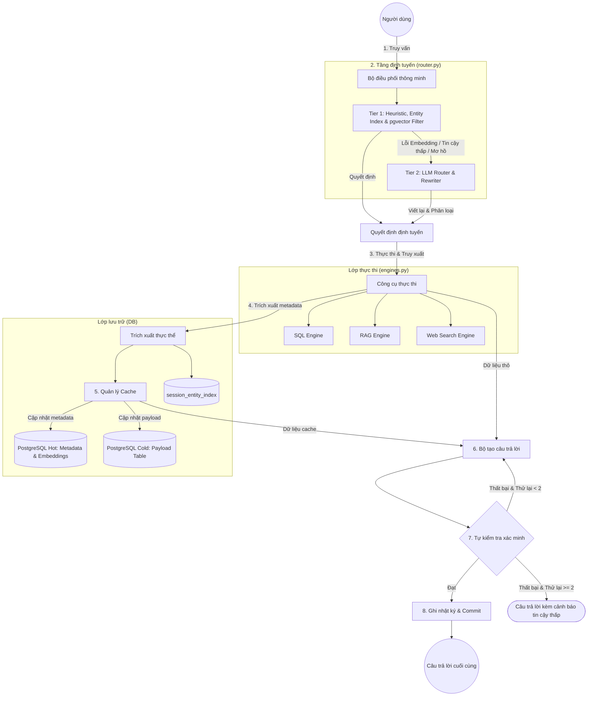

# Tổng quan Kiến trúc Quản lý Ngữ cảnh Đa lượt (Multi-turn Context Management)

Tài liệu này mô tả thiết kế của **Lớp Điều phối Ngữ cảnh Thông minh (Intelligent Context Coordination Layer)** dành cho trợ lý AI. Hệ thống này chuyển đổi từ cơ chế không trạng thái (stateless) sang bộ nhớ đệm ngữ cảnh có trạng thái động (Stateful Context Caching), nhằm tối ưu hóa hiệu suất, giảm độ trễ, tiết kiệm chi phí gọi mô hình và đảm bảo tính nhất quán của câu trả lời.

## 1. Các thành phần hệ thống (System Components)

Hệ thống bao gồm các thành phần chính sau:

### 1.1. Intelligent Orchestrator (Bộ điều phối thông minh)
Đóng vai trò là cổng (gateway) tiếp nhận truy vấn của người dùng (User Query) và quản lý luồng dữ liệu giữa các thành phần.

*   **Direct-Answer Path Routing (Định tuyến phản hồi trực tiếp):** Xác định các kết quả thô từ cache hoặc engine. Nếu kết quả có cấu trúc đơn giản (ví dụ: 1 dòng SQL $\le 5$ cột, hoặc một đoạn trích dẫn Web Search duy nhất với độ liên quan > 0.85) và `needs_retrieval = none`, hệ thống sẽ trả về câu trả lời trực tiếp qua mẫu (template). Nếu `needs_retrieval = partial`, hệ thống bắt buộc phải đi qua luồng LLM để đảm bảo tích hợp ngữ cảnh phù hợp.
*   **Advisory Lock:** Sử dụng khóa cố vấn giao dịch (transaction advisory lock) cấp PostgreSQL dựa trên ID phiên (session ID) được băm thành số nguyên 64-bit (PostgreSQL `bigint`) để ngăn chặn tình trạng tranh chấp (Race Condition) trong cùng một phiên.

### 1.2. 2-Tier Hybrid Router (Bộ định tuyến hỗn hợp 2 lớp)
Tối ưu hóa chi phí token và tính ổn định của hệ thống thông qua hai bước lọc.
*   **Tier 1 (Fast Filter):** Kết hợp các quy tắc heuristic (Regex) và tìm kiếm thực thể nhanh chóng trong `session_entity_index` bằng cách sử dụng ARRAY và pgvector của PostgreSQL. Quyết định chỉ mất dưới 15ms. Lớp này tích hợp trình bao bọc an toàn `_safe_embed()` với thời gian chờ 1.0s và kiểm tra vector 0. Nếu quá trình nhúng (Embedding) thất bại, hệ thống sẽ tự động chuyển sang Tier 2 thay vì bị dừng hoạt động.
*   **Tier 2 (LLM Router & Rewriter):** Chỉ được kích hoạt khi Tier 1 nằm trong vùng xám (mơ hồ) hoặc xảy ra lỗi embedding. Hỗ trợ đa dạng mô hình thông qua **Groq (llama-3.3-70b)** hoặc **Javis Qwen (với suy nghĩ/thought reasoning)** để phân tích sâu lịch sử trò chuyện, xác định loại mối quan hệ (`relation_type`), nhu cầu truy xuất (`needs_retrieval: none | partial | full`) và viết lại truy vấn giải quyết đại từ.

### 1.3. Unified Cache Manager (Trình quản lý cache thống nhất)
Quản lý bộ nhớ đệm bằng cách tách PostgreSQL thành hai bảng: **Hot (Metadata)** và **Cold (Payload)**.
*   **Bảng Hot (`session_context_cache`):** Lưu trữ siêu dữ liệu (metadata) nhẹ, khóa chủ đề (topic key), vector `query_embedding` đại diện cho tâm điểm ngữ cảnh của mỗi slot và dấu thời gian (timestamp).
*   **Bảng Cold (`session_context_payload`):** Lưu trữ dữ liệu thực tế lớn (JSONB). Dữ liệu này chỉ được tải khi bộ định tuyến xác định là **Cache Hit** (`use_cache = true`).
*   **LRU Eviction:** Hệ thống giới hạn tối đa 3 slot cache chủ đề cho mỗi phiên để tối ưu tài nguyên, tự động xóa slot cũ nhất khi vượt giới hạn.
*   **FOR UPDATE Row Locking:** Khóa các hàng trong bảng Cold trong quá trình truy xuất `partial` để ngăn chặn xung đột giữa việc cập nhật payload và việc loại bỏ dữ liệu (LRU eviction).

### 1.4. Execution Engines (Các công cụ thực thi)
Tiếp nhận các tham số truy xuất từng phần `partial_fetch_params` và thực hiện thực thi tối ưu (ví dụ: thêm điều kiện SQL WHERE, lọc ID tài liệu trong RAG) trên nhiều đường ống dữ liệu (pipeline). Các công cụ này có tích hợp sẵn bộ ngắt mạch (circuit breaker) với kiểm soát thời gian chờ.

*   **SQL:** Tự động trích xuất thực thể từ lược đồ có cấu trúc (ví dụ: `transcript_id`, `speaker`).
*   **RAG:** Trích xuất thực thể tài liệu dựa trên siêu dữ liệu (`file_name`).
*   **WEB/MODEL:** Do không có lược đồ cấu trúc, lớp này sử dụng LLM nhẹ để trích xuất các thực thể chính.
*   **Đăng ký chỉ mục (Index Registration):** Thực hiện UPSERT tên hiển thị và các đại từ chỉ định tương ứng (ví dụ: "nó", "cái đó", "cuộc gọi lúc nãy",...) vào `session_entity_index` cho từng thực thể để chuẩn bị cho việc tìm kiếm ở Tier 1.

Chi tiết về các tham số cấu hình và ngưỡng hoạt động, vui lòng tham khảo [Cấu hình và Tinh chỉnh Hệ thống](configuration_and_tuning.md).

## 2. Quy trình vòng đời (Lifecycle Flow)

Quy trình xử lý gồm 8 bước nghiêm ngặt:

1.  **Request Input & Locking:** Người dùng nhập truy vấn, hệ thống lấy Advisory Lock cấp phiên.
2.  **Routing (Tier 1 & Tier 2):** Kiểm tra chỉ mục thực thể phiên và khoảng cách ngữ nghĩa, hoặc gọi LLM để viết lại truy vấn và xác định mục tiêu.
3.  **Execution & Retrieval:** Thực thi truy xuất mới (Full), lấy thêm thông tin (Partial) hoặc tái sử dụng cache (None/Hit).
4.  **Metadata Extraction:** Trích xuất thực thể từ payload mới và chuẩn bị `summary_context`.
5.  **Cache Orchestration:** Upsert dữ liệu vào bảng Hot/Cold, thực hiện giải phóng LRU nếu cần.
6.  **Answer Generation:** Thực hiện luồng LLM hoặc luồng phản hồi trực tiếp (Direct Path).
7.  **Self-Check Verification:** Xác minh xem câu trả lời có mâu thuẫn với ngữ cảnh gốc hoặc có hiện tượng ảo giác (hallucination) hay không.
8.  **Logging & Commit:** Lưu lịch sử chat, metadata và commit giao dịch DB trước khi giải phóng Lock.
