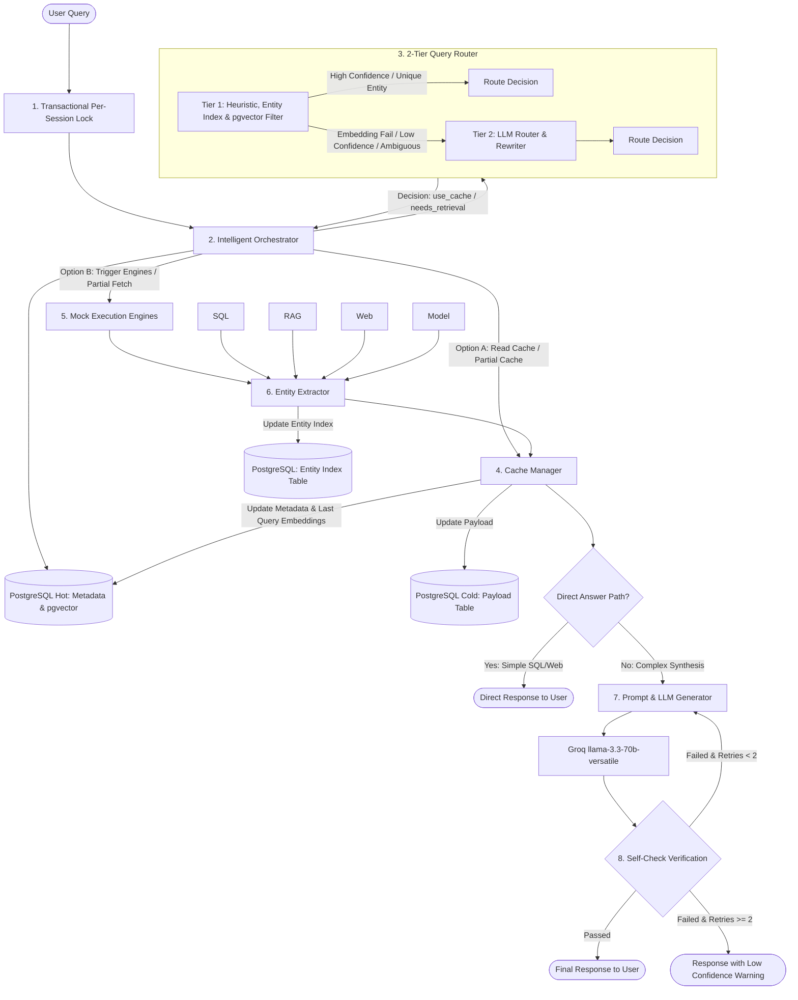

# Tổng Quan Kiến Trúc Hệ Thống (Architecture Overview)
## Quản Lý Ngữ Cảnh Hội Thoại Đa Lượt (Multi-turn Context Management)

Tài liệu này trình bày thiết kế kiến trúc của **Lớp điều phối và Quản lý ngữ cảnh đa lượt (Intelligent Context Coordination Layer)** cho hệ thống Trợ lý AI (AI Assistant). Hệ thống chuyển đổi từ cơ chế không lưu trạng thái (Stateless) sang lưu trạng thái động (Stateful Context Caching) nhằm tối ưu hóa hiệu năng, giảm độ trễ (Latency), tiết kiệm chi phí gọi mô hình (Cost) và đảm bảo tính nhất quán của câu trả lời.

---

## 1. Thành Phần Hệ Thống (System Components)

Kiến trúc giải pháp gồm các thành phần chính hoạt động phối hợp:



### 1.1. Intelligent Orchestrator (Bộ Điều Phối Thông Minh)
Đóng vai trò là cổng tiếp nhận câu hỏi của người dùng (User Query), quản lý luồng dữ liệu giữa các thành phần khác.
* **Transactional Per-Session Lock (Khóa tuần tự theo phiên):** Sử dụng PostgreSQL Advisory Lock (`pg_advisory_xact_lock` hoặc `pg_try_advisory_xact_lock` với timeout 8 giây) để wrap **toàn bộ lifecycle** của một request trong một transaction duy nhất. Đảm bảo tính nhất quán ngữ cảnh tuyệt đối giữa các request song song của cùng một phiên.
* **Direct-Answer Path Routing (Định tuyến câu trả lời trực tiếp):** Nhận dạng kết quả thô từ cache hoặc engine. Nếu kết quả thuộc nhóm cấu trúc đơn giản và `needs_retrieval = none` (SQL 1 dòng $\le 3$ cột, Web Search snippet duy nhất có relevance > 0.85), hệ thống trả về trực tiếp qua template phản hồi. Mọi trường hợp `needs_retrieval = partial` đều đi qua LLM Path để đảm bảo tổng hợp đúng ngữ cảnh.

### 1.2. 2-Tier Query Router & Rewriter (Bộ Định Tuyến & Viết Lại 2 Tầng)
Tối ưu hóa chi phí token và độ ổn định của hệ thống bằng cách chia làm 2 tầng lọc:
* **Tier 1 (Fast Filter):** Sử dụng các luật heuristic (Regex) kết hợp tra cứu thực thể nhanh trong `session_entity_index` bằng PostgreSQL ARRAY và khoảng cách cosine vector (`query_embedding`) bằng pgvector. Quyết định định tuyến nhanh chỉ mất < 15ms. Tích hợp wrapper an toàn `_safe_embed()` với timeout 1.0s và check 0-vector; nếu embedding fail, tự động hạ cấp chuyển lên Tier 2 thay vì crash.
* **Tier 2 (LLM Router & Rewriter):** Chỉ được kích hoạt khi Tier 1 ở vùng xám (mơ hồ) hoặc gặp lỗi embedding. Sử dụng LLM của Groq (llama-3.3-70b) để phân tích sâu, phân giải thực thể thay thế (Co-reference), xác định quan hệ (`relation_type`), nhu cầu truy xuất (`needs_retrieval: none | partial | full`) và sinh tham số truy xuất từng phần (`partial_fetch_params`).

### 1.3. Unified Cache Manager (Quản Lý Cache Hợp Nhất)
Quản lý việc lưu trữ, truy xuất và thu hồi dữ liệu từ database:
* **Tách biệt Hot/Cold Storage:**
  * *Bảng Hot (`session_context_cache`):* Lưu metadata gọn nhẹ, topic key, vector `query_embedding` (được cập nhật mỗi khi `needs_retrieval != none`) và timestamps phục vụ định tuyến và giải phóng LRU.
  * *Bảng Cold (`session_context_payload`):* Lưu trữ payload dữ liệu thô (`cached_payload`) và nội dung tóm tắt ngữ cảnh (`summary_context`).
* **Multi-slot Rolling Cache:** Quản lý tối đa 3 slots cache hoạt động song song per `session_id` với eviction logic LRU tự động (CASCADE xóa bảng Cold).
* **FOR UPDATE Row Locking:** Sử dụng cơ chế khóa dòng tại bảng Cold khi có thao tác `partial` retrieval nhằm ngăn chặn race condition giữa update payload và LRU eviction.

### 1.4. Execution Engines (Các Công Cụ Thực Thi)
Bao gồm các pipeline lấy dữ liệu nguồn được mock hoàn toàn trong PoC, hỗ trợ thêm cơ chế **Partial Retrieval**:
* **SQL, RAG, Web Search:** Nhận các tham số lọc `partial_fetch_params` từ Router để thực thi tối ưu (ví dụ: truy vấn SQL WHERE bổ sung, RAG lọc ID documents) thay vì quét toàn bộ. Tích hợp Circuit Breaker với cơ chế timeout cưỡng bức bất đồng bộ (`asyncio.wait_for`).

### 1.5. Entity Extractor (Bộ Trích Xuất Thực Thể)
Thành phần mới chạy **sau khi** các Execution Engines trả về dữ liệu và **trước khi** Cache Manager ghi dữ liệu vào bảng Cold.
* **Cơ chế hoạt động:** Trích xuất các thực thể chính dựa trên schema cố định đối với SQL (`transcript_id`, `speaker`) và RAG (`file_name`), hoặc sử dụng LLM trích xuất nhẹ cho WEB/MODEL.
* **Ghi chỉ mục:** Thực hiện UPSERT các thực thể kèm danh sách tên hiển thị và đại từ tiếng Việt tương ứng (`display_names` gồm "nó", "ấy", "lúc nãy", v.v.) vào bảng `session_entity_index` để phục vụ tra cứu Tier 1.

---

## 2. Luồng Xử Lý Chi Tiết (Detailed Workflow)

Quy trình xử lý một lượt chat của người dùng ở phiên bản v2 nâng cấp được mô tả qua sequence diagram sau:

```mermaid
sequenceDiagram
    autonumber
    actor User as Người dùng
    participant Orch as Intelligent Orchestrator
    participant Lock as Session Lock Manager
    participant DB as PostgreSQL (Hot/Cold/Entity)
    participant Router as 2-Tier Router
    participant Extractor as Entity Extractor
    participant Engine as Execution Engines
    participant LLM as Final LLM & Verifier (Groq)

    User->>Orch: Gửi câu hỏi (User Query)
    Orch->>Lock: Yêu cầu khóa Session ID (pg_advisory_xact_lock/pg_try_advisory_xact_lock)
    alt Session đang bận xử lý request trước
        Lock->>Lock: Xếp hàng request mới (Queue)
    end
    Lock-->>Orch: Session sẵn sàng (Acquired Lock)
    
    Orch->>DB: Truy vấn Chat History + Entity Index + pgvector Metadata
    DB-->>Orch: Trả về dữ liệu đối sánh
    
    Orch->>Router: Định tuyến Tier 1 (Heuristic / Entity Array Match / pgvector Distance)
    alt Tier 1 thành công (High confidence - Hit hoặc Shift rõ ràng)
        Router-->>Orch: Quyết định định tuyến (needs_retrieval, target_pipeline, target_topic_key)
    else Embedding fail / Tier 1 không chắc chắn (Low confidence / Vùng xám)
        Note over Router: _safe_embed() lỗi hoặc khoảng cách cosine mập mờ -> Fallback sang Tier 2
        Orch->>Router: Định tuyến Tier 2 (LLM Router & Rewriter)
        Router-->>Orch: Quyết định định tuyến (JSON output)
    end
    
    alt needs_retrieval == "none" (Cache Hit)
        Orch->>DB: Đọc Payload từ bảng Cold (session_context_payload)
        DB-->>Orch: Trả về Cached Payload
        Orch->>DB: Cập nhật last_accessed_at cho slot cache (Bảng Hot)
    else needs_retrieval == "partial" (Truy xuất từng phần)
        Orch->>DB: Khóa dòng slot cache (SELECT ... FOR UPDATE) và đọc Payload cũ
        DB-->>Orch: Trả về SQL template / cached documents metadata
        Orch->>Engine: Chạy Engine với filter (partial_fetch_params)
        Engine-->>Orch: Trả về dữ liệu bổ sung
        Orch->>Extractor: Trích xuất thực thể mới từ payload bổ sung
        Extractor->>DB: UPSERT session_entity_index
        Orch->>DB: Cập nhật cache slot payload & refreshed_at = NOW(), query_embedding = rewritten_query_embed
    else needs_retrieval == "full" (Topic Shift)
        Orch->>Engine: Thực thi Target Pipeline gốc
        Engine-->>Orch: Trả về dữ liệu mới hoàn toàn
        Orch->>Extractor: Trích xuất thực thể mới từ payload mới
        Extractor->>DB: UPSERT session_entity_index
        Orch->>DB: Ghi mới cache slot (LRU eviction nếu > 3 slots) & refreshed_at = NOW(), query_embedding = rewritten_query_embed
    end

    alt Direct Answer Path (Simple SQL/Web) và needs_retrieval == "none"
        Orch->>Orch: Khớp template trả lời trực tiếp
        Orch-->>User: Phản hồi kết quả trực tiếp (Direct Answer)
    else Cần tổng hợp phức tạp (hoặc needs_retrieval != "none")
        loop Self-Check Verification (Tối đa 2 lần thử)
            Orch->>LLM: Gửi Prompt (Query + Context từ Cache hoặc Engine)
            LLM-->>Orch: Trả về câu trả lời hoàn chỉnh + kết quả kiểm chứng
            alt Tự kiểm chứng Đạt (Confidence high)
                Note over Orch: Phản hồi câu trả lời trực tiếp
            else Tự kiểm chứng Lỗi và Số lần thử < 2
                Note over Orch: Inject correction instruction và thử lại
            else Tự kiểm chứng Lỗi và Số lần thử >= 2
                Note over Orch: Gắn cờ answer_confidence = 'low' và bổ sung disclaimer
            end
        end
        Orch-->>User: Phản hồi câu trả lời hoàn chỉnh (LLM Answer)
    end
    
    Orch->>DB: Lưu tin nhắn mới và metadata (routing_method, answer_confidence) vào Chat History
    Note over Lock: Tự động giải phóng khóa khi transaction kết thúc (COMMIT/ROLLBACK)
