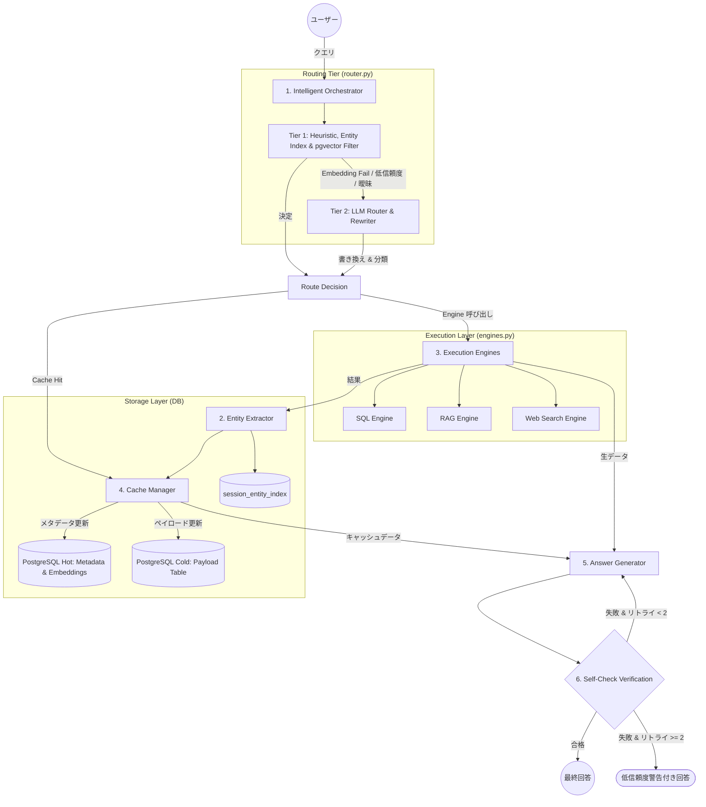

# マルチターン・コンテキスト管理 (Multi-turn Context Management) アーキテクチャ概要

本ドキュメントでは、AIアシスタントのための**高度なコンテキスト調整およびマルチターン管理レイヤー (Intelligent Context Coordination Layer)** の設計について説明します。本システムは、ステートレスなメカニズムから動的なステートフル・コンテキスト・キャッシング (Stateful Context Caching) へと移行することで、パフォーマンスの最適化、レイテンシの低減、モデル呼び出しコストの節約、および回答の一貫性の確保を実現します。

## 1. システム構成要素 (System Components)

システムは以下の主要コンポーネントで構成されています。

### 1.1. Intelligent Orchestrator (高度なオーケストレーター)
ユーザーのクエリ (User Query) を受け取るゲートウェイとして機能し、各コンポーネント間のデータフローを管理します。

*   **Direct-Answer Path Routing (直接回答パス):** キャッシュまたはエンジンからの生の結果を識別します。結果が単純な構造（例：SQL 1行 $\le 3$ 列、relevance > 0.85 の単一 Web Search スニペット）で `needs_retrieval = none` の場合、システムは応答テンプレートを介して直接回答を返します。`needs_retrieval = partial` の場合は、適切なコンテキスト統合を確実にするために必ず LLM パスを経由します。
*   **アドバイザリー・ロック (Advisory Lock):** 82bitのハッシュ化されたセッションIDに基づき、PostgreSQLレベルのトランザクション・アドバイザリー・ロックを使用して、同一セッションでの競合状態（Race Condition）を防止します。

### 1.2. 2-Tier Hybrid Router (2段階ハイブリッド・ルーター)
2段階のフィルタリングにより、トークンコストとシステムの安定性を最適化します。
*   **Tier 1 (Fast Filter):** ヒューリスティック・ルール (Regex) と、PostgreSQLの ARRAY および pgvector を使用した `session_entity_index` での高速な実体（エンティティ）検索を組み合わせます。決定には 15ms 未満しかかかりません。タイムアウト 1.0s と 0ベクトルチェックを備えた安全なラッパー `_safe_embed()` を統合しており、埋め込み（Embedding）に失敗した場合はクラッシュせずに自動的に Tier 2 へフォールバックします。
*   **Tier 2 (LLM Router & Rewriter):** Tier 1 がグレーゾーン（曖昧）であるか、埋め込みエラーが発生した場合にのみ起動します。Groq (llama-3.3-70b) を使用して、チャット履歴の深い分析、共参照解析（Co-reference）、関係性（`relation_type`）の特定、リトリーバル（情報取得）の必要性 (`needs_retrieval: none | partial | full`)、および部分的取得パラメータ (`partial_fetch_params`) の生成を行います。

### 1.3. Unified Cache Manager (統合キャッシュマネージャー)
PostgreSQLを **Hot (Metadata)** と **Cold (Payload)** の2つのテーブルに分離して使用し、キャッシュを管理します。
*   **Hot テーブル (`session_context_cache`):** 軽量なメタデータ、トピックキー、各スロットのコンテキストの中心を表す `query_embedding` ベクトル、および LRU 解放に使用するタイムスタンプを保存します。
*   **Cold テーブル (`session_context_payload`):** 実際の大きなデータ（JSONB）を保存します。ルーターが **Cache Hit** (`use_cache = true`) と判断したときにのみ読み込まれます。
*   **FOR UPDATE Row Locking:** `partial` リトリーバルの際、ペイロードの更新と LRU エビクション（追い出し）の間の競合を防ぐために、Cold テーブルの行をロックします。

### 1.4. Execution Engines (実行エンジン)
部分的取得パラメータ `partial_fetch_params` を受け取り、最適化された実行（例：追加の SQL WHERE 条件、RAG のドキュメント ID フィルタリング）を行う複数のデータソースパイプライン。タイムアウト制御付きのサーキット・ブレーカーを内蔵しています。

*   **SQL:** 定型化されたスキーマから実体を自動抽出（例：`transcript_id`, `speaker`）。
*   **RAG:** メタデータ（`file_name`）に基づきドキュメント実体を抽出。
*   **WEB/MODEL:** 構造化されたスキーマがないため、軽量 LLM を使用して主要な実体を抽出。
*   **インデックス登録:** 各実体に対応する表示名と指示代名詞（例：「それ」、「あれ」、「さっきの通話」など）を `session_entity_index` に UPSERT し、Tier 1 の検索に備えます。

## 2. ライフサイクル・フロー (Lifecycle Flow)

1.  **Request Input:** ユーザーがクエリを入力。
2.  **Tier 1 Check:** セッション・エンティティ・インデックスとセマンティック距離をチェック。
    *   **Tier 1 成功:** 高い信頼性で Hit または Topic Shift を判断。
    *   **Tier 1 不確実:** 埋め込みエラーまたはグレーゾーン。
3.  **Tier 2 (Fallback):** LLM が履歴とキャッシュメタデータを分析し、クエリを書き換えてターゲットを決定。
4.  **Retrieval:**
    *   **None (Hit):** Cold テーブルから既存のペイロードを読み込む。
    *   **Partial (補完):** 既存のペイロードを保持しつつ、特定のフィルタで追加情報を取得してマージ。
    *   **Full (Shift):** 新しいトピックとしてエンジンを実行。
5.  **Index & Cache Update:** 実体を抽出し、`session_entity_index` を更新。同時に、最新のクエリベクトルで `query_embedding` を更新してセマンティック・ドリフトを防止。
6.  **Answer Generation:** LLM パスまたは直接回答パスを実行。
7.  **Self-Check:** 回答が元のコンテキストと矛盾していないか、ハルシネーションがないかを検証。
8.  **Final Response:** ユーザーへ回答を返し、履歴を保存。
