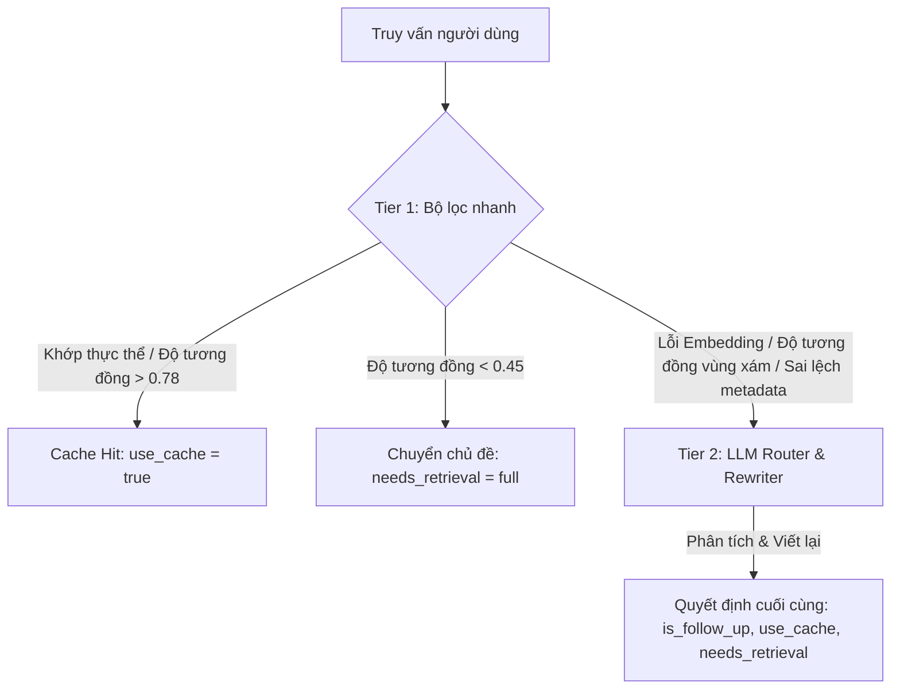

# Quy tắc Quản lý Ngữ cảnh và Định tuyến (Context Management & Routing Rules)

## Tổng quan về Định tuyến 2 lớp (2-Tier Routing)

Để tối ưu hóa chi phí token và tốc độ phản hồi, hệ thống áp dụng cơ chế định tuyến 2 lớp (2-Tier Routing) tích hợp **Tìm kiếm chỉ mục thực thể** và **pgvector**.

### 1. Tier 1: Fast Filter (Heuristic, Tìm kiếm thực thể, Khoảng cách Embedding)

Tier 1 thực hiện tuần tự các bước kiểm tra sau để đưa ra quyết định trong < 15ms:

1.  **Heuristic Switching:** Phát hiện các từ khóa chuyển đổi cứng (ví dụ: "thôi", "hủy", "chuyện khác", "quên đi") bằng Regex để ép định tuyến sang Tier 2 thực hiện Topic Shift.
2.  **Lightweight Entity Index Lookup:**
    *   Sử dụng danh sách hơn 30 đại từ và từ chỉ định (ví dụ: "nó", "người đó", "cuộc gọi lúc nãy", "đó", "họ", "anh ấy").
    *   Tra cứu bảng `session_entity_index`. Nếu khớp duy nhất một thực thể, hệ thống tự động giải quyết đại từ và gán `use_cache = true`.
3.  **Metadata Mismatch Detection (Phát hiện sai lệch):**
    *   Nếu truy vấn đề cập đến một mã GT (ví dụ: GT_05) hoặc một ngày cụ thể khác với thông tin trong Slot Cache gần nhất, hệ thống sẽ ép định tuyến sang Tier 2 để xử lý chuyển chủ đề, tránh việc "râu ông nọ cắm cằm bà kia".
4.  **Semantic Embedding Distance (pgvector):**
    *   **Vùng Xanh (Khoảng cách < 0.22):** Độ tương đồng cao. Coi là cùng một chủ đề (Same Entity).
    *   **Vùng Đỏ (Khoảng cách > 0.55):** Độ tương đồng thấp. Coi là chủ đề mới hoàn toàn (Topic Shift).
    *   **Vùng Xám (0.22 - 0.55):** Không chắc chắn, chuyển sang Tier 2.

5.  **Heuristic Pronoun Resolution (Giải quyết đại từ):**
    *   **Đại từ số ít:** "anh ấy", "cô ấy", "nó" được giải quyết dựa trên thực thể Person hoặc Session gần nhất trong Index. Hệ thống có cơ chế phân biệt giới tính dựa trên tên (ví dụ: 中原 prioritized cho "cô ấy").
    *   **Đại từ số nhiều:** "họ", "hai người họ", "phía bên kia" được giải quyết bằng cách tìm 2 thực thể Person/Session khác nhau gần nhất trong lịch sử để tạo truy vấn so sánh.

### 2. Tier 2: LLM Router & Rewriter (Phân tích nâng cao)

Được kích hoạt khi Tier 1 không thể đưa ra quyết định tin cậy. Hỗ trợ mô hình **Groq (llama-3.3-70b)** hoặc **Javis Qwen** (cho các suy luận phức tạp).

*   **Đầu vào:** 8 tin nhắn lịch sử gần nhất, metadata của 3 Slot Cache đang hoạt động.
*   **Chức năng chính:**
    *   **Co-reference Resolution:** Giải quyết các đại từ phức tạp (ví dụ: "Họ nói gì về giá?" -> "Nhân viên công ty A và B nói gì về giá trong GT_04?").
    *   **Query Rewriting:** Viết lại truy vấn thành câu hoàn chỉnh, độc lập với ngữ cảnh để các Engine (SQL/RAG) xử lý chính xác.
    *   **Pipeline Selection:** SQL (dữ liệu số/cấu trúc), RAG (đọc hiểu văn bản), WEB (thông tin bên ngoài), MODEL (雑談 - hội thoại thông thường).
*   **Đầu ra:** Đối tượng JSON chứa `rewritten_query`, `target_pipeline`, `needs_retrieval`, và `target_topic_key`.

## Cấu trúc và Quản lý Cache (Cache Structure & Management)

### 1. Chính sách quản lý Slot (Slot Management Policy)

*   **LRU Eviction (3 slots):** Hệ thống chỉ giữ tối đa 3 chủ đề nóng nhất cho mỗi phiên. Khi có chủ đề thứ 4, slot có `last_accessed_at` cũ nhất sẽ bị xóa tự động.
*   **TTL (Time To Live):** Đối với dữ liệu từ pipeline WEB, hệ thống kiểm tra `refreshed_at`. Nếu dữ liệu cũ hơn 3600 giây (1 giờ), hệ thống sẽ ép `needs_retrieval = full` để cập nhật thông tin mới nhất.

### 2. Ngăn chặn sự trôi dạt ngữ nghĩa (Embedding Update)

*   **Khi Hit (needs_retrieval = none):** Chỉ cập nhật `last_accessed_at` để duy trì thứ tự LRU.
*   **Khi lấy thêm (needs_retrieval = partial):** Cập nhật `payload` mới (merge), cập nhật `refreshed_at` và cập nhật `query_embedding` bằng vector của truy vấn mới nhất để bám sát trọng tâm ngữ cảnh.
*   **Khi Shift (needs_retrieval = full):** Tạo slot mới hoặc ghi đè slot cũ, lưu embedding mới.

## Thực thi song song và Bảo vệ tính toàn vẹn (Concurrency & Integrity)

*   **Advisory Lock:** Sử dụng `pg_try_advisory_xact_lock` để đảm bảo tính tuần tự của các yêu cầu trong cùng một phiên. Nếu một yêu cầu đang xử lý, yêu cầu thứ hai sẽ phải đợi (retry trong 8 giây) hoặc bị từ chối.
*   **Row Locking (`FOR UPDATE`):** Khi thực hiện cập nhật `partial`, hệ thống khóa hàng dữ liệu trong bảng `session_context_cache` để tránh việc tiến trình khác xóa slot đó do chính sách LRU.
