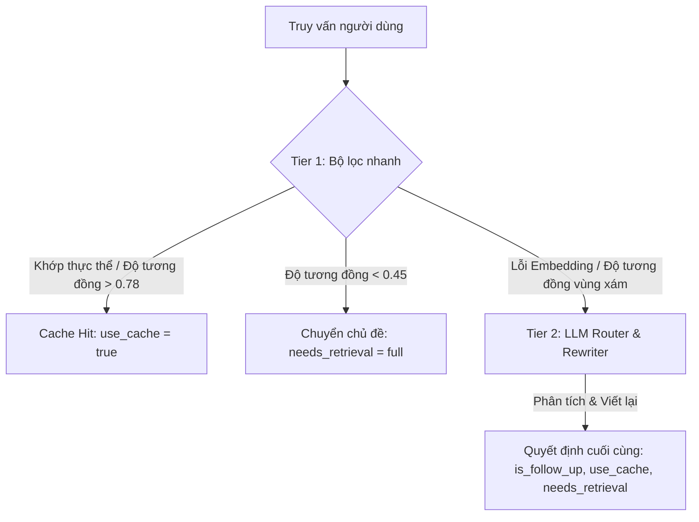

# Quy tắc Quản lý Ngữ cảnh và Định tuyến (Context Management & Routing Rules)

## Tổng quan về Định tuyến 2 lớp (2-Tier Routing)

Để tối ưu hóa chi phí token và tốc độ phản hồi, hệ thống áp dụng cơ chế định tuyến 2 lớp (2-Tier Routing) tích hợp **Tìm kiếm chỉ mục thực thể** và **pgvector**.

### 1. Tier 1: Fast Filter (Heuristic, Tìm kiếm thực thể, Khoảng cách Embedding)

Tier 1 thực hiện tuần tự 4 bước kiểm tra sau:

1.  **Heuristic (Regex & Rule):** Phát hiện các từ khóa chuyển đổi chủ đề như chào hỏi, "vậy còn", "chuyện khác", "bỏ qua",... và đưa ra quyết định Topic Shift ngay lập tức.
2.  **Lightweight Entity Index Lookup (Tìm kiếm thực thể nhanh):**
    *   Kiểm tra xem truy vấn có chứa các đại từ hoặc từ chỉ định (ví dụ: "nó", "cái đó", "lúc nãy", "người đó", "này") hay không.
    *   Thực hiện tìm kiếm ARRAY trong SQL trên bảng `session_entity_index` để xác định các thực thể liên quan đến phiên hiện tại.
    *   Nếu khớp với một thực thể duy nhất: Đặt `use_cache = true` và chuyển nhanh đến Slot Cache tương ứng mà không cần tính toán embedding hay thông qua LLM (mất khoảng 1-2ms).
3.  **Semantic Embedding Distance (pgvector):**
    *   Sử dụng mô hình `multilingual-e5-small` để tạo vector embedding $V_{new}$ cho truy vấn.
    *   Tính toán khoảng cách cosine với `query_embedding` của từng Slot Cache hiện có.
    *   **Khớp với độ tin cậy cao (Khoảng cách < 0.22 / Độ tương đồng > 0.78):** Tự động gán vào chủ đề có độ tương đồng cao nhất và đặt `use_cache = true`.
    *   **Chuyển đổi ngữ nghĩa (Khoảng cách > 0.55 / Độ tương đồng < 0.45):** Xác định là một chủ đề hoàn toàn mới và đặt `needs_retrieval = "full"`.
4.  **Trình bao bọc Embedding an toàn (`_safe_embed()`):**
    *   Có tính năng timeout 1.0s và kiểm tra vector 0. Nếu mô hình embedding gặp sự cố, hệ thống sẽ bỏ qua Tier 1 và chuyển sang Tier 2 với lý do `routing_reason = 'embedding_failure'`.

### 2. Tier 2: LLM Router & Rewriter (Phân tích nâng cao)

Được kích hoạt khi Tier 1 xác định kết quả nằm trong vùng xám hoặc xảy ra lỗi embedding. Groq LLM (llama-3.3-70b) sẽ phân tích sâu lịch sử trò chuyện và metadata cache đang hoạt động.

*   **Đầu vào:** Lịch sử trò chuyện mới nhất (8 lượt), danh sách metadata cache đang hoạt động.
*   **Đầu ra:** Trả về một đối tượng JSON bao gồm:
    *   `is_follow_up`: Có phải là tiếp nối nội dung trước đó hay không.
    *   `use_cache`: Có thể tái sử dụng payload cache hiện có không.
    *   `needs_retrieval`: "none" (cache đã đủ), "partial" (cần truy xuất thêm có điều kiện), "full" (truy xuất mới).
    *   `rewritten_query`: Truy vấn tiếng Nhật/Việt đã được viết lại, bổ sung đại từ và làm rõ ngữ cảnh.
    *   `target_topic_key`: Khóa của slot mục tiêu.
    *   `target_pipeline`: SQL | RAG | WEB | MODEL.
    *   `partial_fetch_params`: Các tham số lọc khi truy xuất `partial` (như mệnh đề SQL WHERE hoặc ID tài liệu).

## Cấu trúc và Quản lý Cache (Cache Structure & Management)

### 1. Cấu trúc Payload Cache thống nhất (Unified Cache Payload Structure)

Mỗi pipeline (SQL, RAG, WEB) lưu trữ payload theo định dạng đã được tối ưu hóa riêng:

*   **SQL:** `{"generated_sql": "...", "rows": [...]}`
*   **RAG:** `{"documents": [{"text": "...", "score": 0.9, "metadata": {...}}, ...]}`
*   **WEB:** `{"results": [{"title": "...", "url": "...", "snippet": "..."}], "query_used": "..."}`

### 2. Chính sách quản lý Slot (Slot Management Policy)

Hệ thống quản lý song song 3 Slot Cache và duy trì độ mới bằng các dấu thời gian sau:

*   **`last_accessed_at` (Thời gian truy cập cuối):** Cập nhật sau mỗi lần đọc/ghi. Đây là tiêu chí để loại bỏ dữ liệu theo thuật toán LRU (Least Recently Used).
*   **`refreshed_at` (Thời gian cập nhật dữ liệu):** Chỉ cập nhật khi thực thi engine bên ngoài để lấy dữ liệu. Dùng để kiểm tra TTL (Time To Live) của pipeline WEB.

### 3. Ngăn chặn sự trôi dạt ngữ nghĩa (Embedding Update)

*   **`needs_retrieval != "none"` (Truy xuất mới/từng phần):** Do tâm điểm ngữ cảnh thay đổi theo các câu hỏi tiếp nối của người dùng, hệ thống sẽ **bắt buộc cập nhật** `query_embedding` bằng vector của truy vấn đã được viết lại.
*   **`needs_retrieval == "none"` (Cache Hit):** Để tiết kiệm tài nguyên, chỉ cập nhật `last_accessed_at` và không cập nhật embedding.

## Thực thi song song và Bảo vệ tính toàn vẹn (Concurrency & Integrity)

Để ngăn chặn xung đột (Race Condition) do các yêu cầu liên tiếp trong cùng một phiên, hệ thống thực hiện bảo vệ qua 2 lớp:

1.  **Transaction Advisory Lock:** Giữ một khóa độc quyền cấp PostgreSQL từ lúc bắt đầu đến khi kết thúc bộ điều phối (Orchestrator).
2.  **Khóa mức hàng (FOR UPDATE):** Trong quá trình truy xuất từng phần (`partial`), khóa hàng metadata tương ứng để đảm bảo nó không bị xóa bởi cơ chế LRU.
