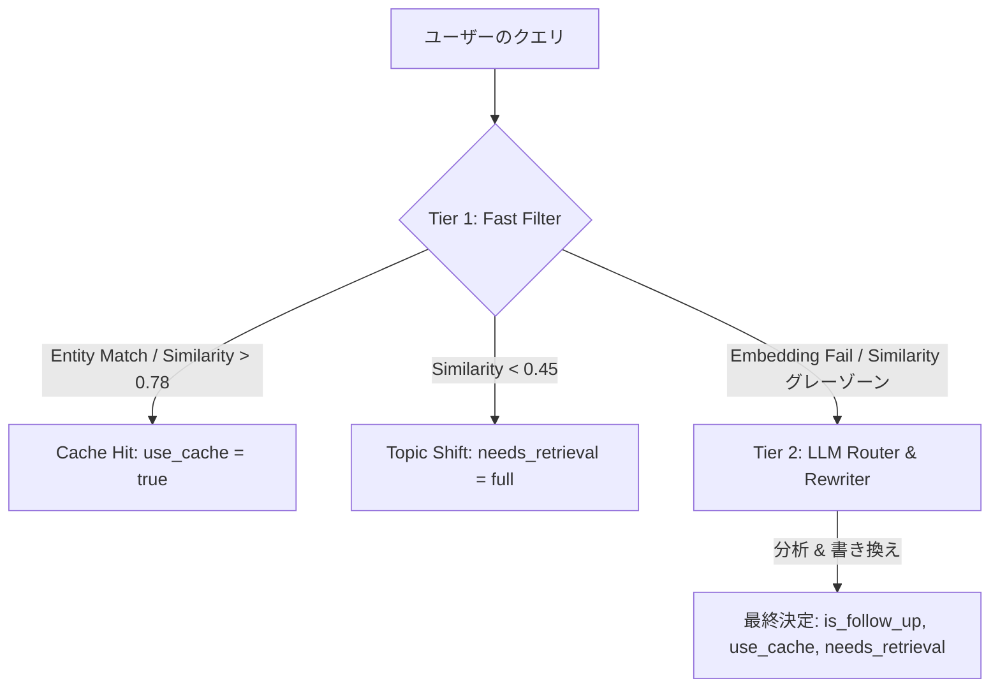

# コンテキスト管理とルーティング規則 (Context Management & Routing Rules)

## 2段階ルーティング (2-Tier Routing) の概要

トークンコストの最適化とレスポンスの高速化を実現するため、システムは **エンティティ・インデックス検索** と **pgvector** を統合した2段階ルーティング (2-Tier Routing) を採用しています。

### 1. Tier 1: Fast Filter (ヒューリスティック、エンティティ検索、埋め込み距離)

Tier 1 は、以下の4つのチェックを順次実行します。

1.  **Heuristic (Regex & Rule):** 挨拶や「やっぱり」「別の話」「スキップ」などのトピック切り替えキーワードを検出し、即座に Topic Shift を判断します。
2.  **Lightweight Entity Index Lookup (高速エンティティ検索):**
    *   クエリ内に代名詞や指示語（例：「それ」、「あれ」、「さっきの」、「その人」、「これ」）が含まれているかチェックします。
    *   `session_entity_index` テーブルに対して SQL の ARRAY 検索を行い、現在のセッションに関連付けられた実体を特定します。
    *   単一の実体が一致した場合：`use_cache = true` を設定し、埋め込み計算や LLM を介さずに該当する Cache Slot へ高速に転送します（約1-2ms）。
3.  **Semantic Embedding Distance (pgvector):**
    *   `multilingual-e5-small` モデルを使用してクエリの埋め込みベクトル $V_{new}$ を生成します。
    *   既存の各 Cache Slot の `query_embedding` との余弦距離を計算します。
    *   **High Confidence Match (Distance < 0.22 / Similarity > 0.78):** 最も類似度の高いトピックに自動割り当てし、`use_cache = true` とします。
    *   **Semantic Shift (Distance > 0.55 / Similarity < 0.45):** 完全に新しいトピックと判断し、`needs_retrieval = "full"` とします。
4.  **安全な埋め込みラッパー (`_safe_embed()`):**
    *   タイムアウト 1.0s と 0ベクトルチェックを備えています。埋め込みモデルに障害が発生した場合は、Tier 1 をバイパスして `routing_reason = 'embedding_failure'` として Tier 2 へフォールバックします。

### 2. Tier 2: LLM Router & Rewriter (高度な分析)

Tier 1 がグレーゾーンと判断した、あるいは埋め込みエラーが発生した場合に起動します。Groq LLM (llama-3.3-70b) がチャット履歴とアクティブなキャッシュ・メタデータを深く分析します。

*   **入力:** 最新のチャット履歴（8ターン）、アクティブなキャッシュ・メタデータのリスト。
*   **出力:** 以下の JSON オブジェクトを返します。
    *   `is_follow_up`: 前の話題の継続かどうか。
    *   `use_cache`: 既存のキャッシュ・ペイロードを再利用できるか。
    *   `needs_retrieval`: "none" (キャッシュで十分), "partial" (追加の条件付き取得が必要), "full" (新規取得)。
    *   `rewritten_query`: 代名詞を補完し、文脈を明確化した日本語クエリ。
    *   `target_topic_key`: 対象となるスロットのキー。
    *   `target_pipeline`: SQL | RAG | WEB | MODEL。
    *   `partial_fetch_params`: `partial` 取得時のフィルタパラメータ（SQL WHERE 句やドキュメント ID など）。

## キャッシュの構造と管理 (Cache Structure & Management)

### 1. 統一キャッシュ・ペイロード構造 (Unified Cache Payload Structure)

各パイプライン（SQL, RAG, WEB）は、それぞれ最適化された形式でペイロードを保持します。

*   **SQL:** `{"generated_sql": "...", "rows": [...]}`
*   **RAG:** `{"documents": [{"text": "...", "score": 0.9, "metadata": {...}}, ...]}`
*   **WEB:** `{"results": [{"title": "...", "url": "...", "snippet": "..."}], "query_used": "..."}`

### 2. スロット管理のポリシー

システムは3つの Cache Slot を並列で管理し、以下のタイムスタンプを使用して鮮度を維持します。

*   **`last_accessed_at` (最終アクセス日時):** 読み書きのたびに更新。LRU (Least Recently Used) 追い出しの基準となります。
*   **`refreshed_at` (データ更新日時):** 外部エンジンを実行してデータを取得したときにのみ更新。WEB パイプラインの TTL (生存期間) チェックに使用します。

### 3. セマンティック・ドリフトの防止 (Embedding Update)

*   **`needs_retrieval != "none"` (新規・部分取得):** ユーザーの継続的な質問によって文脈の中心が変化するため、`query_embedding` を書き換え後のクエリベクトルで **強制的に更新** します。
*   **`needs_retrieval == "none"` (キャッシュ・ヒット):** リソース節約のため `last_accessed_at` の更新のみ行い、埋め込みは更新しません。

## 並行実行と整合性の保護 (Concurrency & Integrity)

同一セッションへの連続したリクエストによる競合（Race Condition）を防ぐため、以下の2段階の保護を行っています。

1.  **トランザクション・アドバイザリー・ロック (Transaction Advisory Lock):** オーケストレーターの開始から終了まで、PostgreSQL レベルの排他ロックを保持します。
2.  **行レベルロック (FOR UPDATE):** 部分取得 (`partial` retrieval) 中に、メタデータ行が LRU エビクションによって削除されないよう、該当行をロックします。
