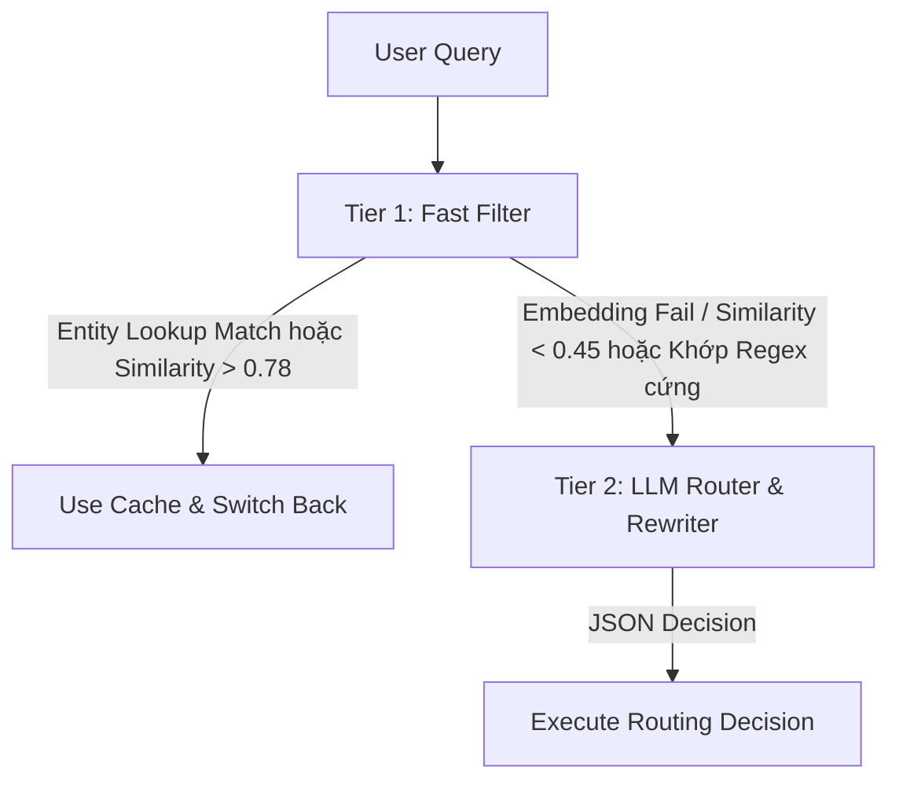

# Quy Tắc Quản Lý Ngữ Cảnh (Context Management & Routing Rules)
## Quản Lý Ngữ Cảnh Hội Thoại Đa Lượt (Multi-turn Context Management)

Tài liệu này đặc tả chi tiết các quy tắc xử lý logic của **Bộ phân giải ngữ cảnh (Query Resolver)**, định dạng lưu trữ cache của các pipeline, thuật toán phát hiện chuyển đổi chủ đề (Topic Switching), và cơ chế khóa đồng thời chống race condition ở phiên bản v3 nâng cấp.

---

## 1. Bộ Phân Giải Ngữ Cảnh 2 Tầng (2-Tier Query Resolution)

Để tối ưu hóa chi phí token và tốc độ phản hồi, hệ thống áp dụng cơ chế định tuyến và viết lại câu hỏi 2 tầng (2-Tier Routing) tích hợp tra cứu Entity Index và pgvector.



### 1.1. Tầng 1: Fast Filter (Heuristic, Entity Lookup & Embedding Distance)
Hệ thống thực hiện bốn bước kiểm tra siêu nhanh theo thứ tự:
1. **Heuristic (Regex & Rule):** Khớp các câu chào hỏi xã giao hoặc các lệnh chuyển mạch cứng (ví dụ: "à thôi", "chuyển sang", "bỏ qua") để xác định nhanh Topic Shift.
2. **Lightweight Entity Index Lookup (Tra cứu thực thể nhanh):**
   * Phân tích câu hỏi mới để tìm các đại từ thay thế hoặc từ chỉ định tiếng Việt (ví dụ: "ấy", "nó", "lúc nãy", "ông đó", "họ", "file này").
   * Thực hiện truy vấn nhanh trên bảng `session_entity_index` bằng câu lệnh SQL ARRAY check:
     ```sql
     SELECT cache_slot_id, entity_id, entity_type 
     FROM session_entity_index 
     WHERE session_id = $1 AND display_names @> ARRAY[$2]::TEXT[];
     ```
   * Nếu có một thực thể khớp chính xác duy nhất: Thiết lập `use_cache = true` (hoặc `needs_retrieval = "none"` nếu dữ liệu cũ đủ), chuyển tiếp nhanh sang Cache Slot tương ứng mà không cần chạy mô hình embedding hay LLM lớn (~1-2ms).
3. **Semantic Embedding Distance (pgvector):**
   * Sử dụng mô hình embedding nhỏ (`multilingual-e5-small`) để sinh vector $V_{new}$ (384 dimensions) cho câu hỏi mới thông qua wrapper an toàn `_safe_embed()`.
   * Chạy truy vấn tương đồng Cosine trực tiếp trên PostgreSQL (tận dụng B-tree index `idx_context_cache_session_topic` để lọc theo `session_id` trước):
     ```sql
     SELECT c.topic_key, c.last_pipeline, (c.query_embedding <=> $1) as distance 
     FROM session_context_cache c
     WHERE c.session_id = $2
     ORDER BY distance ASC
     LIMIT 1;
     ```
   * **Ngưỡng quyết định:**
     * **High Confidence Match (Distance < 0.22 tương đương Similarity > 0.78):** Tự động gán vào topic có độ tương đồng cao nhất. Thiết lập `use_cache = true` (needs_retrieval = "none" hoặc "partial"), cập nhật `last_accessed_at = NOW()`.
     * **High Confidence Shift (Distance > 0.55 tương đương Similarity < 0.45):** Tự động kết luận Topic Shift, chuyển `use_cache = false` (`needs_retrieval = "full"`) và chạy trực tiếp pipeline phù hợp dựa trên heuristic keyword.
     * **Vùng xám (0.22 <= Distance <= 0.55):** Chuyển tiếp lên **Tier 2 (LLM Router)** xử lý.
4. **Wrapper an toàn Embedding (`_safe_embed()`):**
   * Tích hợp cơ chế ngắt thời gian (timeout 1.0s) và kiểm tra vector 0. Nếu mô hình embedding gặp sự cố, Tier 1 tự động bypass kết quả và hạ cấp định tuyến sang Tier 2 với lý do lỗi hệ thống (`routing_reason = 'embedding_failure'`), đảm bảo trợ lý không bị treo.

```python
async def _safe_embed(query: str) -> np.ndarray:
    try:
        # Timeout 1.0s cưỡng bức cho embedding model
        vector = await asyncio.wait_for(embedding_client.embed(query), timeout=1.0)
        if vector is None or np.allclose(vector, 0):
            raise ValueError("Mô hình trả về vector 0 hoặc rỗng")
        return vector
    except (asyncio.TimeoutError, Exception) as e:
        logging.warning(f"Lỗi embedding model: {str(e)}. Tự động chuyển tiếp lên LLM Router.")
        return None
```

### 1.2. Tầng 2: LLM Router & Rewriter (Gọi LLM Lớn)
Khi Tier 1 chuyển tiếp câu hỏi lên Tier 2 do ở vùng xám hoặc gặp lỗi embedding, mô hình Groq LLM (llama-3.3-70b) sẽ phân tích sâu lịch sử và danh sách cache metadata.

#### Cấu trúc Prompt dành cho LLM Router:
```text
Bạn là một AI Router và Query Rewriter chuyên nghiệp.
Nhiệm vụ của bạn là phân tích câu hỏi mới của người dùng (User Query) dựa trên Lịch sử Chat gần nhất và danh sách các Cache Metadata của các chủ đề trước đó.

[LỊCH SỬ CHAT]
{chat_history}

[DANH SÁCH CACHE ĐANG HOẠT ĐỘNG]
{active_caches_metadata}
Ví dụ mỗi cache metadata được định cấu trúc JSON như sau:
{
  "topic_key": "GT_04_yokobori_nakahara",
  "last_pipeline": "SQL",
  "last_accessed_at": "2026-06-15T08:35:00Z",
  "refreshed_at": "2026-06-15T08:30:00Z",
  "summary_context": {
    "entity_type": "meeting_transcript",
    "entity_id": "GT_04",
    "display_name": "Cuộc gọi GT_04 (Nakahara Rinka)",
    "key_attributes": {
      "date": "2026-05-04",
      "participants": ["横堀", "中原凛花"]
    }
  }
}

[CÂU HỎI MỚI]
"{user_query}"

Hãy thực hiện phân tích và trả về một đối tượng JSON chuẩn theo cấu trúc dưới đây (không kèm theo lời giải thích hoặc markdown):
{
  "is_follow_up": boolean,          // Đúng nếu người dùng đang hỏi nối tiếp hoặc làm rõ thông tin cũ.
  "relation_type": string,          // Phân loại quan hệ: "same_entity" | "same_document" | "same_subject_new_param" | "topic_shift" | "clarification"
  "use_cache": boolean,             // Đúng nếu câu hỏi nối tiếp có thể tái sử dụng dữ liệu trong Cache payload cũ mà không cần gọi engine ngoài.
  "needs_retrieval": string,        // "none" (đã có đủ data trong cache), "partial" (cần query thêm filter/param từ context cũ), "full" (truy vấn mới hoàn toàn)
  "context_reuse_type": string,     // "full_data_reuse", "query_rewrite_only", hoặc "none".
  "rewritten_query": string,        // Câu hỏi mới đã được viết lại đầy đủ ý nghĩa, tự động giải quyết các đại từ thay thế.
  "target_topic_key": string,       // Topic key tương ứng của cache slot được chọn. Nếu là topic mới, hãy đặt tên topic mới.
  "target_pipeline": string,        // Chỉ định pipeline thực thi nếu use_cache = false. Giá trị: "RAG", "SQL", "WEB", hoặc "MODEL".
  "partial_fetch_params": {         // Điền tham số lọc nếu needs_retrieval = "partial", ngược lại để null.
    "sql_filter": string,           // Điều kiện WHERE bổ sung (ví dụ: "WHERE transcript_id = 'e00b8e64-e129-57ef-b75f-97216a695d73'")
    "rag_doc_ids": string[],        // Danh sách ID tài liệu cần lọc vector search
    "web_query_append": string      // Từ khóa/site phụ thêm vào query search
  }
}
```

---

## 2. Cấu Trúc Cache Cho Từng Pipeline (Unified Cache Payload Structure)

Dữ liệu payload thô được lưu trữ tại bảng **Cold** (`session_context_payload`) để tránh row bloat cho bảng **Hot** (`session_context_cache`). Cấu trúc payload theo từng pipeline như sau:

### 2.1. Pipeline 1: RAG (Retrieval-Augmented Generation)
```json
{
  "source": "vector_db",
  "documents": [
    {
      "chunk_id": "gt_04_chunk_0",
      "text": "[横堀]：お忙しいところ恐れ入ります。三菱ＵＦＪ銀行の横堀と申します。中原凛花様はいらっしゃいますでしょうか。",
      "score": 0.925,
      "metadata": {
        "file_name": "GT_04.txt"
      }
    }
  ]
}
```

### 2.2. Pipeline 2: SQL (Text-to-SQL)
```json
{
  "source": "relational_db",
  "generated_sql": "SELECT duration_seconds, summary FROM transcripts WHERE meeting_date = '2026-05-04';",
  "rows": [
    {
      "id": "e00b8e64-e129-57ef-b75f-97216a695d73",
      "session_id": "GT_04",
      "meeting_date": "2026-05-04",
      "duration_seconds": 105,
      "summary": "Transcript of meeting GT_04."
    }
  ]
}
```

### 2.3. Pipeline 3: WEB (Web Search Engine)
```json
{
  "source": "google_search_api",
  "ttl_seconds": 3600,
  "query_used": "AJ Technologies Yamashita",
  "results": [
    {
      "title": "AJ Technologies Company Profile",
      "url": "https://aj-tech.example.com/about",
      "snippet": "AJ Technologies Yamashita specializes in construction management and systems integration."
    }
  ]
}
```

---

## 3. Quy Tắc Chuyển Đổi Chủ Đề & Quản Lý Cache (Topic Switching & Cache Management)

Hệ thống quản lý trạng thái cache của 3 slots song song một cách độc lập thông qua việc tách biệt hai mốc thời gian và khắc phục triệt để lỗi Embedding Staleness (Nhạt hóa/Lỗi thời embedding).

### 3.1. Phân Biệt Hai Mốc Thời Gian
* **`last_accessed_at` (Thời điểm truy cập cuối):** Cập nhật mỗi khi cache slot được đọc hoặc ghi. Dùng làm tiêu chí để giải phóng LRU (xóa slot ít được dùng nhất khi đạt ngưỡng 3 slots).
* **`refreshed_at` (Thời điểm làm mới dữ liệu):** Chỉ cập nhật khi hệ thống chạy các Execution Engine ngoài để lấy dữ liệu mới. Dùng làm căn cứ để tính toán thời gian sống của cache (TTL check).

### 3.2. Khắc phục Embedding Staleness (Cập nhật Vector)
Vector `query_embedding` tại bảng Hot (`session_context_cache`) đại diện cho trọng tâm ngữ cảnh của slot đó. 
* Khi người dùng hỏi nối tiếp làm thay đổi dữ liệu hoặc bộ lọc (`needs_retrieval != "none"`, gồm `partial` và `full` retrieval), hệ thống **bắt buộc cập nhật** `query_embedding` theo vector của câu hỏi mới đã viết lại (`rewritten_query`) để tránh lệch tâm ngữ cảnh ở các câu hỏi tiếp theo.
* Nếu là cache hit thuần túy (`needs_retrieval == "none"`), hệ thống **chỉ cập nhật** `last_accessed_at` (touch cache) mà không sinh lại embedding để tiết kiệm tài nguyên.

```python
async def touch_cache_slot(session_id: str, topic_key: str):
    # Chỉ cập nhật timestamp truy cập để xếp hạng LRU (Cache Hit)
    await db.execute(
        "UPDATE session_context_cache SET last_accessed_at = NOW() WHERE session_id = $1 AND topic_key = $2",
        session_id, topic_key
    )

async def update_cache_slot(session_id: str, topic_key: str, payload: dict, rewritten_query: str = None):
    # Cập nhật dữ liệu ở bảng Cold và đồng thời làm mới embedding ở bảng Hot nếu metadata thay đổi (needs_retrieval != none)
    embedding = None
    if rewritten_query:
        embedding = await _safe_embed(rewritten_query)
        
    async with db.transaction():
        # [Locking Gap 2]: FOR UPDATE Lock dòng để tránh việc chạy Partial Fetch song song bị LRU Eviction xóa mất
        await db.execute(
            "SELECT 1 FROM session_context_cache WHERE session_id = $1 AND topic_key = $2 FOR UPDATE",
            session_id, topic_key
        )
        
        await db.execute(
            "UPDATE session_context_payload SET cached_payload = $1 WHERE session_id = $2 AND topic_key = $3",
            payload, session_id, topic_key
        )
        
        if embedding is not None:
            await db.execute(
                """
                UPDATE session_context_cache 
                SET last_accessed_at = NOW(), refreshed_at = NOW(), query_embedding = $1 
                WHERE session_id = $2 AND topic_key = $3
                """,
                embedding, session_id, topic_key
            )
        else:
            await db.execute(
                """
                UPDATE session_context_cache 
                SET last_accessed_at = NOW(), refreshed_at = NOW() 
                WHERE session_id = $1 AND topic_key = $2
                """,
                session_id, topic_key
            )
```

### 3.3. Quy Trình Kiểm Tra TTL Cho Cache Động
Trước khi đồng ý sử dụng cache của pipeline `WEB`, hệ thống kiểm tra thời hạn hiệu lực dựa trên mốc `refreshed_at` của slot cache và thời gian lưu trữ ở bảng Hot:
```python
from datetime import datetime, timezone

def check_cache_ttl(refreshed_at: datetime, ttl_seconds: int = 3600) -> bool:
    if not refreshed_at:
        return False # Không có timestamp -> coi như stale
        
    now = datetime.now(timezone.utc)
    age_seconds = (now - refreshed_at).total_seconds()
    return age_seconds <= ttl_seconds
```
Nếu `check_cache_ttl` trả về `False`, hệ thống sẽ đặt `use_cache = false` để buộc phải lấy lại dữ liệu mới từ Web Search.

---

## 4. Quản Lý Đồng Thời: Advisory Lock & Row Lock (Concurrency Controls)

Để tránh các race condition cực kỳ nguy hiểm (như một câu hỏi dài đang xử lý dữ liệu dở dang thì câu hỏi tiếp theo chen vào đẩy cache slot đó ra khỏi LRU), hệ thống sử dụng cơ chế khóa 2 tầng bảo vệ:

### 4.1. Transactional Advisory Lock (Khóa Giao Dịch Session)
Wrap toàn bộ lifecycle của request (từ lúc Routing, chạy Engine, trích xuất thực thể, cho đến khi ghi DB thành công) trong duy nhất một transaction có gắn Advisory Lock. Hệ thống sử dụng khóa không chặn đứng hoàn toàn mà có timeout (`pg_try_advisory_xact_lock` với 8 giây thử lại) để ngăn chặn thắt nút cổ chai vô hạn.

```python
import time
import asyncio

class SessionLockManager:
    def __init__(self, db, session_id: str, timeout_seconds: float = 8.0):
        self.db = db
        self.session_id = session_id
        self.timeout_seconds = timeout_seconds
        # Băm session_id sang khóa số 64-bit int của Postgres
        self.lock_id = hash(session_id) & 0x7FFFFFFFFFFFFFFF

    async def __aenter__(self):
        start_time = time.time()
        while time.time() - start_time < self.timeout_seconds:
            # Lấy khóa giao dịch Postgres (tự giải phóng khi transaction kết thúc)
            locked = await self.db.fetch_val("SELECT pg_try_advisory_xact_lock($1)", self.lock_id)
            if locked:
                return self
            await asyncio.sleep(0.1)
        raise TimeoutError(f"Không lấy được khóa session {self.session_id} sau {self.timeout_seconds} giây")

    async def __aexit__(self, exc_type, exc_val, exc_tb):
        pass # Postgres tự giải phóng khóa khi COMMIT/ROLLBACK giao dịch ngoại vi
```

### 4.2. Row Locking (`FOR UPDATE`)
Trong quá trình truy xuất từng phần (`needs_retrieval == "partial"`), Orchestrator sẽ khóa dòng metadata của cache slot đó bằng `SELECT ... FOR UPDATE` trước khi kích hoạt chạy Engine ngoài. Việc này ngăn chặn tuyệt đối tiến trình chạy song song của cùng phiên hoặc lệnh dọn dẹp cache vô tình evict dòng này khỏi database trước khi hoàn thành cập nhật payload.

---

## 5. Tự Động Hạ Cấp Khi Lỗi Engine (Circuit Breaker Timeout)

Khi các công cụ dữ liệu bên ngoài (SQL, RAG, Web Search) bị treo hoặc lỗi, hệ thống sử dụng cơ chế timeout cưỡng bức bất đồng bộ (`asyncio.wait_for`) để ngắt luồng xử lý và chuyển sang chế độ hạ cấp an toàn:

```python
import asyncio
import logging
import time

class EngineCircuitBreaker:
    def __init__(self, engine, failure_threshold: int = 3, cooldown_seconds: int = 30, timeout_seconds: float = 3.0):
        self.engine = engine
        self.failure_threshold = failure_threshold
        self.cooldown_seconds = cooldown_seconds
        self.timeout_seconds = timeout_seconds
        
        self.failures = 0
        self.state = "CLOSED"  # CLOSED / OPEN / HALF_OPEN
        self.last_state_change = time.time()

    async def execute(self, query: str):
        now = time.time()
        if self.state == "OPEN":
            if now - self.last_state_change > self.cooldown_seconds:
                self.state = "HALF_OPEN"
                self.last_state_change = now
                logging.info("Circuit Breaker chuyển sang HALF_OPEN. Thử nghiệm request...")
            else:
                logging.warning("Circuit đang OPEN. Hạ cấp nhanh sang Parametric Model.")
                return "parametric_knowledge", {"error": "Circuit is OPEN", "fallback": True}

        try:
            # Thực thi có timeout cưỡng bức thực tế ở tầng async
            result = await asyncio.wait_for(
                self.engine.execute(query), 
                timeout=self.timeout_seconds
            )
            
            if self.state == "HALF_OPEN":
                self.failures = 0
                self.state = "CLOSED"
                logging.info("Circuit Breaker khôi phục về CLOSED.")
            return result
            
        except (asyncio.TimeoutError, Exception) as e:
            logging.error(f"Engine lỗi hoặc quá hạn timeout: {str(e)}")
            self.failures += 1
            if self.failures >= self.failure_threshold:
                self.state = "OPEN"
                self.state = "OPEN"
                self.last_state_change = time.time()
                logging.error("Circuit Breaker kích hoạt OPEN. Tạm dừng Engine.")
            return "parametric_knowledge", {"error": f"Engine failed: {str(e)}", "fallback": True}
