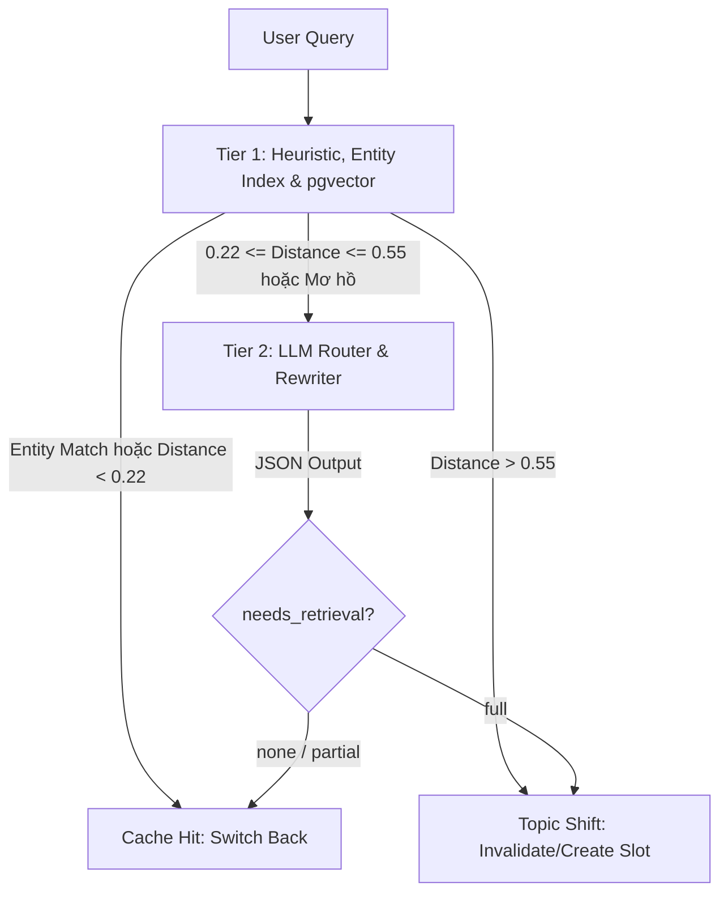
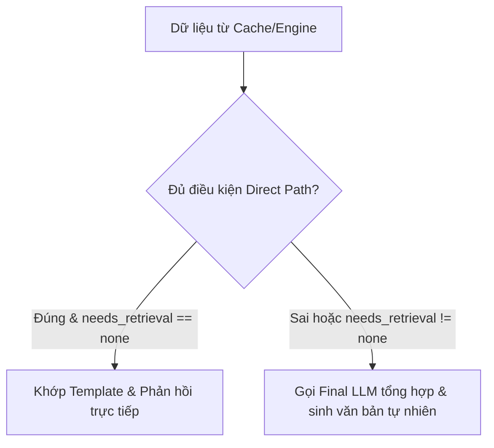
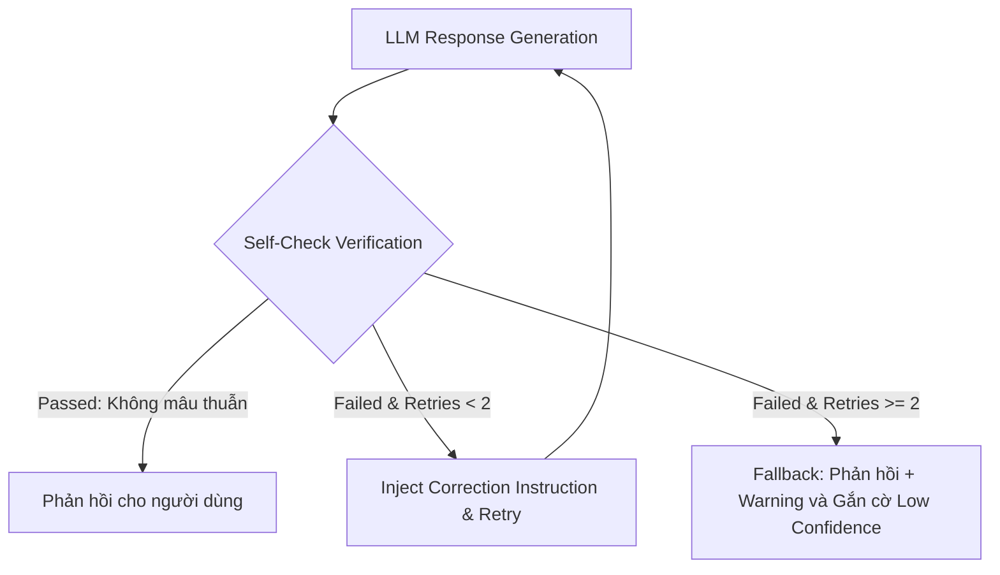

# Phương Pháp Cốt Lõi (Core Methodology)
## Quản Lý Ngữ Cảnh Hội Thoại Đa Lượt (Multi-turn Context Management)

Tài liệu này tập trung phân tích sâu vào **Phương pháp luận (Methodology)**, các thuật toán và mô hình thiết kế của hệ thống điều phối ngữ cảnh phiên bản v3.

---

## 1. Phương Pháp Phân Giải Ngữ Cảnh & Định Tuyến (Query Resolution & Routing)

Để tối ưu hóa chi phí và tốc độ, hệ thống sử dụng phương pháp định tuyến kết hợp 2 tầng (2-Tier Hybrid Routing) có sử dụng pgvector và PostgreSQL Entity Lookup.

### 1.1. So Sánh Các Phương Pháp Viết Lại Câu Hỏi & Định Tuyến

| Phương Pháp | Mô Tả | Ưu Điểm | Nhược Điểm | Đánh Giá Lựa Chọn |
| :--- | :--- | :--- | :--- | :--- |
| **1. Single-pass LLM Rewrite & Route** | Gửi toàn bộ chat history + query vào một LLM duy nhất. | • Tiết kiệm số lượt gọi API (1 RTT). | • Tốn token LLM lớn cho mọi query.<br>• Trễ từ 150-250ms. | Chỉ sử dụng làm giải pháp dự phòng ở Tier 2. |
| **2. Multi-pass LLM (Split Task)** | Tách làm 2 bước độc lập: LLM 1 viết lại câu hỏi, LLM 2 phân loại intent. | • Các prompt đơn giản hơn, dễ tối ưu. | • Gấp đôi RTT.<br>• Trễ tăng gấp đôi. | **Không sử dụng** do không tối ưu độ trễ. |
| **3. Heuristic / Rule-based (Regex)** | Dùng Regex khớp từ khóa chuyển tiếp. | • Latency gần như bằng 0.<br>• Không tốn token. | • Khó bao phủ hết các ngữ cảnh tự do phức tạp. | Dùng làm một bộ lọc bổ trợ trong Tier 1. |
| **4. 2-Tier Hybrid Routing (Fast/Slow Path)** *(Bản nâng cấp v3)* | Kết hợp Heuristic, Entity Index Lookup và pgvector ở Tier 1; chỉ gọi LLM lớn ở Tier 2 khi mơ hồ hoặc lỗi embedding. | • Tiết kiệm tới 70% token định tuyến.<br>• Latency trung bình cực thấp (< 15ms cho fast path). | • Cần quản lý cấu trúc bảng Entity Index trong DB. | **Lựa chọn chính thức** nhờ tối ưu hóa chi phí token và độ trễ phản hồi. |

---

## 2. Phương Pháp Phát Hiện Chủ Đề (Topic Shift Detection)

Hệ thống kết hợp kiểm tra heuristic từ khóa cứng, đối sánh thực thể nhanh (Entity Index Match) và khoảng cách ngữ nghĩa vector (pgvector Distance) để xác định xem câu hỏi mới của người dùng thuộc về chủ đề cũ (Cache Hit) hay mở ra chủ đề mới (Topic Shift).



### Thuật toán Phân giải & Phát hiện ở Tier 1:
1. **Bước 1: Tra cứu Thực thể Nhanh (Entity linking):**
   * Nếu query chứa pronoun/đại từ ("ấy", "nó", "đó", "họ", "lúc nãy", "khi nãy"), Orchestrator thực hiện SQL query so khớp ARRAY trên bảng `session_entity_index`.
   * Nếu khớp duy nhất 1 entity, tự động map vào cache slot sở hữu entity đó mà không cần tính toán embedding.
2. **Bước 2: Tìm kiếm Tương đồng Ngữ nghĩa (pgvector):**
   * Tạo vector embedding $V_{new}$ (384 dims) cho query bằng `multilingual-e5-small`. Tích hợp hàm bọc `_safe_embed()` tự động hạ cấp lên Tier 2 nếu có lỗi.
   * Truy vấn cosine distance (`<=>` operator trong pgvector) trực tiếp trên PostgreSQL:
     $$	ext{Distance} = 1 - 	ext{CosineSimilarity}$$
3. **Phân vùng xử lý:**
   * **Vùng xanh (Distance < 0.22):** Xác nhận cùng chủ đề. Kích hoạt trực tiếp cache slot tương ứng, cập nhật `last_accessed_at = NOW()`.
   * **Vùng đỏ (Distance > 0.55):** Xác nhận Topic Shift hoàn toàn. Kích hoạt Engine tương ứng để lấy dữ liệu mới (`needs_retrieval = "full"`), áp dụng LRU.
   * **Vùng xám (0.22 <= Distance <= 0.55):** Gửi yêu cầu lên Tier 2 để LLM lớn phân tích sâu.

---

## 3. Thiết Kế Nhánh Trả Lời Trực Tiếp (Direct-Answer Path)

Để tránh lãng phí tài nguyên của LLM chính (Final LLM) trong việc viết câu trả lời cho các câu hỏi tra cứu thông tin cứng, hệ thống tích hợp một nhánh **Direct-Answer Path** ở Orchestrator. Tuy nhiên, để đảm bảo tổng hợp đúng ngữ cảnh, mọi trường hợp **truy xuất từng phần** (`needs_retrieval == "partial"`) đều buộc phải đi qua LLM Path.



### Ma Trận Quyết Định Direct-Answer Path:

| Pipeline | Dạng dữ liệu trả về | Điều kiện | Quyết định | Cơ chế xử lý |
| :--- | :--- | :--- | :--- | :--- |
| **SQL** | Bảng kết quả (Tabular rows) | Kết quả có 1 dòng và $\le 3$ cột, `needs_retrieval == "none"` | **Direct Path** | Điền giá trị vào template định cấu trúc sẵn. Ví dụ: *"Thời lượng cuộc gọi GT_04: 105 giây"* -> *"Thời lượng cuộc gọi GT_04 là 105 giây."* |
| **SQL** | Bảng kết quả (Tabular rows) | Nhiều dòng, nhiều cột hoặc `needs_retrieval == "partial"` | **LLM Path** | Gọi Final LLM để tóm tắt xu hướng và đưa ra phân tích số liệu kèm ngữ cảnh cũ. |
| **WEB** | Snippets từ Web Search | Snippet có độ tin cậy cao, trả về đúng thực thể, `needs_retrieval == "none"` | **Direct Path** | Trích xuất thông tin chính xác trả về cho người dùng (ví dụ: nhiệt độ hiện tại). |
| **WEB** | Snippets từ Web Search | Nhiều nguồn thông tin dài, trái chiều hoặc `needs_retrieval != "none"` | **LLM Path** | Gọi Final LLM để phân tích, đối chiếu và tổng hợp nội dung khách quan. |
| **RAG** | Chunks tài liệu văn bản | Luôn luôn | **LLM Path** | Bắt buộc sử dụng Final LLM để đọc hiểu các đoạn văn bản thô và tổng hợp thành câu trả lời tự nhiên. |
| **MODEL**| Tri thức mô hình | Luôn luôn | **LLM Path** | Sử dụng LLM để sinh câu trả lời trực tiếp. |

```python
def should_use_direct_path(pipeline: str, payload: dict, needs_retrieval: str) -> bool:
    # Mọi trường hợp partial fetch đều bắt buộc đi qua LLM để tổng hợp ngữ cảnh
    if needs_retrieval == "partial":
        return False
        
    if pipeline == "SQL":
        rows = payload.get("rows", [])
        return len(rows) == 1 and len(rows[0].keys()) <= 3
    elif pipeline == "WEB":
        results = payload.get("results", [])
        return len(results) == 1 and results[0].get("relevance", 0) > 0.85
    return False
```

---

## 4. Tự Động Hạ Cấp Khi Lỗi Engine (Engine Circuit Breaker)

Hệ thống bảo vệ các kết nối tới các Engine ngoài bằng lớp Circuit Breaker hoạt động theo cơ chế **Timeout cưỡng bức bất đồng bộ (Async Task Timeout)**. Cơ chế này đảm bảo ngắt transaction ngay lập tức nếu Engine bị treo, tránh việc chiếm dụng luồng của hệ thống.

```python
import asyncio
import logging
import time

class EngineResult:
    def __init__(self, source: str, payload: dict):
        self.source = source
        self.payload = payload

class EngineCircuitBreaker:
    def __init__(self, engine, failure_threshold: int = 3, cooldown_seconds: int = 30, timeout_seconds: float = 3.0):
        self.engine = engine
        self.failure_threshold = failure_threshold
        self.cooldown_seconds = cooldown_seconds
        self.timeout_seconds = timeout_seconds
        
        self.failures = 0
        self.state = "CLOSED"  # CLOSED / OPEN / HALF_OPEN
        self.last_state_change = time.time()

    async def execute(self, query: str) -> EngineResult:
        now = time.time()
        
        # 1. Kiểm tra trạng thái OPEN và cooldown
        if self.state == "OPEN":
            if now - self.last_state_change > self.cooldown_seconds:
                self.state = "HALF_OPEN"
                self.last_state_change = now
                logging.info("Circuit Breaker chuyển sang HALF_OPEN. Đang thử nghiệm request...")
            else:
                logging.warning("Circuit đang OPEN. Hạ cấp nhanh (Fast Fallback) sang Parametric Model.")
                return EngineResult(
                    source="parametric_knowledge",
                    payload={"error": "Engine Circuit is OPEN. Fallback to model parametric knowledge.", "fallback": True}
                )

        try:
            # 2. Thực thi Engine với timeout cưỡng bức sử dụng asyncio.wait_for
            result = await asyncio.wait_for(
                self.engine.execute(query), 
                timeout=self.timeout_seconds
            )
            
            # 3. Nếu đang ở HALF_OPEN mà thành công -> đóng mạch
            if self.state == "HALF_OPEN":
                self.failures = 0
                self.state = "CLOSED"
                logging.info("Circuit Breaker reset về CLOSED. Engine hoạt động bình thường.")
                
            return result
            
        except asyncio.TimeoutError:
            logging.error(f"Engine execution quá hạn timeout {self.timeout_seconds}s.")
            self._on_failure()
            return self._get_fallback_result("Engine execution timeout.")
            
        except Exception as e:
            logging.error(f"Engine execution gặp lỗi hệ thống: {str(e)}")
            self._on_failure()
            return self._get_fallback_result(str(e))

    def _on_failure(self):
        self.failures += 1
        if self.failures >= self.failure_threshold:
            self.state = "OPEN"
            self.last_state_change = time.time()
            logging.error(f"Mạch đã mở (OPEN). Engine bị vô hiệu hóa trong {self.cooldown_seconds}s.")

    def _get_fallback_result(self, error_msg: str) -> EngineResult:
        return EngineResult(
            source="parametric_knowledge",
            payload={"error": f"Hạ cấp do lỗi: {error_msg}", "fallback": True}
        )
```

---

## 5. Phân Giải Thực Thể Nhẹ (Lightweight Entity Linking)

Thay vì triển khai một Graph DB phức tạp (như Neo4j) vốn đòi hỏi cao về tài nguyên và hạ tầng, hệ thống sử dụng bảng `session_entity_index` trên PostgreSQL để thực hiện so khớp đại từ chỉ định và liên kết thực thể (Coreference & Entity Linking) siêu nhanh ở Tier 1.

### Giải thuật so khớp đại từ tiếng Việt:
1. **Trích xuất đại từ chỉ định:** Khi nhận được query mới, hệ thống chuẩn hóa chuỗi và tách các từ chỉ định hoặc đại từ viết tắt (ví dụ: *"ấy"*, *"nó"*, *"đó"*, *"họ"*, *"lúc nãy"*, *"khi nãy"*).
2. **Truy vấn cơ sở dữ liệu:** Hệ thống dùng toán tử `@>` (chứa mảng) của PostgreSQL để quét nhanh các display_names liên kết với session hiện tại:
   ```sql
   SELECT cache_slot_id, entity_id, entity_type 
   FROM session_entity_index 
   WHERE session_id = $1 AND display_names @> ARRAY[$2]::TEXT[];
   ```
3. **Ánh xạ cache slot:** Nếu tìm thấy `cache_slot_id` khớp, Orchestrator tự động trỏ ngữ cảnh hiện tại về cache slot đó, cập nhật `last_accessed_at = NOW()` và lấy payload thô phục vụ trả lời hoặc viết lại query, hạ độ trễ phân giải xuống còn < 3ms.

---

## 6. Truy Xuất Từng Phần & Ràng Buộc Ngữ Cảnh (Partial Fetch & Context-Bound Retrieval)

Khi bộ định tuyến Router (Tier 1 hoặc Tier 2) trả về `"needs_retrieval": "partial"`, hệ thống không chạy lại toàn bộ query nặng mà chỉ thực hiện truy xuất bổ sung ràng buộc dữ liệu theo ngữ cảnh cũ (Context-bound):

### 6.1. Pipeline SQL (Parameterized SQL Reuse)
* **Cơ chế:** Lưu lại snapshot của template SQL và các entity_ids lấy được ở lần truy vấn trước vào `cached_payload`.
* **Thực thi:** Khi cần partial fetch (ví dụ: *"Thế còn Tsuji tìm Onoda?"* sau khi đã hỏi về cuộc gọi Yamashita tìm Kase), SQL Engine sử dụng `sql_filter` được Router trả về (ví dụ: `WHERE session_id = 'GT_08'`) để gắn vào template SQL gốc thay vì viết lại từ đầu.

### 6.2. Pipeline RAG (Metadata-Constrained Search)
* **Cơ chế:** Tránh quét toàn bộ Vector DB.
* **Thực thi:** Sử dụng danh sách các `rag_doc_ids` được Router trả về từ context cũ để thực hiện tìm kiếm vector có lọc metadata (Metadata-constrained vector search):
  ```python
  results = vector_db.similarity_search(
      query=rewritten_query,
      filter={"file_id": {"$in": rag_doc_ids}}
  )
  ```
  Điều này tăng độ chính xác tìm kiếm ngữ nghĩa lên gấp nhiều lần và loại bỏ nhiễu từ các văn bản khác.

### 6.3. Pipeline WEB Search (Targeted Parameter Append)
* **Thực thi:** Tự động đính kèm từ khóa ràng buộc hoặc địa chỉ web xác định vào tham số tìm kiếm (ví dụ: thêm `"site:weather.example.com"` hoặc `"nhiệt độ"`) từ `web_query_append` để lấy tin tức chính xác cho chủ thể đang bàn luận.

---

## 7. Tự Động Kiểm Tra Chất Lượng Câu Trả Lời (Lightweight Self-Check Verification)

Để ngăn chặn ảo giác (Hallucination) và khống chế chi phí gọi LLM sửa đổi nhiều lần, Answer Generator tích hợp một bộ tự kiểm chứng **Self-Check Verification** có giới hạn số lần thử lại (circuit breaker ở mức 2 lần).



### Chi tiết giải thuật giới hạn tự kiểm chứng:
1. LLM chính nhận prompt tổng hợp và sinh ra câu trả lời thô.
2. Bộ kiểm chứng gọi API kiểm chứng độ tin cậy so với dữ liệu nguồn.
3. Nếu phát hiện mâu thuẫn (như tự chế số liệu, lệch so với Cold payload), hệ thống inject correction instruction vào prompt và thực hiện tối đa **2 lần thử lại**.
4. Nếu vẫn thất bại sau 2 lần thử, hệ thống chấp nhận câu trả lời thô gần nhất nhưng:
   * Thiết lập thuộc tính `answer_confidence = 'low'` ở lịch sử chat.
   * Tự động nối thêm chuỗi thông tin cảnh báo: *"*(Lưu ý: Câu trả lời này có độ tin cậy thấp do không tự kiểm chứng đồng nhất được với dữ liệu thô. Vui lòng đối chiếu thêm với nguồn dữ liệu gốc)*"*.

```python
class SelfCheckVerifier:
    def __init__(self, llm_client, max_retries: int = 2):
        self.llm_client = llm_client
        self.max_retries = max_retries

    async def verify_and_generate(self, prompt: str, raw_context: dict) -> tuple[str, str]:
        retries = 0
        current_prompt = prompt
        
        while retries <= self.max_retries:
            response = await self.llm_client.generate(current_prompt)
            passed, issues = await self._check_hallucination(response, raw_context)
            if passed:
                return response, "high"
                
            retries += 1
            if retries <= self.max_retries:
                current_prompt = self._inject_correction_instruction(prompt, response, issues)
            else:
                disclaimer = "

*(Lưu ý: Câu trả lời này có độ tin cậy thấp do không tự kiểm chứng đồng nhất được với dữ liệu thô. Vui lòng đối chiếu thêm với nguồn dữ liệu gốc)*"
                return response + disclaimer, "low"
```

---

## 8. Quy Trình Ghi Chỉ Mục Thực Thể (Entity Index Write Pipeline)

Thao tác trích xuất và ghi các thực thể (Entity) vào bảng `session_entity_index` được tổ chức thành một pipeline chuyên biệt (**EntityExtractor**) chạy độc lập sau khi Execution Engine trả về dữ liệu và trước khi ghi Cache.

### 8.1. Các Phương Pháp Trích Xuất Entity
* **SQL Pipeline (Rule-based):** Sử dụng các luật tĩnh dựa trên schema trả về của query SQL. Ví dụ, nếu kết quả SQL chứa cột `transcript_id` hoặc `session_id`, thực thể sẽ được tạo tự động với display_names gồm các định danh và các đại từ tương ứng.
* **RAG Pipeline (Metadata-based):** Trích xuất tên tệp tin (`file_name`), định danh tài liệu (`document_id`), người chủ trì hoặc tác giả từ thông tin metadata của document chunks.
* **WEB / MODEL Pipelines (LLM Fallback):** Do dữ liệu trả về từ web search hoặc tri thức mô hình không có cấu trúc cố định, hệ thống chạy một lượt gọi LLM siêu nhẹ (lightweight extraction model) để lọc ra các danh từ riêng chính làm thực thể.

### 8.2. Quy trình UPSERT vào Database
Khi có thực thể mới:
1. Tạo danh sách `display_names` gồm tên chính thức cùng các đại từ chỉ định tiếng Việt phù hợp (ví dụ: `["GT_04.txt", "cuộc gọi này", "cuộc gọi đó", "nó", "người đó", "ấy"]`).
2. Thực hiện ghi vào DB bằng câu lệnh UPSERT để tránh trùng lặp:
   ```sql
   INSERT INTO session_entity_index (session_id, cache_slot_id, entity_id, entity_type, display_names)
   VALUES ($1, $2, $3, $4, $5)
   ON CONFLICT (session_id, entity_id) 
   DO UPDATE SET display_names = ARRAY(
       SELECT DISTINCT unnest(session_entity_index.display_names || EXCLUDED.display_names)
   );
   ```
3. Sau khi ghi thành công, dữ liệu lập tức có hiệu lực cho bộ định tuyến Tier 1 ở lượt chat tiếp theo.
