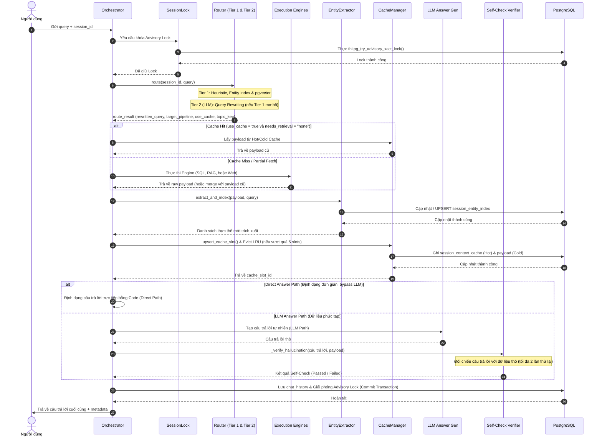
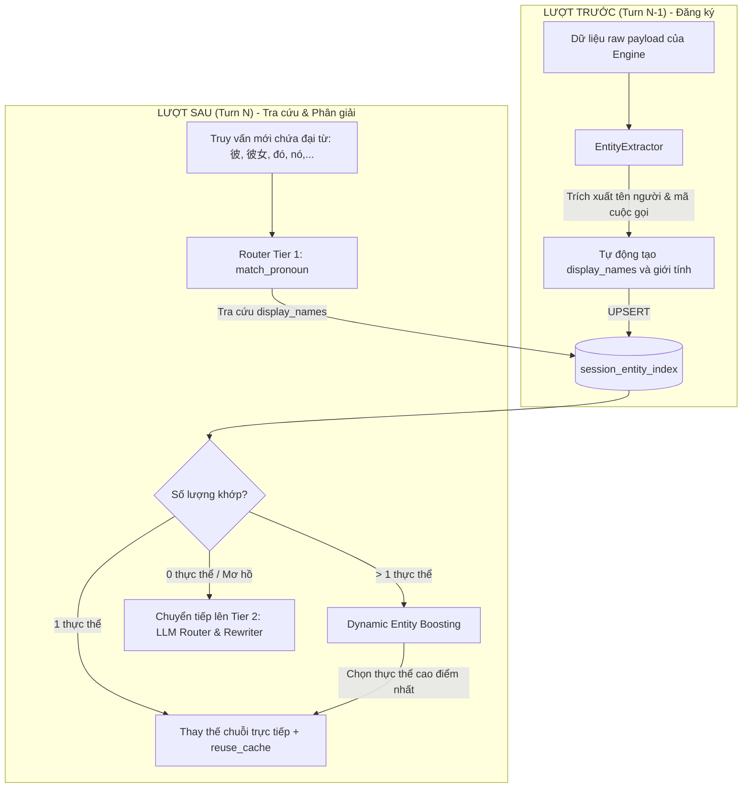

# Đặc tả Luồng xử lý Toàn diện (Full Pipeline Specification)

Tài liệu này mô tả chi tiết kiến trúc, quy trình vận hành và cơ chế nghiệp vụ cốt lõi của **Hệ thống Quản lý Ngữ cảnh Đa lượt Javis (Multi-turn Context Manager)**. Hệ thống được thiết kế để giải quyết vấn đề quy chiếu thực thể (Coreference Resolution), tối ưu hóa độ trễ, tiết kiệm chi phí gọi LLM và triệt tiêu lỗi ảo giác (hallucination) ngữ nghĩa thông qua mô hình phân giải thực thể **2-Tier Hybrid Routing**.

---

## 🏗️ 1. Quy trình Vòng đời 8 bước (Orchestrator Lifecycle)

Bộ điều phối thông minh [IntelligentOrchestrator](file:///D:/VJ/Tro-li-ao-Javis/multi-turn-context-manager/src/orchestrator.py#L154) chịu trách nhiệm kiểm soát toàn bộ vòng đời của một truy vấn thông qua phương thức [handle](file:///D:/VJ/Tro-li-ao-Javis/multi-turn-context-manager/src/orchestrator.py#L169). Quy trình xử lý tuân thủ nghiêm ngặt 8 bước sau:



### Chi tiết các bước xử lý:

#### 1. Tiếp nhận và Khóa phiên (Session Ingestion & Locking)
*   **Mô tả:** Hệ thống tiếp nhận `session_id` và truy vấn `query`. Để ngăn chặn tình trạng Race Condition (yêu cầu gửi đồng thời ghi đè lẫn nhau), hệ thống lấy một khóa cố vấn độc quyền cấp phiên.
*   **Cơ chế:** Lớp [SessionLockManager](file:///D:/VJ/Tro-li-ao-Javis/multi-turn-context-manager/src/session_lock.py) băm `session_id` thành một số nguyên 64-bit dùng MD5 và gọi hàm `pg_try_advisory_xact_lock` trên PostgreSQL. Nếu không lấy được khóa trong vòng `8.0s` (tham số `lock_timeout`), hệ thống sẽ ném `asyncio.TimeoutError`.

#### 2. Định tuyến 2 tầng (2-Tier Routing)
*   **Mô tả:** Xác định cách truy xuất dữ liệu tối ưu nhất và viết lại truy vấn (Query Rewriting). Tier 1 có các đường tối ưu hóa heuristic trước khi chạy pgvector:
    *   **Hard-Switch Keywords:** Nếu query chứa từ khóa chuyển chủ đề (`"やっぱり"`, `"別の話"`, `"キャンセル"`, `"スキップ"`, `"忘れて"`), bypass thẳng lên Tier 2.
    *   **Explicit New GT:** Nếu query chứa 1 GT session mới chưa có trong entity index → topic shift (Tier 1 heuristic).
    *   **Date-Only Query:** Nếu query chứa ngày tháng nhưng không khớp entity nào → topic shift (Tier 1 heuristic).
    *   **Singular Pronoun Resolution:** Nếu query chứa đại từ đơn (`"彼"`, `"彼女"`, `"それ"`, `"その件"`) và không có GT rõ ràng, hệ thống tự động phân giải về slot cache gần nhất (Tier 1 heuristic).
*   **Cơ chế:** Phương thức [Router.route](file:///D:/VJ/Tro-li-ao-Javis/multi-turn-context-manager/src/router.py#L379) thực thi. Tầng 1 (Fast Filter) sẽ chạy logic heuristics hoặc tra cứu chỉ mục thực thể nhanh. Nếu gặp trường hợp mơ hồ, hệ thống chuyển tiếp (escalate) sang Tầng 2 để gọi LLM viết lại câu hỏi hoàn chỉnh độc lập ngữ cảnh (`rewritten_query`) và phân loại ý định chính xác. Tầng 2 cũng có cơ chế **programmatic override**: nếu phát hiện query so sánh/nhiều GT, nó ghi đè `needs_retrieval = "full"` và `use_cache = false`.

#### 3. Thực thi và Truy xuất (Execution & Retrieval)
*   **Mô tả:** Chạy công cụ phù hợp để lấy thông tin mới hoặc tái sử dụng bộ nhớ đệm.
*   **Cơ chế:**
    *   **Cache Hit (`use_cache = true` & `needs_retrieval = "none"`):** Lấy trực tiếp tải trọng dữ liệu thô lớn (`cached_payload`) từ bảng `session_context_payload`. Kiểm tra TTL (Cache TTL: SQL = 86400s/24h, WEB = 3600s/1h) và kiểm tra payload rỗng trước khi dùng.
    *   **Partial Fetch:** Giữ lại payload cũ, chạy Engine lấy thêm dữ liệu mới, merge lại.
    *   **Full Retrieval:** Thực thi các Engine được định nghĩa trong [engines.py](file:///D:/VJ/Tro-li-ao-Javis/multi-turn-context-manager/src/engines.py) (SQL, RAG, Web Search) với cơ chế bảo vệ **Circuit Breaker** (ngắt mạch sau 3 lỗi liên tiếp, cooldown 30s, timeout 60s) và dịch SQL Heuristic ([heuristic_sql_translation](file:///D:/VJ/Tro-li-ao-Javis/multi-turn-context-manager/src/engines.py#L89)).
    *   **SQL→RAG Fallback:** Nếu SQLEngine trả về rows rỗng, Orchestrator tự động fallback sang RAGEngine và đổi `target_pipeline` thành `"RAG"` + cập nhật `target_topic_key` tương ứng.

> **Lưu ý về thứ tự:** Với `full` retrieval, cache slot phải được tạo **trước** khi entity indexing (vì `extract_and_index` cần `cache_slot_id`). Với `partial` retrieval, cache slot đã tồn tại nên entity indexing được thực hiện trước cache update. Flowchart bên trên minh họa luồng tổng quát, thứ tự thực tế phụ thuộc vào `needs_retrieval`.

#### 4. Trích xuất Thực thể và metadata (Entity Indexing & Summary)
*   **Mô tả:** Phân tích dữ liệu mới lấy được để ánh xạ các thực thể và đại từ chỉ định, phục vụ cho việc tra cứu ở lượt chat kế tiếp.
*   **Cơ chế:** Phương thức [EntityExtractor.extract_and_index](file:///D:/VJ/Tro-li-ao-Javis/multi-turn-context-manager/src/entity_extractor.py#L16) sẽ tự động bóc tách thực thể (Người, Cuộc gọi, Tài liệu) và lưu thông tin định danh vào bảng `session_entity_index`.
    *   **SQL Pipeline:** Trích xuất `session_id` từ rows, kèm participants ↔ person entities.
    *   **RAG Pipeline:** Trích xuất entity từ metadata document. Có cơ chế **GT Scoping**: chỉ index entity thuộc các GT được đề cập trong query, ngăn nhiễu chéo từ vector search.
    *   **WEB / MODEL Pipeline:** Gọi LLM lightweight để trích xuất tối đa 2 entity từ kết quả (tránh các từ generic như "情報", "データ").
    *   **Global Aggregate Skip:** Nếu `summary_context.entity_id == "global_aggregate"`, bỏ qua hoàn toàn việc entity indexing.

#### 5. Cập nhật Bộ nhớ đệm (Cache Orchestration)
*   **Mô tả:** Cập nhật trạng thái ngữ cảnh mới nhất vào Hot Cache (`session_context_cache`) và Cold Cache (`session_context_payload`).
*   **Cơ chế:**
    *   **Upsert & LRU Eviction:** Sử dụng phương thức [upsert_cache_slot](file:///D:/VJ/Tro-li-ao-Javis/multi-turn-context-manager/src/cache_manager.py#L85) để lưu trữ. Khi số lượng slot cache vượt quá giới hạn **5 slot** (`MAX_CACHE_SLOTS = 5` tại [config.py](file:///D:/VJ/Tro-li-ao-Javis/multi-turn-context-manager/src/config.py)), hệ thống sẽ áp dụng thuật toán LRU (Least Recently Used) để xóa bỏ slot có `last_accessed_at` xa nhất.
    *   **Row Locking:** Phương thức [update_cache_slot](file:///D:/VJ/Tro-li-ao-Javis/multi-turn-context-manager/src/cache_manager.py#L124) sử dụng `SELECT ... FOR UPDATE` để khóa dòng, loại bỏ hoàn toàn xung đột tương tranh.
    *   **EMA Embedding Update** ([update_cache_slot_ema](file:///D:/VJ/Tro-li-ao-Javis/multi-turn-context-manager/src/cache_manager.py#L179)): Sau mỗi lượt chat, query_embedding của cache slot được cập nhật bằng công thức EMA (Exponential Moving Average) với α = 0.8: $$V_{new} = 0.8 \times V_{current} + 0.2 \times V_{query}$$ Vector mới được chuẩn hóa (normalize). Cơ chế an toàn:
        *   **Khóa sau 5 lần cập nhật** (`ema_update_count >= 5`): vector đại diện bị đóng băng.
        *   **Drift Mitigation:** Nếu cosine distance giữa `V_query` và `V_current` > 0.5, bỏ qua EMA update.
        *   **Similarity Safeguard:** Nếu similarity với vector gốc < 0.60, reset về vector gốc và reset `update_count` về 0.

#### 6. Tạo câu trả lời (Answer Generation - Dual Path)
*   **Mô tả:** Tạo câu trả lời tự nhiên cho người dùng.
*   **Cơ chế:**
    *   **Direct Path:** Đối với các câu hỏi cấu trúc đơn giản (như đếm số lượng, tổng thời lượng, transcript details, hoặc một đoạn trích web duy nhất với relevance > 0.85), hệ thống dùng code định dạng trực tiếp ([should_use_direct_path](file:///D:/VJ/Tro-li-ao-Javis/multi-turn-context-manager/src/orchestrator.py#L15)) để trả lời ngay, tiết kiệm 100% token LLM. Direct Path bị vô hiệu nếu `needs_retrieval = "partial"` hoặc query yêu cầu lý do/giải thích (`"なぜ"`, `"理由"`...).
    *   **LLM Path:** Sử dụng LLM để sinh câu trả lời tự nhiên từ `payload` thô thông qua [_generate_llm_answer_with_self_check](file:///D:/VJ/Tro-li-ao-Javis/multi-turn-context-manager/src/orchestrator.py#L572). Khi self-check thất bại và retry, hệ thống append **correction prompt** vào messages để yêu cầu LLM tái sinh câu trả lời chính xác hơn.

#### 7. Xác minh tự thân chống ảo giác (Self-Check Verification)
*   **Mô tả:** Kiểm tra chéo thông tin trả về của LLM với dữ liệu thô ban đầu nhằm loại bỏ ảo giác (hallucination).
*   **Cơ chế:** Phương thức [_verify_hallucination](file:///D:/VJ/Tro-li-ao-Javis/multi-turn-context-manager/src/orchestrator.py#L664) gọi LLM kiểm định độc lập đối chiếu câu trả lời với `payload` (response_format JSON). Cho phép **thử lại tối đa 2 lần** (`max_retries = 2`). Nếu thất bại sau 2 lần thử, câu trả lời sẽ đi kèm cảnh báo độ tin cậy thấp (`low confidence disclaimer`). Nếu Verifier gặp exception (offline), hệ thống mặc định `passed=true` nhưng gắn cảnh báo `medium` confidence.
*   **Think Tag Handling:** Trước khi xử lý, tất cả output LLM đều được tự động loại bỏ thẻ `<think>...</think>` (nếu có) để tránh nhiễu từ reasoning model.

#### 8. Ghi nhật ký và Hoàn tất (Logging & Commit)
*   **Mô tả:** Lưu lịch sử hội thoại và giải phóng tài nguyên.
*   **Cơ chế:** Lưu thông tin vào bảng `chat_history` (bao gồm cả truy vấn gốc và truy vấn đã viết lại `rewritten_content`), commit giao dịch DB để giải phóng Advisory Lock và trả kết quả cho người dùng.

---

## 🧠 2. Mô hình Phân giải Thực thể 2-Tier (2-Tier Entity Resolution)

Thay vì sử dụng LLM cho toàn bộ quá trình phân giải đại từ chỉ định và ngữ cảnh, Javis triển khai cơ chế **2-Tier Entity Resolution** kết hợp tối ưu giữa Heuristics/Database (Tier 1) và LLM (Tier 2).

### Tại sao không dùng LLM cho toàn bộ quá trình?
1.  **Latency (Độ trễ):** Gọi API LLM mất trung bình từ $0.5$ đến vài giây. Với các câu hỏi tiếp nối đơn giản, Tier 1 xử lý trực tiếp bằng code Python trong **vài mili-giây**.
2.  **Deterministic (Tính nhất quán):** LLM có tính ngẫu nhiên (nondeterministic) và dễ bị ảo giác tên người/mã cuộc gọi. Logic rules của Tier 1 đảm bảo tính chính xác tuyệt đối.
3.  **Cost (Chi phí):** Tiết kiệm tài nguyên token cực lớn khi vận hành ở quy mô doanh nghiệp.

### Các ưu điểm vượt trội của mô hình 2-Tier:
*   **Triệt tiêu ảo giác về thực thể (Entity Hallucination Control):** Ràng buộc việc phân giải thông qua bảng chỉ mục thực thể `session_entity_index`, đảm bảo đại từ chỉ được ánh xạ vào các thực thể **thực sự tồn tại** trong cuộc đối thoại hiện tại.
*   **Nhận biết giới tính thông minh (Gender-Aware Suffix Matching):** Sử dụng các hậu tố tiếng Nhật phổ biến để tự động suy luận giới tính, tránh nhầm lẫn vai trò khi phân giải đại từ "彼" (anh ấy) và "彼女" (cô ấy).
*   **Tối ưu hóa bộ nhớ đệm (Cache Bypass):** Trực tiếp kích hoạt `use_cache = true` và `needs_retrieval = "none"` khi xác định cùng chủ đề (`same_entity`), bỏ qua hoàn toàn bước chạy SQL/RAG tốn kém.
*   **Thuật toán Tăng cường Thực thể Động (Dynamic Entity Boosting):** Giải quyết mơ hồ khi có nhiều thực thể trùng tên bằng thuật toán tính điểm kết hợp giữa **độ mới** (recency) và **tần suất được nhắc đến** (mention count với hệ số suy hao thời gian).
*   **Cập nhật Tương tác & Suy hao Thực thể (Entity Interaction Decay):** Hàm [update_entity_interaction_counts](file:///D:/VJ/Tro-li-ao-Javis/multi-turn-context-manager/src/router.py#L124) tự động cập nhật `mention_count` sau mỗi lượt định tuyến Tier 1: thực thể được chọn (active) được tăng `mention_count += 1`, các thực thể khác trong cùng session bị suy hao `mention_count ×= 0.5`. Điều này đảm bảo thực thể được nhắc đến gần đây nhất luôn có ưu tiên cao hơn khi phân giải đại từ.

---

## 🔄 3. Cơ chế Từ điển Động Đăng ký & Tra cứu Thực thể

Cơ chế phân giải thực thể của Javis hoạt động dựa trên một từ điển động được đăng ký ở lượt chat trước và tra cứu ở lượt chat sau:



### Bước 1: Trích xuất & Đăng ký (Lượt trước)
Mỗi khi hệ thống kết thúc việc truy xuất dữ liệu ở bước 4, [EntityExtractor](file:///D:/VJ/Tro-li-ao-Javis/multi-turn-context-manager/src/entity_extractor.py#L11) sẽ phân tích dữ liệu thô và tự động tạo ra một danh sách các biến thể tên gọi cùng đại từ đại diện tương ứng để lưu vào cột `display_names` của bảng `session_entity_index` trong DB:

1.  **Đối với cuộc gọi/phiên hội thoại (Ví dụ: `GT_04`):**
    Hệ thống đăng ký `entity_id = "GT_04"` và sinh ra mảng `display_names` bao gồm các biến thể sau:
    ```python
    ["GT_04", "GT_04.txt",
     "GT_04の通話", "GT_04の会話", "GT_04の打ち合わせ",
     "その通話", "その会話", "その打ち合わせ",
     "先ほどの通話", "先ほどの会話", "先ほどの打ち合わせ",
     "さっきの通話", "さっきの会話", "さっきの打ち合わせ",
     "その連絡", "先ほどの連絡", "さっきの連絡",
     "その件", "その話", "それ"]
    ```
    *(Nếu cuộc gọi có ngày tháng cụ thể như ngày 4 tháng 5 năm 2026, nó sẽ tự sinh thêm: `"2026年5月4日の通話"`, `"5月4日の通話"`, `"2026年5月4日の会話"`, `"5月4日の会話"`).*
2.  **Đối với con người (Ví dụ: khách hàng `Nakaoka` trong phiên `GT_02`):**
    Hệ thống đăng ký `entity_id = "GT_02_Nakaoka"` và tạo ra các tên gọi đại diện:
    `["中岡", "中岡さん", "中岡様", "Nakaoka"]`.
    Đồng thời, hệ thống cũng bóc tách giới tính của người tham gia từ bảng dữ liệu gốc. Tên tổ chức/company cũng được đăng ký riêng (ví dụ: `"GT_02_AJ_Technologies"`) với các biến thể như `"AJ_Technologies"`, `"AJ_Technologiesの通話"`.

3.  **Cơ chế GT Scoping cho RAG Pipeline:**
    Khi EntityExtractor xử lý kết quả từ RAGEngine, nó áp dụng **GT Scoping**: chỉ index các entity thuộc GT được đề cập trong query hiện tại. Các entity từ GT khác bị nhiễu bởi vector search sẽ bị lọc bỏ, ngăn ngừa ô nhiễm entity index chéo giữa các session.

### Bước 2: So khớp & Thay thế (Lượt sau)
Khi người dùng gửi truy vấn chứa đại từ (ví dụ: *"彼は何と言いましたか？"* - *"Anh ấy đã nói gì?"*):

1.  **Quét đại từ chỉ định:** Hệ thống duyệt qua danh sách các đại từ singular pronouns chuẩn (như `"彼"`, `"彼女"`, `"それ"`, `"その人"`).
2.  **Truy vấn DB đối sánh:** Sử dụng toán tử mảng `@>` của Postgres để quét nhanh mảng `display_names` trong `session_entity_index` xem có thực thể nào khớp với đại từ hay không.
3.  **Phân giải giới tính (Gender-Aware Helper):** 
    Nếu gặp đại từ chỉ nam giới `"彼"`, hệ thống sẽ sử dụng danh sách hậu tố để lọc ra các thực thể thuộc giới tính nam. Việc phân loại được thực hiện động từ DB (cột `participants.gender`) kết hợp suy luận bằng hậu tố tên. Các hậu tố tiếng Nhật được dùng để suy luận tự động bao gồm:
    *   **Hậu tố Nữ (Female Suffixes):** `子`, `美`, `香`, `花`, `華`, `奈`, `菜`, `乃`, `莉`, `里`, `理`, `梨`, `咲`, `織`, `恵`, `絵`, `江`, `穂`, `沙`, `紗`, `羽`, `和`, `音`, `凛`, `杏`, `楓`, `葵`.
    *   **Hậu tố Nam (Male Suffixes):** `郎`, `朗`, `夫`, `男`, `雄`, `介`, `助`, `佑`, `佐`, `人`, `斗`, `翔`, `登`, `太`, `也`, `哉`, `弥`, `樹`, `輝`, `木`, `司`, `嗣`, `馬`, `吾`, `悟`, `将`, `正`, `雅`, `洋`, `博`, `宏`, `浩`.
4.  **Thay thế chuỗi (String Replacement):**
    *   **Khớp duy nhất 1 thực thể:** Trực tiếp thay thế đại từ bằng ID thực thể đã được phân giải (ví dụ: thế `"彼"` bằng `"GT_02_Nakaokaさん"`) và trả về kết quả định tuyến với `use_cache = true`.
    *   **Khớp nhiều thực thể (Trùng lặp):** Áp dụng **Dynamic Entity Boosting** để tính điểm ưu tiên:
        $$Score = Score_{raw} \times (1.0 + \beta \times \ln(\text{mention\_count}))$$
        Trong đó:
        *   $Score_{raw} = \frac{1.0}{1.0 + \Delta t}$ (với $\Delta t$ là thời gian trôi qua tính bằng giờ kể từ lần truy cập gần nhất).
        *   $\beta = 0.5$ (hệ số tăng cường cho tần suất nhắc đến `mention_count`).
        Thực thể có điểm số cao nhất sẽ được chọn để phân giải. Nếu điểm số không chênh lệch rõ ràng hoặc không tìm thấy thực thể nào hoạt động, hệ thống sẽ thực hiện **chuyển tiếp lên Tier 2**.

---

## ⚡ 5 Cơ chế Chuyển tiếp (Escalation) lên Tier 2

Để đảm bảo hệ thống không bao giờ quyết định sai khi gặp truy vấn phức tạp, Javis định nghĩa **5 cơ chế kiểm tra** để chuyển tiếp quyền xử lý từ logic heuristics (Tier 1) lên LLM Router & Rewriter (Tier 2):

### 0. Chuyển chủ đề chủ động (Hard-Switch Keywords)
*   Trước khi chạy bất kỳ logic Tier 1 nào, Router kiểm tra query có chứa từ khóa chuyển chủ đề không thông qua `SWITCH_KEYWORDS_PATTERN`: `"やっぱり"`, `"別の話"`, `"キャンセル"`, `"スキップ"`, `"忘れて"`. Nếu có, query được bypass thẳng lên Tier 2 để LLM xử lý như một chủ đề hoàn toàn mới.

### 1. Mơ hồ về đại từ (Pronoun Ambiguity)
*   **Unresolved Pronoun:** Truy vấn chứa đại từ chỉ định hoặc các câu hỏi tỉnh lược (ellipsis như `は？`, `も？`) nhưng tra cứu trong bảng chỉ mục `session_entity_index` không trả về bất kỳ kết quả nào hoạt động (`len(matched_entities) == 0`).
*   **Plural Pronoun (Đại từ số nhiều):** Truy vấn chứa các từ chỉ tập hợp số nhiều như `彼ら` (họ), `彼女ら` (các cô ấy), `双方` (hai bên), `お二人` (hai người). Việc xác định chính xác danh sách các thực thể con vượt quá khả năng của heuristics nên bắt buộc phải chuyển lên Tier 2.
*   **Other Entity Match Guard (Xung đột thực thể chéo):** Trường hợp truy vấn chứa đại từ đơn (ví dụ: "Anh ấy") khớp với một slot cache hiện tại, nhưng câu hỏi của người dùng lại chứa một cái tên riêng rõ ràng thuộc về một cache slot khác. Hệ thống sẽ nhận diện đây là sự nhập nhằng chủ đề và chuyển giao lên Tier 2 để LLM giải quyết.

### 2. Mơ hồ về dữ liệu ngữ cảnh (Metadata Mismatch)
Dù heuristics khớp được duy nhất 1 thực thể, hệ thống vẫn kiểm tra chéo các thông tin khác trong câu hỏi để phát hiện mâu thuẫn:
*   **Mâu thuẫn Session ID:** Câu hỏi của người dùng nhắc đến một session khác (ví dụ: `GT_04`) nhưng thực thể được tìm thấy lại thuộc về cache của session `GT_02`.
*   **Mâu thuẫn Ngày tháng (Date Mismatch):** Ngày tháng được người dùng đề cập trong câu hỏi (ví dụ: ngày 4 tháng 5) không khớp với ngày diễn ra cuộc gọi ghi nhận trong `summary_context` của cache slot.

### 3. Mơ hồ về ngữ nghĩa (Semantic Ambiguity - pgvector)
Khi tính toán khoảng cách cosine giữa vector câu hỏi hiện tại với vector của các câu hỏi cũ trong cache, hệ thống lấy ra 2 cache slot có khoảng cách gần nhất là $d_1$ (gần nhất) và $d_2$ (gần thứ hai), sau đó tính tỉ lệ khoảng cách tương đối $gap = \frac{d_1}{d_2}$:
*   **Vùng xám ngữ nghĩa (Gray Area):** Câu hỏi được coi là mơ hồ và được chuyển tiếp lên Tier 2 khi rơi vào một trong các điều kiện:
    *   $d_1 \ge 0.35$ (tương đương độ tương đồng ngữ nghĩa thấp, không đủ tin cậy để xác định là cùng chủ đề).
    *   Tỉ lệ khoảng cách tương đối $gap \ge 0.65$ (khoảng cách đến slot thứ nhất và slot thứ hai quá gần nhau, không phân biệt rõ ràng được câu hỏi đang hướng tới slot nào).
*   **Ngưỡng khác (Clear Cutoffs):**
    *   $d_1 < 0.35$ và $gap < 0.65$: Confident semantic match → Cache Hit (Tier 1 tự xử lý).
    *   $d_1 > 0.55$ và không có cache active: Topic shift → Tier 1 tự tạo topic key mới.
    *   $d_1 > 0.55$ và có cache active: Semantic shift với active caches → Chuyển lên Tier 2 để kiểm tra switchback.

### 4. Truy vấn chứa nhiều thực thể (Multiple GTs)
*   Nếu câu hỏi của người dùng chứa từ $2$ Session ID trở lên (ví dụ: *"Hãy so sánh cuộc gọi GT_01 và GT_02"*), hệ thống tự động xác định đây là truy vấn phức hợp chéo và chuyển thẳng lên Tier 2 để LLM viết lại câu truy vấn.

---

## 🗄️ 5. Lược đồ Cơ sở Dữ liệu Liên quan

Các bảng cơ sở dữ liệu đóng vai trò quyết định trong việc lưu trữ ngữ cảnh và hỗ trợ Tier 1 phân giải nhanh bao gồm:

1.  **Bảng chỉ mục thực thể [session_entity_index](file:///D:/VJ/Tro-li-ao-Javis/multi-turn-context-manager/docs/database_schema.md#L83):**
    *   `session_id` (Khóa phân vùng phiên).
    *   `entity_id` (Định danh thực thể duy nhất, ví dụ: `GT_04`, `GT_02_Nakaoka`). `UNIQUE (session_id, entity_id)`.
    *   `entity_type` (Phân loại: `meeting_transcript`, `person`, `document`, `sql_result`).
    *   `display_names` (Mảng chứa các tên gọi đại diện, được tạo chỉ mục **GIN Index** để tối ưu tra cứu bằng toán tử `@>`).
    *   `cache_slot_id` (Liên kết tới Hot Cache, ON DELETE CASCADE).
    *   `mention_count` (NUMERIC, mặc định 1.0): Số lần thực thể được nhắc đến, dùng cho Dynamic Entity Boosting và Entity Decay.
    *   `last_interacted_at` (TIMESTAMP): Thời điểm thực thể được tương tác gần nhất, dùng cho tính recency score.
    *   `created_at` (TIMESTAMP): Thời điểm tạo bản ghi.
2.  **Bảng Hot Cache [session_context_cache](file:///D:/VJ/Tro-li-ao-Javis/multi-turn-context-manager/docs/database_schema.md#L57):**
    *   `topic_key` (Khóa phân biệt chủ đề, `UNIQUE (session_id, topic_key)`).
    *   `last_pipeline` (Pipeline cuối cùng: SQL, RAG, WEB, MODEL).
    *   `last_routing_method` (Phương thức định tuyến cuối: heuristics, embeddings, llm_router, fallback).
    *   `query_embedding` (Vector đại diện 384 chiều, tìm kiếm bằng khoảng cách cosine `<=>`).
    *   `embedding_model_version` (Tên model embedding: 'multilingual-e5-small').
    *   `last_accessed_at` / `refreshed_at` (Sử dụng cho chính sách LRU và TTL).
3.  **Bảng Cold Cache [session_context_payload](file:///D:/VJ/Tro-li-ao-Javis/multi-turn-context-manager/docs/database_schema.md#L72):**
    *   `cache_id` (Khóa chính, REFERENCES session_context_cache(id) ON DELETE CASCADE).
    *   `cached_payload` (Dữ liệu JSON lớn, chỉ tải lên bộ nhớ RAM khi xác định là **Cache Hit**).
    *   `summary_context` (Metadata tóm tắt chứa thông tin `entity_id`, `entity_type`, `display_name`, `key_attributes`, và `ema_update_count` cho cơ chế EMA embedding update).
