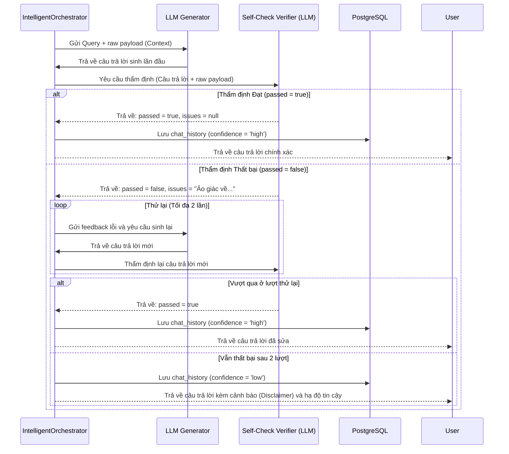

# Phân tích Kỹ thuật: Nguy cơ Ảo giác (Hallucination) và Cơ chế Bảo vệ của Hệ thống Javis

Ảo giác (Hallucination) là một trong những thách thức lớn nhất khi triển khai các hệ thống trợ lý ảo dựa trên mô hình ngôn ngữ lớn (LLM), đặc biệt là trong các bài toán quản lý hội thoại đa lượt phức tạp và xử lý cuộc gọi nghiệp vụ. Bất kỳ sự sai lệch nào về người nói, ngày tháng, thời lượng hay nội dung thỏa thuận đều có thể dẫn đến hậu quả nghiêm trọng cho quyết định kinh doanh.

Dưới đây là bản phân tích chi tiết về các **nguy cơ xảy ra ảo giác** trong hệ thống Javis và các **cơ chế bảo vệ nhiều lớp** đã được triển khai trong mã nguồn.

---

## 🔍 1. Các Nguy cơ xảy ra Ảo giác (Hallucination Risks)

Trong hệ thống quản lý ngữ cảnh đa lượt, ảo giác có thể xuất hiện từ các nguyên nhân sau:

1. **Nhầm lẫn/Sai lệch thực thể liên kết (Entity Mismatch & Co-reference Error)**:
   * *Mô tả*: Khi người dùng sử dụng các đại từ chỉ định ("nó", "cuộc gọi đó", "彼", "彼女", "彼ら") hoặc đại từ không rõ ràng, hệ thống có thể phân giải sai sang một người hoặc cuộc họp ở phiên làm việc khác. LLM sau đó sẽ lấy thông tin của thực thể sai để trả lời cho câu hỏi hiện tại.
2. **Ô nhiễm dữ liệu ngữ cảnh (Context Pollution)**:
   * *Mô tả*: Cache của hệ thống lưu trữ thông tin của nhiều lượt hội thoại trước đó. Nếu không có cơ chế phân tách và giải phóng cache (eviction) hiệu quả, LLM dễ bị "nhiễu" bởi các dữ liệu đã cũ hoặc dữ liệu thuộc các phiên chat (GT session) khác nhau dẫn tới việc trộn lẫn thông tin.
3. **Ảo giác từ tri thức nội tại của LLM (Parametric Knowledge Hallucination)**:
   * *Mô tả*: Khi cơ sở dữ liệu (SQL/RAG) không trả về kết quả hoặc kết quả bị rỗng, LLM có xu hướng "tự bịa" ra một câu trả lời hợp lý dựa trên dữ liệu huấn luyện của chính nó thay vì báo rằng dữ liệu không tồn tại.
4. **Nhầm lẫn vai trò nói và nhãn giới tính (Speaker & Gender Role Confusion)**:
   * *Mô tả*: Trong log hội thoại cuộc gọi, các nhãn thoại (như `Nam`, `Nữ` hoặc nhân viên lễ tân) có thể bị LLM nhầm lẫn với khách hàng chính hoặc nhân viên xử lý vụ việc thực tế, dẫn đến việc báo cáo sai người thực hiện cuộc gọi hoặc cam kết.
5. **Lỗi dịch câu lệnh SQL (SQL Injection & Translation Failure)**:
   * *Mô tả*: Nếu câu hỏi tự nhiên bị dịch sai thành câu lệnh SQL không chuẩn xác, kết quả trả về từ DB sẽ bị thiếu hoặc sai lệch. Nếu LLM tiếp nhận kết quả sai này, nó sẽ sinh ra câu trả lời không phản ánh đúng thực tế.

---

## 🛡️ 2. Các Cơ chế Bảo vệ Nhiều Lớp (Protection Mechanisms)

Hệ thống Javis triển khai một kiến trúc bảo vệ nghiêm ngặt chống ảo giác gồm **5 tầng phòng ngự**:

### Tầng 1: Định tuyến & Viết lại truy vấn chính xác (2-Tier Routing & Query Rewriting)
* **Giải quyết đại từ chỉ định ở Tier 1 (Heuristics & Gender-Aware Check)**: 
  * Tận dụng chỉ mục thực thể [session_entity_index](file:///D:/VJ/Tro-li-ao-Javis/multi-turn-context-manager/docs/database_schema.md#L144) để ánh xạ đại từ singular ("彼", "彼女") vào thực thể đang hoạt động gần nhất. 
  * Hệ thống tự động phân loại giới tính của các tên người trong DB bằng các hậu tố tiếng Nhật (như "子", "美" cho nữ và "郎", "朗" cho nam) để đảm bảo đại từ chỉ định giới tính được ánh xạ chính xác tới người nói, tránh nhầm lẫn vai trò (tại [router.py:L539-550](file:///D:/VJ/Tro-li-ao-Javis/multi-turn-context-manager/src/router.py#L539-L550)).
* **Viết lại câu hỏi độc lập ở Tier 2 (LLM Rewriter)**: 
  * Nếu Tier 1 không tự tin, LLM của Tier 2 sẽ đọc lịch sử hội thoại và viết lại câu hỏi thành một câu hỏi đầy đủ danh tính (ví dụ: Thay vì *"Anh ấy đã nói gì?"* thành *"Nakaoka ở phiên GT_02 đã nói gì về việc đặt lịch内見?"*).
* **Bypass phân tích tổng hợp (Global Aggregate Cache Bypass)**:
  * Đóng nhãn `entity_id = "global_aggregate"` đối với các truy vấn tổng hợp toàn cục (ví dụ: *"Tổng thời lượng tất cả cuộc gọi"*). Việc này ngăn hệ thống tự động khóa/viết lại câu hỏi hướng vào một phiên chat cụ thể, bảo toàn phạm vi tính toán.

### Tầng 2: Cô lập Ngữ cảnh Cache (Cache Isolation & Granularity Check)
* **LRU Cache Eviction**: 
  * Giới hạn tối đa 5 slot cache hoạt động. Điều này giúp dọn sạch các ngữ cảnh cũ, giữ cho context window truyền vào LLM gọn gàng và không bị chồng lấp thông tin.
* **Empty Payload & Granularity Fallback**:
  * Nếu cache trúng nhưng dữ liệu bên trong bị rỗng, hệ thống bỏ qua cache và ép chạy truy xuất mới (`needs_retrieval = "full"`).
  * **Granularity Check**: Nếu câu hỏi yêu cầu dữ liệu chi tiết ("詳細", "発言") nhưng cache chỉ lưu dữ liệu tổng hợp, hệ thống tự động từ chối cache để tránh việc LLM phải tự suy đoán thông tin chi tiết dựa trên tóm tắt ngắn.

### Tầng 3: Các quy tắc Prompt nghiêm ngặt (Strict Prompt Engineering Rules)
Prompt hệ thống của Generator tại phương thức [_generate_llm_answer_with_self_check](file:///D:/VJ/Tro-li-ao-Javis/multi-turn-context-manager/src/orchestrator.py#L562) thiết lập các ràng buộc thép đối với LLM:
* **Rule 1 & 4**: Chỉ được trả lời dựa trên thông tin trong `[CONTEXT]`. Không được tự ý bổ sung kiến thức nội tại hoặc bịa đặt số liệu.
* **Rule 2**: Nếu context không đủ thông tin, bắt buộc phải trả lời mẫu câu từ chối chuẩn: *"申し訳ありませんが、提供された資料からはその情報を確認できませんでした"* (Tôi xin lỗi nhưng không thể xác nhận thông tin này từ tài liệu được cung cấp).
* **Rule 6 & 7**: Phải phân biệt rõ ràng vai trò của người gọi (phát sinh) và người nghe (nhận) dựa vào văn cảnh (ví dụ: biểu cảm chào hỏi).
* **Rule 10**: Nhận biết nhãn thoại chung (`Nữ`, `Nam`) là người tiếp nhận trung gian chứ không nhầm lẫn với đối tượng nghiệp vụ cụ thể.

### Tầng 4: Hệ thống Tự Kiểm duyệt Chéo (Self-Check Verifier)
Đây là chốt chặn quan trọng nhất của hệ thống, được thực hiện bởi phương thức [_verify_hallucination](file:///D:/VJ/Tro-li-ao-Javis/multi-turn-context-manager/src/orchestrator.py#L644):
1. **Hoạt động**: Sau khi Generator sinh câu trả lời, một tác vụ LLM kiểm định độc lập (được cung cấp Context thô ban đầu và câu trả lời của trợ lý) sẽ thực hiện chấm điểm.
2. **Tiêu chí kiểm định**:
   * Kiểm tra xem câu trả lời có chứa các số liệu, tên người, sự kiện không có trong dữ liệu thô (raw payload) hay không.
   * Phát hiện các mâu thuẫn hoặc sự phóng đại thông tin.
3. **Quy tắc bảo vệ "Từ chối thông tin"**:
   * Nếu AI Generator trả lời "Tôi không tìm thấy thông tin này", Verifier sẽ tự động đánh giá **Đạt (passed: true)**. Hệ thống coi việc thừa nhận thiếu thông tin là hành vi đúng đắn để chống ảo giác, không ép buộc AI phải trả lời có.

### Tầng 5: Cơ chế Thử lại & Hạ độ tin cậy (Retry & Confidence Degradation)
* **Vòng lặp sửa sai (Correction Loop)**: 
  * Nếu Verifier phát hiện lỗi ảo giác (`passed = false`), hệ thống không trả kết quả lỗi cho người dùng ngay mà sẽ đính kèm thông tin lỗi (`issues`) và yêu cầu Generator sinh lại câu trả lời (tối đa 2 lần thử lại).
* **Hạ cấp độ tin cậy (Confidence Lowering)**: 
  * Nếu sau 2 lần thử lại mà câu trả lời vẫn không thể vượt qua bước kiểm duyệt, hệ thống sẽ thực hiện cơ chế hạ cấp an toàn (graceful degradation):
    1. Đính kèm thông báo cảnh báo vào cuối câu trả lời: `\n\n*(注意: この回答は自己検証で完全に一致しなかったため、信頼性が低くなっています。)*` (Chú ý: Câu trả lời này không khớp hoàn toàn trong quá trình tự xác minh, vì vậy độ tin cậy thấp).
    2. Ghi nhận trường `answer_confidence = 'low'` vào bảng lịch sử hội thoại `chat_history` và metadata trả về để hệ thống đầu cuối nhận biết và cảnh báo người dùng.

### Tầng 6: Đường truyền trả lời trực tiếp (Direct-Answer Path) triệt tiêu LLM
* **Cơ chế**: Đối với các câu hỏi có cấu trúc đơn giản hoặc kết quả thống kê (ví dụ: Tính tổng thời lượng cuộc gọi, đếm số cuộc gọi, hiển thị log cuộc nói chuyện chi tiết khi được yêu cầu trực tiếp), hệ thống sẽ kích hoạt **Direct-Answer Path** tại [should_use_direct_path](file:///D:/VJ/Tro-li-ao-Javis/multi-turn-context-manager/src/orchestrator.py#L15).
* **Hiệu quả**: Hệ thống định dạng trực tiếp câu trả lời bằng code Python thuần túy dựa trên các dòng dữ liệu thô thu được từ SQL/Web. Việc bypass hoàn toàn LLM Generator ở bước này giúp loại bỏ 100% rủi ro ảo giác sinh ra từ mô hình ngôn ngữ lớn đối với nhóm câu hỏi này.

---

## 📊 3. Sơ đồ Hoạt động của Chốt chặn Chống Ảo giác (Self-Check Loop)

Nhờ kiến trúc 5 tầng vững chắc này, hệ thống Javis đảm bảo thông tin trả ra cho người dùng cuối luôn được đối chiếu thực tế với nguồn dữ liệu gốc, hạn chế tối đa nguy cơ ảo giác và cung cấp cảnh báo kịp thời khi có nghi ngờ sai lệch.
