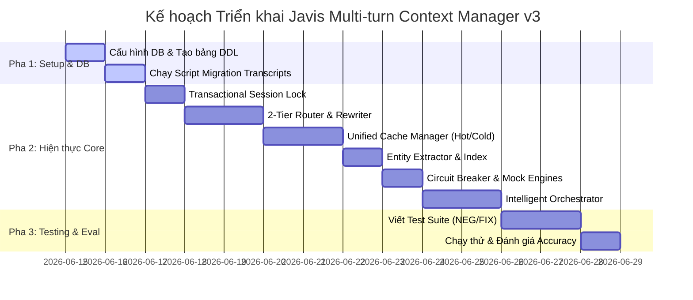

# Kế Hoạch Triển Khai Hoàn Chỉnh Hệ Thống Quản Lý Ngữ Cảnh Đa Lượt (Javis Multi-turn Context Manager v3)

Tài liệu này đặc tả kế hoạch triển khai chi tiết từng bước (Phased Implementation Plan) để xây dựng, tích hợp và kiểm thử hệ thống Quản lý Ngữ cảnh Đa lượt Stateful cho Trợ lý AI Javis sử dụng cơ sở dữ liệu PostgreSQL (`app_db`) và các API của Groq.

---

## 1. Bản Đồ Các Pha Triển Khai (Implementation Roadmap)



---

## 2. Chi Tiết Từng Pha Triển Khai (Detailed Phases)

### Pha 1: Thiết Lập Cơ Sở Dữ Liệu & Chuẩn Bị Dữ Liệu (Database & Data Setup)

*   **Môi trường chạy Python:** Sử dụng trình thông dịch Python hệ thống toàn cục tại `C:\Users\This PC\AppData\Local\Programs\Python\Python311\python.exe` để tránh thiếu thư viện (các gói `asyncpg`, `groq`, `sentence-transformers` và `numpy` đã được cài đặt sẵn tại đây).
*   **Nhiệm vụ 1.1: Tạo các bảng dữ liệu trên PostgreSQL (`app_db`)**
    *   Tạo file `requirements.txt` trong thư mục gốc dự án để chuẩn hóa các dependencies:
        ```text
        asyncpg>=0.29.0
        groq>=0.9.0
        sentence-transformers>=3.0.0
        numpy>=1.24.0
        python-dotenv>=1.0.0
        ```
    *   Thực thi mã DDL khởi tạo 4 bảng cache: `chat_history`, `session_context_cache` (bảng Hot), `session_context_payload` (bảng Cold), và `session_entity_index`.
    *   Bảo đảm kích hoạt các extension `pgvector` và `uuid-ossp` bằng các lệnh:
        ```sql
        CREATE EXTENSION IF NOT EXISTS vector;
        CREATE EXTENSION IF NOT EXISTS "uuid-ossp";
        ```
        > [!NOTE]
        > Đã cấu hình cài đặt package `postgresql-15-pgvector` thành công bên trong Docker Container của Postgres. Việc kích hoạt extension `vector` sẽ chạy mượt mà.
    *   Tạo chỉ mục B-Tree và chỉ mục GIN cho `display_names`. Không tạo chỉ mục vector (IVFFlat/HNSW) cho `query_embedding` vì brute-force trên tập kết quả sau khi lọc theo `session_id` tối ưu hơn (tối đa 3 slots/session).

*   **Nhiệm vụ 1.2: Chạy script migration cập nhật transcripts**
    *   Database hiện đã có sẵn 13 hàng trong bảng `transcripts` và 350 hàng trong bảng `chunks_turn` chứa toàn bộ nội dung của các file `GT_01.txt` đến `GT_09.txt` nhưng với `session_id` dạng thô như `ingest-media-gt_04-2026-05-04`.
    *   Viết script migration `migrate_transcripts.py` để chuẩn hóa cột `session_id` trong bảng `transcripts` về dạng canonical `GT_01` ... `GT_09`. Việc này giúp giữ nguyên dữ liệu gốc và metadata có sẵn (`meeting_date`, `duration_seconds`, `summary`, `raw_text`) mà không làm ảnh hưởng tới các foreign keys của `chunks_turn` (liên kết qua `transcript_id` dạng UUID).
    *   Mẫu SQL chạy trong Migration script:
        ```sql
        UPDATE transcripts SET session_id = 'GT_01' WHERE session_id = 'ingest-media-gt_01-2026-05-01';
        UPDATE transcripts SET session_id = 'GT_02' WHERE session_id = 'ingest-media-gt_02-2026-05-02';
        UPDATE transcripts SET session_id = 'GT_03' WHERE session_id = 'ingest-media-gt_03-2026-05-03';
        UPDATE transcripts SET session_id = 'GT_04' WHERE session_id = 'ingest-media-gt_04-2026-05-04';
        UPDATE transcripts SET session_id = 'GT_05' WHERE session_id = 'ingest-media-gt_05-2026-05-05';
        UPDATE transcripts SET session_id = 'GT_06' WHERE session_id = 'ingest-media-gt_06-2026-05-06';
        UPDATE transcripts SET session_id = 'GT_07' WHERE session_id = 'ingest-media-gt_07-2026-05-07';
        UPDATE transcripts SET session_id = 'GT_08' WHERE session_id = 'ingest-media-gt_08-2026-05-08';
        UPDATE transcripts SET session_id = 'GT_09' WHERE session_id = 'ingest-media-gt_09-2026-05-09';
        ```

---

### Pha 2: Hiện Thực Hóa Các Module Lõi (Core Development)

*   **Nhiệm vụ 2.1: Transactional Session Lock (`session_lock.py`)**
    *   Hiện thực class `SessionLockManager` sử dụng `pg_try_advisory_xact_lock`.
    *   > [!IMPORTANT]
        > **Sửa lỗi ngẫu nhiên hóa Hash của Python**: Hàm `hash()` mặc định của Python 3 sẽ trả về giá trị ngẫu nhiên khác nhau giữa các tiến trình chạy song song (do tính năng Hash Randomization). 
        > Do đó, để Advisory Lock hoạt động đồng bộ chính xác trên môi trường đa luồng/đa tiến trình, ta phải dùng thuật toán băm nhất quán như MD5 để sinh khóa số 64-bit int:
        ```python
        import hashlib
        
        def get_lock_id(session_id: str) -> int:
            hasher = hashlib.md5(session_id.encode('utf-8'))
            digest = hasher.digest()
            # Lấy 8 bytes đầu tiên chuyển sang kiểu signed 64-bit integer (PostgreSQL bigint)
            return int.from_bytes(digest[:8], byteorder='big', signed=True)
        ```
    *   Hỗ trợ loop chờ với timeout 8.0 giây. Ném lỗi `TimeoutError` nếu quá hạn để giải phóng RAM nhanh chóng.

*   **Nhiệm vụ 2.2: 2-Tier Router & Rewriter (`router.py`)**
    *   **Tier 1 (Fast Filter):**
        *   Regex kiểm tra chuyển mạch từ khóa cứng.
        *   Tra cứu nhanh đại từ nhân xưng tiếng Việt từ bảng `session_entity_index` bằng câu lệnh SQL ARRAY check.
        *   Tính toán tương đồng ngữ nghĩa vector bằng pgvector (Cosine distance) sử dụng mô hình `intfloat/multilingual-e5-small` thông qua thư viện `sentence-transformers`.
        *   > [!TIP]
            > **E5 Prefixing**: Khi gọi mô hình `multilingual-e5-small` để sinh embedding cho câu hỏi mới, bắt buộc phải đính kèm tiền tố `"query: "` vào trước câu hỏi để đạt độ chính xác tối ưu theo thiết kế của dòng E5.
        *   Tích hợp hàm bọc `_safe_embed()` khống chế timeout 1s và chặn vector 0; nếu embedding lỗi, tự động hạ cấp chuyển lên Tier 2 thay vì crash.
    *   **Tier 2 (LLM Router):**
        *   Gọi API Groq (mô hình `llama-3.3-70b-versatile` cấu hình trong `.env`) sử dụng cơ chế xoay vòng danh sách Groq API Keys để tránh Rate Limit (HTTP 429).
        *   Viết lại câu hỏi (`rewritten_query`) và định tuyến khi Tier 1 ở vùng xám.

*   **Nhiệm vụ 2.3: Unified Cache Manager (`cache_manager.py`)**
    *   Thao tác ghi tách biệt bảng Hot/Cold.
    *   > [!IMPORTANT]
        > **Sửa lỗi truy vấn bảng Cold**: Bảng `session_context_payload` chỉ chứa khóa ngoại `cache_id` trỏ tới `session_context_cache(id)`. Do đó, câu lệnh UPDATE payload phải dùng subquery kết nối:
        ```sql
        UPDATE session_context_payload 
        SET cached_payload = $1 
        WHERE cache_id = (
            SELECT id FROM session_context_cache 
            WHERE session_id = $2 AND topic_key = $3
        );
        ```
    *   Hiện thực logic `touch_cache_slot` (chỉ cập nhật `last_accessed_at` khi cache hit) và `update_cache_slot` (cập nhật payload và đồng thời sinh đè embedding khi có data update).
    *   Hiện thực thuật toán LRU Eviction tự động xóa dòng cũ nhất khi vượt quá 3 slots per session (sử dụng `ON DELETE CASCADE` tự động giải phóng bảng Cold).
    *   Cơ chế `FOR UPDATE` lock dòng tại bảng Hot (`session_context_cache`) khi có thao tác truy xuất từng phần (partial retrieval) để ngăn chặn LRU cleanup xóa nhầm dòng khi đang truy vấn.

*   **Nhiệm vụ 2.4: Entity Extractor (`entity_extractor.py`)**
    *   Phân tích dữ liệu trả về từ execution engine để trích xuất `transcript_id`, `speaker` (dành cho SQL), hoặc `file_name` (dành cho RAG).
    *   Thực hiện UPSERT các đại từ tiếng Việt tương ứng (`"nó"`, `"ấy"`, `"ông đó"`, `"họ"`, v.v.) vào bảng `session_entity_index` liên kết với `cache_slot_id` vừa thao tác.

*   **Nhiệm vụ 2.5: Engines & Circuit Breaker (`engines.py`)**
    *   **SQL Engine**: Nhận câu lệnh SQL và các tham số lọc, thực thi trực tiếp trên database PostgreSQL và trả về danh sách các hàng dữ liệu.
    *   **RAG Engine**: Tìm kiếm thông tin trên các bảng `company_chunks` hoặc `chunks_turn`. Lọc theo `rag_doc_ids` (chính là `document_id` hoặc `transcript_id`) nếu có, sử dụng mô hình embedding E5 tính tương đồng cosine trong Python (hoặc SQL full-text search) để lấy ra chunks phù hợp nhất.
    *   **Web Engine**: Gọi mô hình Groq LLM phụ với system prompt đóng vai trò mô phỏng Google Search để sinh các snippets thông tin thực tế dựa trên query, bỏ qua sự phụ thuộc vào API Key tìm kiếm bên thứ ba mà vẫn đảm bảo tính chân thực và cơ chế TTL 1 giờ.
    *   Tất cả các Engine được bảo vệ bằng Circuit Breaker (CLOSED/OPEN/HALF_OPEN) và giới hạn timeout 3s sử dụng `asyncio.wait_for`.

*   **Nhiệm vụ 2.6: Intelligent Orchestrator (`orchestrator.py`)**
    *   Ráp nối toàn bộ 8 bước pipeline của hệ thống.
    *   Triển khai phân nhánh trả lời trực tiếp (Direct-Answer Path) cho câu trả lời đơn giản để bypass LLM nhằm tiết kiệm token và thời gian phản hồi.
    *   Triển khai bộ kiểm chứng chất lượng Self-Check Verification (tối đa 2 lần thử lại). Khi vượt quá số lần thử, trả về câu trả lời kèm thông điệp cảnh báo an toàn và gắn cờ `answer_confidence = 'low'`.

---

## 3. Xây Dựng Bộ Kiểm Thử & Đánh Giá (Testing & Evaluation)

*   **Nhiệm vụ 3.1: Hiện thực hóa kịch bản kiểm thử (`test_suite.py`)**
    *   Cấu hình 19 test case nhiễu (`NEG_001` - `NEG_019`) và 10 test case khắc phục lỗi (`FIX_001` - `FIX_010`) dựa trên ma trận kiểm thử tại `testing_and_evaluation.md`.
    *   Chạy mô phỏng tải song song (concurrent requests) để kiểm nghiệm Advisory Locks.
*   **Nhiệm vụ 3.2: Đo đạc chỉ số (KPI evaluation)**
    *   Đo đạc độ trễ định tuyến của Tier 1 (< 15ms) và Tier 2.
    *   Báo cáo tỷ lệ cache hit, tỷ lệ định tuyến sai và độ chính xác tự kiểm chứng (Self-check pass rate) thông qua CLI report định cấu trúc.

---

## 4. Quản Trị Rủi Ro & Cơ Chế Fallback (Risk Management)

| Rủi ro tiềm ẩn | Mức độ | Cơ chế ứng phó và phòng vệ |
| :--- | :--- | :--- |
| **API Groq bị Rate Limit (HTTP 429)** | Cao | Tự động xoay vòng danh sách Groq API Keys đã cấu hình trong `.env` (`GROQ_API_KEYS`). |
| **Mô hình Embedding Timeout / Chậm** | Trung bình | `_safe_embed()` tự ngắt sau 1s, chuyển trực tiếp lên Tier 2 để LLM Router giải quyết mà không gây crash luồng. |
| **Nghẽn Advisory Lock do transaction treo** | Trung bình | Timeout 8s khống chế ở `SessionLockManager`, ném lỗi giải phóng luồng nhanh chóng để bảo vệ RAM. |
| **Database bị phình dữ liệu do JSON quá lớn** | Thấp | Tách biệt lưu trữ Hot (chỉ số gọn nhẹ) và Cold (payload cồng kềnh) kết hợp LRU dọn dẹp tối đa 3 slots/session. |
