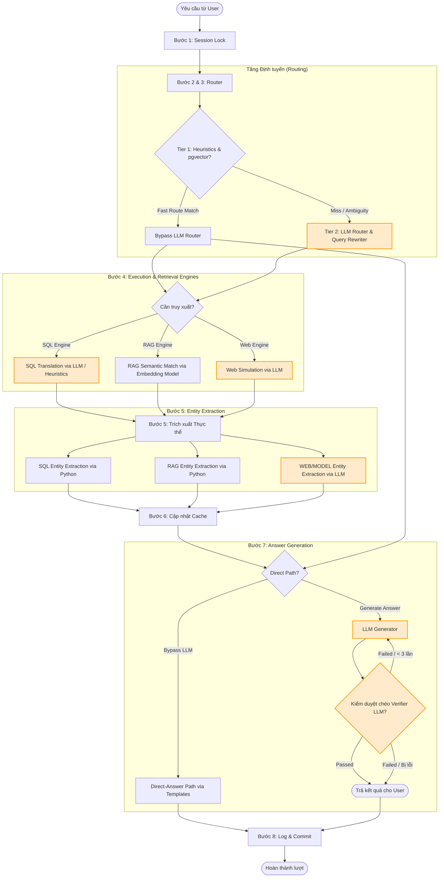
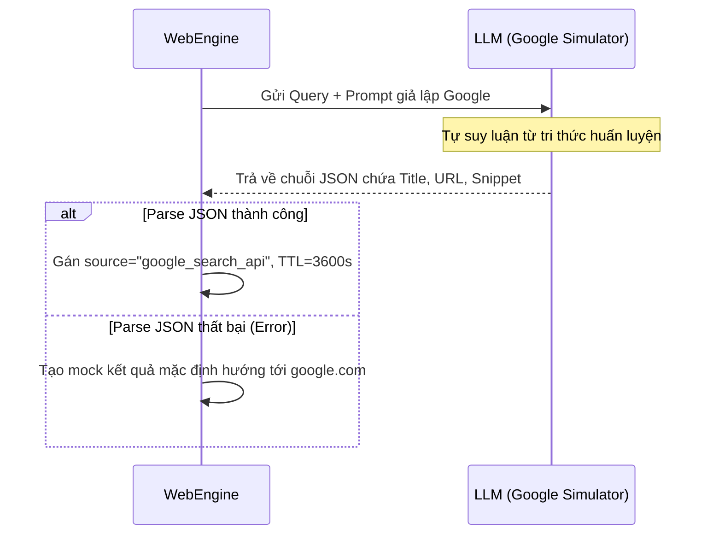
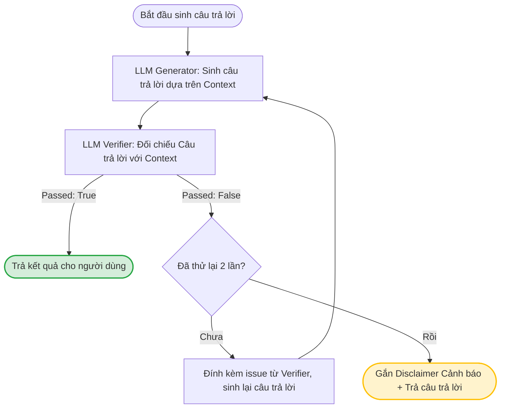

# Báo cáo Phân tích Chuyên sâu: Điểm chạm LLM và Kiểm soát Ảo giác (Hallucination) trong Javis V3

*Mã tài liệu: JAVIS-LLM-HALLUCINATION-02*  
*Người lập: Antigravity AI Agent*  
*Ngày lập: 24/06/2026*  

---

## ⚡ 1. Bản đồ Điểm chạm LLM trong Pipeline Javis V3

Hệ thống Javis Multi-Turn Context Manager (V3) được thiết kế theo luồng xử lý 8 bước tuần tự. Trong đó, LLM được sử dụng tại **5 vị trí chiến lược** nhằm xử lý các tác vụ yêu cầu hiểu ngôn ngữ tự nhiên, lập luận và sinh câu trả lời.



### Bảng tóm tắt các Điểm chạm LLM

| Điểm chạm | Thành phần (Component) | Phương thức & Tập tin | Mô tả và Nhiệm vụ kỹ thuật |
| :--- | :--- | :--- | :--- |
| **1** | **Precision Router & Query Rewriter** | [_route_tier_2](file:///D:/VJ/Tro-li-ao-Javis/multi-turn-context-manager/src/router.py#L800) trong [router.py](file:///D:/VJ/Tro-li-ao-Javis/multi-turn-context-manager/src/router.py) | Giải quyết đại từ chỉ định, viết lại câu hỏi đơn độc thành câu truy vấn đầy đủ ngữ cảnh (`rewritten_query`), và định tuyến sang pipeline tối ưu (`SQL`, `RAG`, `WEB`, `MODEL`). |
| **2** | **SQL Query Generator** | [SQLEngine.execute](file:///D:/VJ/Tro-li-ao-Javis/multi-turn-context-manager/src/engines.py#L148) trong [engines.py](file:///D:/VJ/Tro-li-ao-Javis/multi-turn-context-manager/src/engines.py) | Dịch câu hỏi tự nhiên tiếng Nhật/Việt sang câu truy vấn `SELECT` của PostgreSQL dựa trên schema cơ sở dữ liệu được đính kèm trực tiếp trong prompt. |
| **3** | **Web Search Simulator** | [WebEngine.execute](file:///D:/VJ/Tro-li-ao-Javis/multi-turn-context-manager/src/engines.py#L520) trong [engines.py](file:///D:/VJ/Tro-li-ao-Javis/multi-turn-context-manager/src/engines.py) | Giả lập công cụ tìm kiếm Google để trả về kết quả cấu trúc JSON chứa `title`, `url`, `snippet` và `relevance` dựa trên tri thức nội tại của mô hình. |
| **4** | **WEB/MODEL Entity Extractor** | [EntityExtractor](file:///D:/VJ/Tro-li-ao-Javis/multi-turn-context-manager/src/entity_extractor.py#L195) trong [entity_extractor.py](file:///D:/VJ/Tro-li-ao-Javis/multi-turn-context-manager/src/entity_extractor.py) | Phân tích văn bản phi cấu trúc (kết quả web hoặc câu trả lời từ mô hình) để trích xuất tối đa 2 thực thể chính (người, công ty, tài liệu) phục vụ việc lập chỉ mục ngữ cảnh. |
| **5** | **Answer Generator & Self-Check Verifier** | [_generate_llm_answer_with_self_check](file:///D:/VJ/Tro-li-ao-Javis/multi-turn-context-manager/src/orchestrator.py#L533) & [_verify_hallucination](file:///D:/VJ/Tro-li-ao-Javis/multi-turn-context-manager/src/orchestrator.py#L606) trong [orchestrator.py](file:///D:/VJ/Tro-li-ao-Javis/multi-turn-context-manager/src/orchestrator.py) | **Generator:** Sinh câu trả lời tự nhiên từ kết quả truy xuất.<br>**Verifier:** Sử dụng LLM độc lập chạy song song đối chiếu câu trả lời với dữ liệu thô (raw payload) để phát hiện ảo giác hoặc mâu thuẫn thông tin. |

---

## 🔍 2. Phân tích Chi tiết Kỹ thuật và Cơ chế Kiểm soát tại Mã nguồn

### 1. Precision Router & Query Rewriter

#### Luồng xử lý chi tiết:
1. Hệ thống truy vấn lịch sử hội thoại từ bảng `chat_history` (giới hạn 16 tin nhắn gần nhất) và chuyển đổi thành một chuỗi văn bản đại diện cho luồng chat (`history_str`).
2. Lấy dữ liệu metadata của các cache slots đang hoạt động liên quan đến `session_id` từ bảng `session_context_cache` và các thực thể liên quan từ `session_entity_index` để xây dựng chuỗi thông tin cache hoạt động (`active_caches_str`).
3. Gọi mô hình LLM (Groq Llama-3.3-70B-Versatile) với định dạng phản hồi bắt buộc là JSON.

#### Các cơ chế kiểm soát cứng bằng mã nguồn (Hardcoded Overrides):
Để khắc phục xu hướng "quá tự tin" hoặc định tuyến sai của LLM, [router.py](file:///D:/VJ/Tro-li-ao-Javis/multi-turn-context-manager/src/router.py) tích hợp các quy tắc ghi đè lập trình (Heuristic Overrides) sau:
* **Ghi đè truy vấn so sánh/nhiều thực thể:** Hệ thống kích hoạt override qua hai cơ chế song song: (a) phát hiện từ khóa so sánh trong cả câu hỏi gốc lẫn `rewritten_query` (ví dụ: *比較, 同じ目的, 共通, 違い, 異なる, 別, 両方, すべて, 全員, 合計*), và (b) đếm số lượng session ID (GT_xx) xuất hiện trong `rewritten_query`. Nếu có từ khóa so sánh hoặc nhiều hơn 1 session ID (`has_multiple_gts`), hệ thống ghi đè quyết định của LLM, ép buộc `needs_retrieval = "full"` và `use_cache = False` để lấy lại toàn bộ dữ liệu mới.
* **Đồng bộ hóa Case-Sensitive:** Đồng bộ hóa `target_topic_key` với các cache hiện tại trong DB để tránh trường hợp LLM trả về chữ hoa/thường không khớp (ví dụ: `gt_04` so với `GT_04`), đồng thời hạ cấp xuống full retrieval nếu LLM tham chiếu đến một key không tồn tại.
* **Tự động vá đại từ chỉ định:** Nếu `target_topic_key` trỏ tới một session cụ thể nhưng trong `rewritten_query` của LLM vẫn còn đại từ chỉ định (như `彼` - anh ấy, `彼女` - cô ấy, `それ` - cái đó), mã nguồn Python sẽ tự động thay thế đại từ đó bằng Session ID (ví dụ: `GT_04`) để làm sạch câu hỏi trước khi đưa vào các Engine.
* **Bảo vệ luồng dữ liệu session:** Nếu câu hỏi chứa Session ID, hệ thống sẽ cấm định tuyến vào pipeline `MODEL` hoặc `WEB`, tự động chuyển sang `SQL` hoặc `RAG` để bảo vệ tính toàn vẹn dữ liệu.
* **Chặn ghi đè pipeline khi có nhiều GT ID:** Nếu `query_gts_count > 1` (phát hiện nhiều session ID ngay trong câu hỏi gốc), hệ thống force `needs_retrieval = "full"` và `use_cache = False`, bất kể LLM có trả về `same_entity` hay không. Cơ chế này hoạt động độc lập với override so sánh bên trên.
* **Ghi đè cưỡng bức sang WEB pipeline:** Nếu câu hỏi gốc chứa các từ khóa tìm kiếm tiếng Nhật rõ ràng như `"ネットで"`, `"検索して"`, hoặc `"グーグルで"`, hệ thống sẽ bỏ qua phán đoán của LLM và cưỡng bức chuyển `target_pipeline = "WEB"`.
* **Giới hạn của bộ vá đại từ chỉ định (Loop Break):** Mặc dù mã nguồn có cơ chế vá đại từ chỉ định bằng cách duyệt danh sách `PRONOUNS` đã sắp xếp theo độ dài giảm dần, nhưng việc sử dụng câu lệnh `break` ngay sau khi tìm thấy đại từ đầu tiên làm cho hệ thống chỉ thay thế được **một** đại từ chỉ định duy nhất trong câu hỏi. Nếu câu hỏi có nhiều đại từ chỉ định khác nhau (ví dụ: *"彼とそちらの通話について"*), các đại từ còn lại sẽ bị bỏ sót.

---

### 2. SQL Query Generator

#### Luồng xử lý chi tiết:
1. `SQLEngine` trước tiên gọi hàm kiểm tra heuristic [heuristic_sql_translation](file:///D:/VJ/Tro-li-ao-Javis/multi-turn-context-manager/src/engines.py#L89) để tự động dịch các câu hỏi phổ biến (như lấy chi tiết, đếm, tính thời lượng, hỏi danh sách tham gia) bằng Regex. Nếu khớp, hệ thống sẽ **bỏ qua hoàn toàn cuộc gọi LLM**, tránh trễ và triệt tiêu 100% ảo giác ở bước này.
2. Nếu heuristic bị trượt (miss), LLM sẽ được gọi kèm theo chi tiết schema của hai bảng `transcripts` và `chunks_turn`.
3. LLM sinh mã PostgreSQL dạng chuỗi thuần túy.

#### Các cơ chế kiểm soát cứng bằng mã nguồn:
* **Lọc bỏ khối suy nghĩ (Think Tags):** Loại bỏ thẻ `<think>...</think>` của các mô hình lý luận (như DeepSeek-R1) để tránh lỗi cú pháp SQL.
* **Vệ sinh định dạng:** Loại bỏ cú pháp bao bọc Markdown (ví dụ: ` ```sql `) và trích xuất câu lệnh bắt đầu từ từ khóa `SELECT`.
* **Cắt đuôi giải thích:** Cắt bỏ mọi văn bản giải thích thừa của LLM sau dấu chấm phẩy `;`.
* **Bộ lọc an toàn (Safety Guard - whitelist):** Kiểm tra câu lệnh SQL có bắt đầu bằng từ khóa `SELECT` hay không. Nếu không (ví dụ bắt đầu bằng `INSERT`, `UPDATE`, `DELETE`, `DROP`, `ALTER` hoặc bất kỳ lệnh DDL/DML nào khác), truy vấn sẽ bị từ chối ngay lập tức bằng một `ValueError`. Đây là cơ chế whitelist, không phải blacklist — chỉ có `SELECT` mới được phép đi qua.
* **Fallback tự động phục hồi:** Nếu thực thi SQL phát sinh lỗi cơ sở dữ liệu hoặc trả về kết quả trống, hệ thống sẽ kích hoạt luồng cứu hộ, tự động fallback sang `RAGEngine` để tìm kiếm ngữ cảnh dựa trên embedding.
* **Tích hợp Circuit Breaker và Fallback:** Khi `SQLEngine` phát sinh lỗi cơ sở dữ liệu hoặc ValueError (như lệnh không phải SELECT), lớp `EngineCircuitBreaker` sẽ bắt lấy ngoại lệ và trả về payload an toàn dạng `{"error": ..., "fallback": True}`. Do payload này không chứa khoá `"rows"`, Orchestrator sẽ tự động phát hiện thông qua logic `not payload.get("rows")` và chuyển hướng sang `RAGEngine` một cách mượt mà.

---

### 3. Web Search Simulator

#### Luồng xử lý chi tiết:
1. `WebEngine` nhận truy vấn tìm kiếm (có thể kèm theo tham số bổ sung từ router).
2. Xây dựng prompt yêu cầu LLM đóng vai trò Google Search Simulator, tạo ra các kết quả tìm kiếm giả lập dưới định dạng JSON có cấu trúc.



> [!WARNING]
> **Rủi ro ảo giác cực cao:** Vì không có API tìm kiếm thực tế, toàn bộ kết quả của `WebEngine` đều dựa vào khả năng ghi nhớ thông tin cũ của LLM. Mọi URL được tạo ra đều là giả lập và có nguy cơ cao bị sai lệch thông số thực tế khi người dùng hỏi các sự kiện diễn ra sau ngày cắt dữ liệu huấn luyện của mô hình.

> [!NOTE]
> Cả nhánh parse JSON thành công và nhánh fallback khi lỗi đều gán `source = "google_search_api"` cho payload đầu ra. Điều này khiến các thành phần downstream (EntityExtractor, Generator) không thể phân biệt đâu là kết quả thật từ LLM và đâu là kết quả mặc định khi parse thất bại, dẫn đến nguy cơ false confidence.

> [!CAUTION]
> **Lỗ hổng Bypass TTL Cache (Mã nguồn bỏ quên kiểm tra TTL):** Hệ thống định nghĩa `CACHE_TTL_WEB = 3600` (1 giờ) và `CACHE_TTL_SQL = 86400` (24 giờ), đồng thời xây dựng hàm kiểm tra `check_cache_ttl` trong `cache_manager.py`. Tuy nhiên, trong toàn bộ luồng xử lý của `Orchestrator`, hàm kiểm tra TTL này **không bao giờ được gọi**. Kết quả là các slot cache WEB giả lập và SQL được tái sử dụng vô hạn cho đến khi bị eviction bằng LRU (khi vượt quá 5 slots). Điều này dẫn tới nguy cơ ảo giác dữ liệu lỗi thời cực cao.

---

### 4. WEB/MODEL Entity Extractor

#### Luồng xử lý chi tiết:
1. Đối với kết quả phi cấu trúc từ `WEB` hoặc `MODEL`, `EntityExtractor` gọi LLM để đọc ngữ cảnh văn bản và trích xuất tối đa 2 thực thể.
2. Hệ thống áp dụng cấu trúc JSON trả về nghiêm ngặt chứa `entity_id`, `entity_type` và `display_names`.

#### Quy tắc chặn từ khóa trừu tượng (Negative Constraints):
* Để tránh làm ô nhiễm bộ chỉ mục thực thể (`session_entity_index`), hệ thống cấm tuyệt đối việc trích xuất các danh từ chung chung, trừu tượng như: *情報 (thông tin), データ (dữ liệu), 内容 (nội dung), 詳細 (chi tiết), こと (sự việc), もの (sự vật)*. Việc đưa các từ khóa này vào danh sách thực thể sẽ làm hỏng hoàn toàn cơ chế phân giải đại từ chỉ định của Router ở các lượt chat sau.
* Bộ lọc kiểu thực thể (Type Normalization): Hệ thống chuẩn hóa các thực thể không hợp lệ về các nhóm chuẩn `meeting_transcript`, `person`, `document`, `sql_result`.

---

### 5. Answer Generator & Self-Check Verifier

Đây là chốt chặn quan trọng nhất của hệ thống nhằm đảm bảo câu trả lời cuối cùng không chứa thông tin sai lệch so với dữ liệu thô đã truy xuất.



#### Cơ chế của Generator:
Sử dụng 10 quy tắc hệ thống cực kỳ chi tiết, trong đó nổi bật là:
* **Quy tắc 2 (An toàn tối đa):** Bắt buộc trả lời không tìm thấy dữ liệu nếu context trống hoặc không đủ thông tin.
* **Quy tắc 6 & 7 (Chống đảo ngược vai trò và đại từ):** Phân tích kỹ lưỡng lời chào hỏi và nội dung đàm thoại để phân biệt rõ bên gọi (phát sinh) và bên nghe (tiếp nhận), tránh nhầm lẫn đại từ `彼` (anh ấy) hoặc `彼女` (cô ấy) của nhân vật này sang nhân vật khác.
* **Quy tắc 8 (Ràng buộc logic so sánh):** Bắt buộc câu trả lời phủ định phải chứa các từ khóa rõ ràng (*いいえ, 異なり, 違う, 別, ない*).

#### Cơ chế của Verifier:
* So sánh câu trả lời của Generator với dữ liệu gốc (`context_str`) chạy trên một LLM độc lập.
* **Quy tắc an toàn (Không phạt sự trung thực):** Nếu Generator trả lời *"Không có thông tin"* hoặc *"Không thể xác nhận"*, Verifier được cấu hình bắt buộc phải chấm **Passed: True** để bảo vệ hành vi an toàn của Generator.
* Nếu phát hiện lỗi (Passed: False), Verifier trả về JSON mô tả lỗi (`issues`).
* **Vòng lặp tự sửa lỗi (Retry Loop):** Hệ thống cho phép tối đa 2 lần sinh lại. Mỗi lần sinh lại, mô tả lỗi từ Verifier sẽ được đính kèm vào lịch sử hội thoại để Generator tự sửa đổi.
* **Cảnh báo độ tin cậy thấp (Disclaimer):** Nếu sau 2 lần sửa đổi vẫn không vượt qua kiểm duyệt, hệ thống vẫn trả về câu trả lời nhưng tự động đính kèm cảnh báo: `*(注意: この回答は自己検証で完全に一致しなかったため、信頼性が低くなっています。)*`
* **Fail-Open Safe:** Nếu cuộc gọi LLM Verifier bị lỗi kết nối hoặc ngoại lệ (exception), hệ thống trả về `True, None` để tránh việc chương trình bị treo hoặc rơi vào vòng lặp vô hạn.

---

## 💥 3. Ma trận Rủi ro Ảo giác (Hallucination Vulnerability Matrix)

Dưới đây là bảng phân tích chi tiết các kịch bản lỗi, nguyên nhân gốc rễ và mức độ ảnh hưởng của ảo giác trong hệ thống Javis V3:

| Mã lỗi | Kịch bản lỗi (Failure Scenario) | Nguyên nhân gốc rễ (Root Cause) | Mức độ nghiêm trọng | Cơ chế phòng thủ hiện tại | Rủi ro còn lại (Remaining Risk) |
| :--- | :--- | :--- | :---: | :--- | :--- |
| **V-01** | **Ảo giác thông tin Web tuyệt đối** | `WebEngine` tự sinh dữ liệu và URL từ trọng số mô hình khi không tích hợp API tìm kiếm thực tế. | **High** | Không có (Hoàn toàn phụ thuộc vào tri thức huấn luyện của mô hình). | Cực kỳ cao đối với các câu hỏi về thông tin thời gian thực hoặc chi tiết kỹ thuật mới. |
| **V-02** | **Bỏ lọt ảo giác do Fail-Open** | Verifier gặp lỗi (Rate Limit, Timeout, Network Error), hàm trả về `True` để tránh deadlock. | **Medium** | Tự động trả về `True, None` khi xảy ra exception. | Câu trả lời bị ảo giác nặng vẫn có thể được trả trực tiếp cho người dùng mà không có cảnh báo. |
| **V-03** | **Đảo ngược vai trò hội thoại (Role Reversal)** | Generator hiểu sai chủ ngữ/vị ngữ trong các cuộc gọi tiếng Nhật có cấu trúc câu lược bỏ chủ từ. | **High** | Quy tắc hệ thống số 6 & 7 ép mô hình phân biệt bên gọi/bên nghe. | LLM vẫn có thể bị nhầm lẫn khi gặp các cuộc gọi có cấu trúc đàm thoại phức tạp hoặc gián đoạn giữa chừng. |
| **V-04** | **Lỗi cú pháp SQL hoặc Cột ảo** | LLM Generator tạo ra các cột không có trong schema DB (ví dụ: `transcript_chunks` thay vì `chunks_turn`). | **High** | Heuristic SQL Bypass cho các câu lệnh đơn giản; Lọc cú pháp SQL; Fallback tự động sang RAG khi lỗi. | Các câu lệnh phức tạp đòi hỏi logic gom nhóm (group by) hoặc lọc lồng nhau vẫn có nguy cơ bị lỗi cú pháp cao. |
| **V-05** | **Ô nhiễm thực thể chéo (Cross-Session Pollution)** | Router giải quyết đại từ chỉ định sai lệch, tham chiếu nhầm nhân vật ở một session cũ hơn. | **Medium** | Phân giải đại từ chỉ định ưu tiên chọn thực thể ở lượt gần nhất; Loại bỏ từ khóa trừu tượng. | Khi lịch sử trò chuyện kéo dài và phức tạp, việc nhầm lẫn giữa các nhân vật có tên giống hoặc gần giống nhau vẫn có thể xảy ra. |
| **V-06** | **Bỏ quên kiểm tra TTL Cache (Bypass TTL)** | Hàm `check_cache_ttl` trong `cache_manager.py` không bao giờ được gọi ở `Orchestrator`, khiến cache được lưu vĩnh viễn. | **High** | Eviction bằng thuật toán LRU (tối đa 5 slots). | Ảo giác do context cũ/lỗi thời (stale context) khi người dùng hỏi các thông tin thời gian thực. |
| **V-07** | **Giới hạn vòng lặp thế đại từ chỉ định (Loop Break)** | Lệnh `break` trong luồng thay thế đại từ chỉ định ở `router.py` dừng ngay sau đại từ đầu tiên được khớp. | **Medium** | Sắp xếp danh sách đại từ theo chiều dài giảm dần. | Các đại từ chỉ định tiếp theo trong câu hỏi phức hợp không được giải quyết, dẫn đến truy xuất sai/thiếu ngữ cảnh. |
| **V-08** | **Direct-Answer Path bypass lập luận khi Cache Hit** | `should_use_direct_path` tự động kích hoạt nếu cached payload là SQL kết quả có 1 dòng, bỏ qua LLM Generator. | **Low** | Ràng buộc từ khóa `DIRECT_PATH_SPECIFIC_FIELDS` để phát hiện câu hỏi chi tiết. | Khi người dùng hỏi câu hỏi lập luận trên kết quả cached, hệ thống trả về thông tin thô từ cache thay vì câu trả lời lập luận. |

---

## 🛠️ 4. Kiến nghị Cải tiến và Sơ đồ Giải pháp Kỹ thuật

Để giải quyết triệt để các rủi ro ảo giác trên, chúng tôi đề xuất 2 cải tiến kỹ thuật cốt lõi:

### 1. Loại bỏ rủi ro Fail-Open của Verifier bằng Nhãn Cảnh báo Tường minh
Trong hàm [_verify_hallucination](file:///D:/VJ/Tro-li-ao-Javis/multi-turn-context-manager/src/orchestrator.py#L606), khi xảy ra exception, thay vì trả về `True, None` (cho qua âm thầm), hệ thống cần trả về `True, "Verifier Connection Error"` để điều phối viên có thể đính kèm một nhãn cảnh báo tường minh lên giao diện người dùng.

#### Đề xuất chỉnh sửa mã nguồn tại [_verify_hallucination](file:///D:/VJ/Tro-li-ao-Javis/multi-turn-context-manager/src/orchestrator.py#L606):
```python
        except Exception as e:
            logger.error(f"Error during self-check verification: {e}")
            # Trả về True kèm theo issue mô tả lỗi kết nối để ghi nhận cảnh báo
            return True, f"Verifier system encountered an exception: {str(e)}"
```

#### Xử lý tại Generator [_generate_llm_answer_with_self_check](file:///D:/VJ/Tro-li-ao-Javis/multi-turn-context-manager/src/orchestrator.py#L533):
```python
                passed, issues = await self._verify_hallucination(response, context_str)
                if passed:
                    if issues and "Verifier system" in issues:
                        # Hệ thống chạy bình thường nhưng đính kèm disclaimer cảnh báo verifier lỗi
                        disclaimer = "\n\n*(警告: 自己検証エンジンがオフラインのため、回答の整合性を完全に保証できません。)*"
                        return response + disclaimer, "medium", True, retries
                    return response, "high", True, retries
```

---

### 2. Tích hợp Lớp Xác thực Schema dữ liệu bằng Pydantic (Data Contract)
Hiện tại, payload trao đổi giữa các engine và generator là các Python dictionary không định kiểu. Việc này dễ dẫn đến các lỗi runtime khi truy xuất thuộc tính (ví dụ: `payload.get("rows")` bị trả về `None` hoặc sai cấu trúc danh sách).

Chúng tôi đề xuất định nghĩa cấu trúc dữ liệu đầu ra của các Engine bằng Pydantic Models:

```python
from pydantic import BaseModel, Field, HttpUrl
from typing import List, Optional, Dict, Any

class SQLResultPayload(BaseModel):
    generated_sql: str
    rows: List[Dict[str, Any]] = Field(default_factory=list)

class WebSearchResultItem(BaseModel):
    title: str
    url: HttpUrl
    snippet: str
    relevance: float

class WebResultPayload(BaseModel):
    results: List[WebSearchResultItem]
    source: str
    query_used: str

class RAGDocumentItem(BaseModel):
    chunk_id: str
    text: str
    score: float
    metadata: Dict[str, Any]

class RAGResultPayload(BaseModel):
    documents: List[RAGDocumentItem]
```

Việc tích hợp Pydantic đảm bảo dữ liệu đầu vào của Generator và Verifier luôn tuân thủ đúng định dạng, giúp tránh các lỗi xử lý dữ liệu dẫn đến việc LLM Generator tự suy diễn thông tin bị thiếu (ảo giác).

---

### 3. Kích hoạt kiểm tra TTL Cache trong Orchestrator
Hiện tại cache được tái sử dụng vô thời hạn do bỏ quên bước kiểm tra TTL. Chúng tôi đề xuất gọi hàm `check_cache_ttl` trong `orchestrator.py` trước khi chấp nhận Cache Hit:

```python
            if needs_retrieval == "none" and use_cache:
                cache_slot = await get_cache_slot(conn, session_id, target_topic_key)
                if cache_slot:
                    # Kiểm tra tính tươi mới của cache (TTL)
                    ttl = CACHE_TTL_SQL if cache_slot["last_pipeline"] == "SQL" else CACHE_TTL_WEB
                    is_fresh = check_cache_ttl(cache_slot["refreshed_at"], ttl)
                    
                    if not is_fresh:
                        logger.info(f"Cache slot '{target_topic_key}' expired. Downgrading to full retrieval.")
                        needs_retrieval = "full"
                        use_cache = False
                    else:
                        # Tiếp tục kiểm tra Empty Payload và Granularity...
```

---

### 4. Loại bỏ câu lệnh break trong vòng lặp thay thế đại từ chỉ định
Để hỗ trợ việc thay thế nhiều đại từ chỉ định khác nhau trong cùng một câu hỏi phức hợp, cần gỡ bỏ từ khóa `break` trong hàm xử lý của `router.py`:

```python
                if gt_id and gt_id not in rewritten.upper():
                    has_pronoun = any(re.search(re.escape(p), rewritten.lower()) for p in PRONOUNS)
                    if has_pronoun:
                        sorted_pronouns = sorted(PRONOUNS, key=len, reverse=True)
                        for pron in sorted_pronouns:
                            if pron in rewritten:
                                rewritten = rewritten.replace(pron, gt_id)
                                # Bỏ break ở đây để tiếp tục thay thế các đại từ khác nếu có
                        result["rewritten_query"] = rewritten
```

---

## 📈 5. Kế hoạch Hành động (Action Plan) đề xuất

Để áp dụng các đề xuất trên vào dự án Javis V3, chúng tôi khuyến nghị thực hiện theo lộ trình 2 bước sau:

1. **Bước 1 (Ưu tiên Cao):** Khắc phục các lỗ hổng hệ thống và lỗi logic ảnh hưởng trực tiếp đến dữ liệu và tính trung thực của câu trả lời:
   - Sửa đổi hàm `_verify_hallucination` và `_generate_llm_answer_with_self_check` để cảnh báo tường minh khi Verifier lỗi (Rate Limit/Network Error).
   - Kích hoạt kiểm tra TTL cache bằng cách gọi `check_cache_ttl` trong luồng xử lý Cache Hit của `Orchestrator.handle`.
   - Gỡ bỏ lệnh `break` trong vòng lặp thay thế đại từ của `router.py` để hỗ trợ giải quyết nhiều đại từ đồng thời.
2. **Bước 2 (Ưu tiên Thấp):** Refactor toàn bộ dữ liệu đầu ra của các Engine sử dụng Pydantic Models để tăng tính chặt chẽ của mã nguồn (Data Contract).
