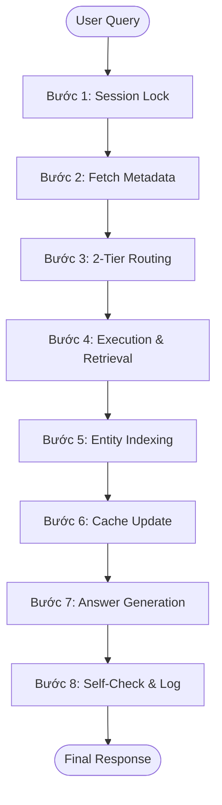
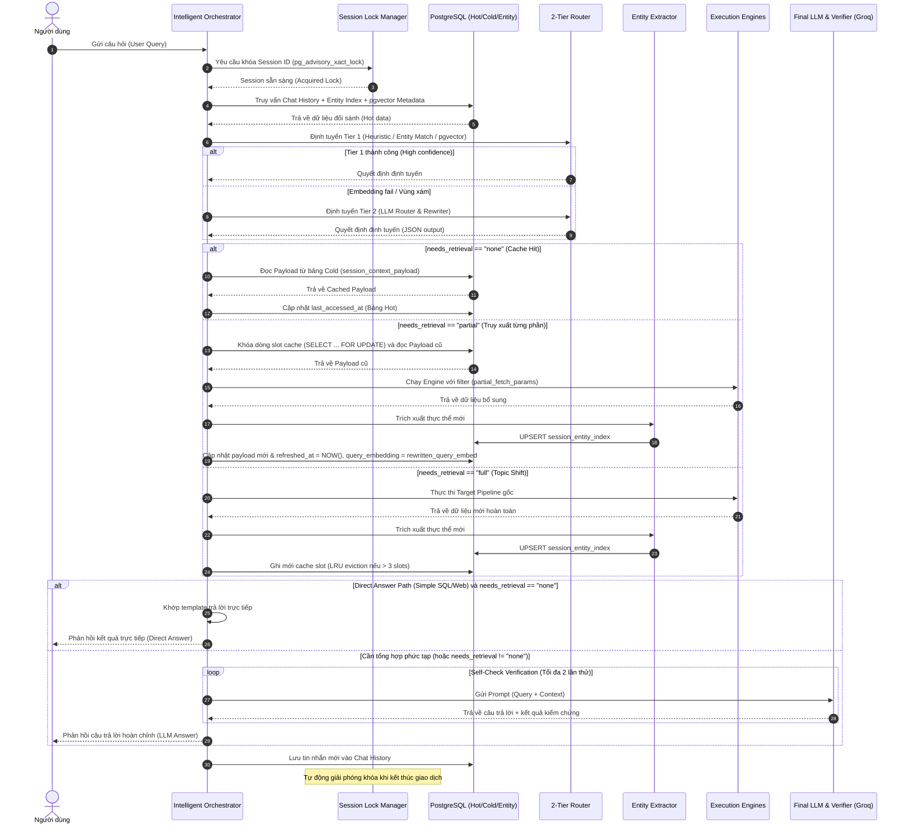

# Quy Trình Pipeline Hệ Thống (System Pipeline Description)
## Quản Lý Ngữ Cảnh Hội Thoại Đa Lượt (Multi-turn Context Management v3)

Tài liệu này mô tả chi tiết quy trình xử lý từng bước (Pipeline) của hệ thống quản lý ngữ cảnh hội thoại đa lượt lưu trạng thái (Stateful Context Management), từ lúc tiếp nhận câu hỏi của người dùng cho đến khi trả về phản hồi cuối cùng.

---

## 1. Tổng Quan Luồng Xử Lý (8 Bước Pipeline)

Quy trình xử lý một lượt chat của người dùng bao gồm 8 bước chính, được điều phối bởi **Intelligent Orchestrator**:

### Bước 1: Khóa Tuần Tự Phiên (Session Lock)
* **Mục tiêu:** Ngăn chặn race condition khi người dùng gửi nhiều câu hỏi cùng lúc hoặc click đúp.
* **Hoạt động:** Hệ thống sử dụng Transactional Advisory Lock (`pg_try_advisory_xact_lock` với timeout 8 giây) trên PostgreSQL. Nếu session đang bận, request mới sẽ phải xếp hàng chờ.

### Bước 2: Truy Vấn Lịch Sử & Metadata (Fetch Metadata)
* **Mục tiêu:** Thu thập ngữ cảnh hiện tại của session.
* **Hoạt động:** Thực hiện truy vấn nhanh trên bảng Hot (`session_context_cache`), lịch sử hội thoại gần nhất (`chat_history`), và danh mục thực thể (`session_entity_index`). Nhờ thiết kế phân tách Hot/Cold table, bước này chỉ quét các metadata gọn nhẹ nên độ trễ cực thấp.

### Bước 3: Định Tuyến 2 Tầng (2-Tier Routing)
* **Mục tiêu:** Xác định xem câu hỏi có kế thừa ngữ cảnh cũ (Cache Hit/Partial Fetch) hay chuyển chủ đề (Topic Shift).
* **Hoạt động:** Chạy qua **Tier 1 (Fast Filter)** sử dụng Regex, Entity Lookup và pgvector distance. Nếu rơi vào "Vùng xám" hoặc lỗi embedding, hệ thống tự động hạ cấp chuyển lên **Tier 2 (LLM Router & Rewriter)** để viết lại câu hỏi và phân tích sâu.

### Bước 4: Thực Thi Lấy Dữ Liệu (Execution & Retrieval)
* **Mục tiêu:** Lấy dữ liệu thô phục vụ câu trả lời.
* **Hoạt động:** Tùy thuộc vào kết quả của Router:
  * `needs_retrieval = "none"`: Đọc dữ liệu từ bảng Cold (`session_context_payload`).
  * `needs_retrieval = "partial"`: Sử dụng cơ chế **Partial Fetch** để truy vấn thêm dữ liệu bổ sung có ràng buộc (gắn SQL filter hoặc document IDs từ context cũ) mà không cần chạy lại toàn bộ query nặng.
  * `needs_retrieval = "full"`: Kích hoạt chạy các Execution Engine tương ứng (SQL, RAG, WEB, hoặc MODEL) từ đầu. Các Engine được bảo vệ bằng Circuit Breaker chống treo hệ thống.

### Bước 5: Trích Xuất & Ghi Thực Thể (Entity Indexing)
* **Mục tiêu:** Chỉ mục hóa các thực thể mới xuất hiện để phục vụ định tuyến nhanh ở lượt tiếp theo.
* **Hoạt động:** Chạy bộ trích xuất **EntityExtractor** (dựa trên cấu trúc SQL/RAG metadata hoặc LLM rút gọn cho WEB/MODEL) và thực hiện `UPSERT` vào bảng `session_entity_index`.

### Bước 6: Cập Nhật Trạng Thái Cache (Cache Update)
* **Mục tiêu:** Đồng bộ trạng thái và giải phóng bộ nhớ.
* **Hoạt động:** Ghi payload mới vào bảng Cold và cập nhật timestamps (`last_accessed_at`, `refreshed_at`) cũng như vector `query_embedding` mới (nếu có truy xuất mới) vào bảng Hot. Áp dụng thuật toán **LRU Eviction** giới hạn tối đa 3 slots cache cho mỗi phiên hội thoại (tự động CASCADE xóa bảng Cold nhờ ràng buộc khóa ngoại).

### Bước 7: Chọn Nhánh Sinh Câu Trả Lời (Answer Generation)
* **Mục tiêu:** Tối ưu hóa chi phí token bằng cách bỏ qua LLM khi không cần thiết.
* **Hoạt động:** Hệ thống quyết định đi theo **Direct-Answer Path** (trả về trực tiếp qua template được lập trình sẵn nếu kết quả đơn giản và `needs_retrieval = "none"`) hoặc đi theo **LLM Path** (gọi Groq LLM để đọc hiểu và tổng hợp tự nhiên).

### Bước 8: Tự Kiểm Chứng & Lưu Lịch Sử (Self-Check & Log)
* **Mục tiêu:** Đảm bảo câu trả lời không bị ảo giác (hallucination) và lưu vết hệ thống.
* **Hoạt động:**
  * Nếu đi qua LLM Path, hệ thống chạy cơ chế **Self-Check Verification** đối chiếu với nguồn dữ liệu gốc (tối đa 2 lần thử lại). Nếu thất bại sau 2 lần, câu trả lời sẽ đi kèm cảnh báo và gắn cờ `answer_confidence = "low"`.
  * Lưu nội dung chat thô, câu hỏi đã viết lại (`rewritten_content`), phương thức định tuyến, và độ tin cậy vào bảng `chat_history`.
  * Giải phóng Advisory Lock khi transaction COMMIT hoặc ROLLBACK.

---

## 2. Chi Tiết Các Điểm Nút Quyết Định (Decision Points)

Hệ thống quản lý ngữ cảnh tối ưu hóa chi phí và tốc độ dựa trên 3 điểm nút định tuyến cốt lõi sau:

### 2.1. Điểm Quyết Định 1: Tầng Lọc Nhanh (Tier 1 Routing)
Bộ lọc này chạy tuần tự nhằm đưa ra quyết định chớp nhoáng (< 15ms) không tốn token:
1. **Luật Cứng (Heuristic/Regex):** Quét các cụm từ chuyển mạch ("à thôi", "bỏ qua") $\rightarrow$ Chốt ngay Topic Shift (`needs_retrieval = "full"`).
2. **Đối Sánh Thực Thể (Entity Index Lookup):** Kiểm tra các đại từ tiếng Việt ("nó", "ấy", "lúc nãy") $\rightarrow$ Nếu có duy nhất 1 thực thể khớp trong `session_entity_index` $\rightarrow$ Chốt ngay Cache Hit (`needs_retrieval = "none"` hoặc `"partial"`).
3. **Khoảng Cách Ngữ Nghĩa (pgvector Distance):** Tính cosine distance của query embedding so với cache metadata:
   * **Vùng Xanh (< 0.22):** Quá giống nhau $\rightarrow$ Chốt Cache Hit.
   * **Vùng Đỏ (> 0.55):** Quá khác nhau $\rightarrow$ Chốt Topic Shift.
   * **Vùng Xám (0.22 - 0.55):** Mơ hồ, hoặc model embedding bị lỗi/timeout $\rightarrow$ Chuyển tiếp lên Tier 2.

### 2.2. Điểm Quyết Định 2: Định Tuyến Bằng LLM (Tier 2 Routing)
Được kích hoạt khi Tier 1 ở vùng xám. LLM (llama-3.3-70b) phân tích toàn bộ lịch sử để trả về JSON định dạng nhu cầu dữ liệu (`needs_retrieval`):
* **`none`:** Tái sử dụng 100% dữ liệu cũ trong bảng Cold.
* **`partial`:** Chạy **Partial Fetch** để lấy thêm dữ liệu (ví dụ: gắn thêm WHERE filter cho SQL template cũ).
* **`full`:** Chạy lại pipeline từ đầu.
* **TTL Override Check:** Tại bước này, nếu là cache `WEB` đã lưu quá 1 tiếng (3600s), hệ thống tự động bẻ lái thành `"full"` để lấy tin tức mới nhất.

### 2.3. Điểm Quyết Định 3: Chọn Nhánh Trả Lời (Answer Path)
* **Direct-Answer Path (Bỏ qua LLM):** Đi thẳng qua template nếu `needs_retrieval = "none"` và dữ liệu thô đơn giản (SQL $\le 1$ dòng và $\le 3$ cột; hoặc Web snippet relevance $> 0.85$). Tiết kiệm 100% token phản hồi.
* **LLM Path (Gọi LLM tổng hợp):** Áp dụng cho mọi trường hợp dữ liệu phức tạp (nhiều dòng SQL, RAG chunks) hoặc khi `needs_retrieval = "partial"`.

---

## 3. Bản Đồ Sequence Diagram Chi Tiết

Quy trình tương tác giữa các thực thể trong toàn bộ lifecycle của một request:

