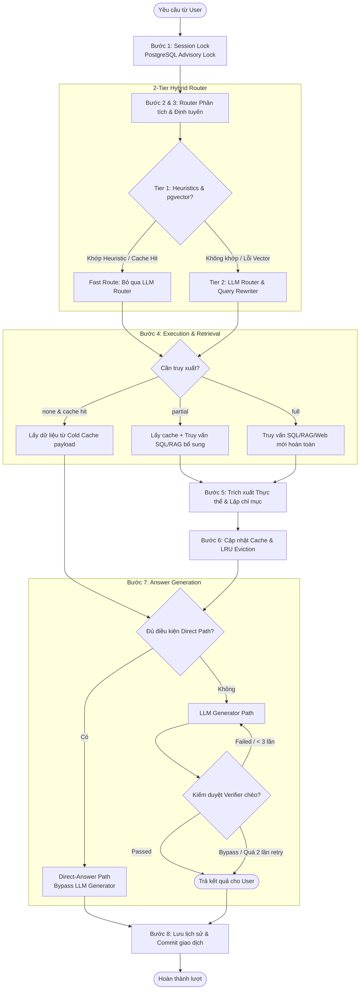
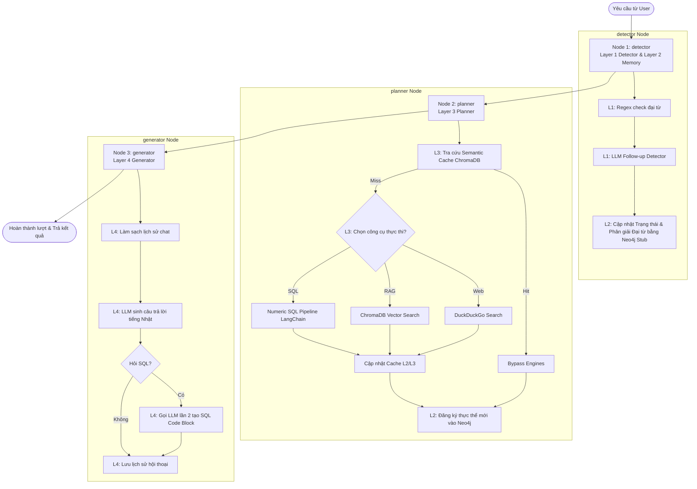

# Hướng dẫn Kỹ thuật: Phân tích Chi tiết Pipeline Vận Hành

### Đối chiếu Kiến trúc: Javis Multi-Turn Context Manager (V3) vs. HCACIS

*Mã tài liệu: JAVIS-VS-HCACIS-PIPE-01*  
*Người lập: Antigravity AI Agent*  
*Ngày lập: 23/06/2026*  

---

## 🎯 Giới thiệu

Tài liệu này cung cấp cái nhìn chi tiết và trực quan nhất về quy trình xử lý dữ liệu (pipeline) của hai hệ thống:

1. **Javis Multi-Turn Context Manager (V3)**: Hệ thống định tuyến hỗn hợp 2 tầng, sử dụng PostgreSQL làm backend lưu trữ tập trung, hỗ trợ advisory locking, hot/cold caching và cơ chế self-check verifier kiểm soát ảo giác.
2. **HCACIS (Hierarchical Context-Aware Conversational Intelligence System)**: Hệ thống đa tầng phân cấp triển khai trên LangGraph, sử dụng Neo4j cho đồ thị ngữ cảnh, Redis/ChromaDB làm cache, và LangChain làm framework điều phối.

---

## ⚡ 1. Pipeline của Javis Multi-Turn Context Manager (V3)

Hệ thống Javis xử lý yêu cầu tuần tự qua **8 bước** cực kỳ chặt chẽ trong thực thể `IntelligentOrchestrator` tại `orchestrator.py`.

### Sơ đồ Luồng (Mermaid Flowchart)

### Chi tiết 8 bước vận hành

1. **Bước 1: Session Lock (Khóa phiên)**
    * Hệ thống khởi tạo một kết nối PostgreSQL và mở một transaction.
    * Sử dụng PostgreSQL Advisory Lock thông qua hàm `pg_try_advisory_xact_lock` trên `session_id` để tuần tự hóa các truy vấn đồng thời trong cùng một phiên chat (timeout tối đa 8 giây). Điều này ngăn chặn race condition khi người dùng nhấn gửi liên tục.
2. **Bước 2 & 3: Fetch Metadata & Route (Truy xuất Metadata và Định tuyến)**
    * **Tier 1 (Fast Path):** `Router` sử dụng regex và so khớp thực thể kết hợp tính toán khoảng cách vector ngữ nghĩa (`pgvector`) đối với các câu hỏi trước đó trong cache. Nếu khoảng cách cosine $d_1 < 0.35$ và tỷ số khoảng cách $d_1/d_2 < 0.65$, hệ thống quyết định trúng cache và bỏ qua LLM Router (mục tiêu thiết kế cho thời gian quyết định định tuyến là < 15ms).
    * **Tier 2 (Precision Path):** Nếu Tier 1 không khớp, hệ thống gọi LLM (Groq/Qwen) để phân tích ý định (`intent_category`), mức độ cần truy xuất (`needs_retrieval`: `none`, `partial`, `full`), thực thể liên quan và viết lại câu hỏi đơn độc độc lập ngữ cảnh (`rewritten_standalone_query`).
3. **Bước 4: Execution & Retrieval (Thực thi và Truy xuất)**
    * **Cache Hit (`none`):** Lấy dữ liệu thô (raw payload từ cột `cached_payload`) từ bảng `session_context_payload` (Cold Table) dựa trên chủ đề (`target_topic_key`). Cache Hit trải qua 2 tầng kiểm tra trước khi dùng: (1) **Empty Payload Check** — nếu payload rỗng, tự động downgrade xuống `full` retrieval; (2) **Granularity Check** — nếu query yêu cầu dữ liệu chi tiết (ví dụ: 詳細, 発言) nhưng cache chỉ có dữ liệu tổng hợp (thiếu trường `speaker`/`text` turn-level), hệ thống tự động nâng cấp lên `full` retrieval.
    * **Partial Retrieval (`partial`):** Khóa bản ghi hot cache, lấy payload cũ, đồng thời gọi SQL/RAG engine với bộ lọc giới hạn (`partial_fetch_params`), sau đó thực hiện gộp payload bằng Python (`merged_payload = {**old_payload, **payload}`).
    * **Full Retrieval (`full`):** Chạy công cụ tìm kiếm mới từ đầu (SQL, RAG, Web, hoặc Pure LLM). Nếu `SQLEngine` trả về kết quả rỗng, hệ thống tự động fallback sang `RAGEngine`.
4. **Bước 5 & 6: Entity Indexing & Cache Update (thứ tự linh hoạt theo nhánh)**
    * Sau khi có dữ liệu thô mới, hệ thống xây dựng `summary_context`, sau đó thực hiện đồng thời hai việc: trích xuất thực thể và cập nhật cache. **Thứ tự phụ thuộc vào nhánh truy xuất:**
        * **Partial path:** Entity Indexing trước → Cache Update sau.
        * **Full path:** Cache Upsert (kèm LRU eviction) trước → Entity Indexing sau.
    * **Entity Indexing:** `EntityExtractor` phân tích và lập chỉ mục các thực thể xuất hiện trong kết quả (ví dụ: tên người tham gia, ngày tháng, thông tin công ty) vào bảng `session_entity_index` kèm `last_accessed_at` để phục vụ LRU tracking cho thực thể.
    * **Cache Update:** Lưu payload mới và `summary_context` vào PostgreSQL. Nếu số lượng cache slot vượt quá `MAX_CACHE_SLOTS = 5` (lưu ý: tài liệu schema cũ và docstring trong code có thể đề cập đến giới hạn 3 slots từ các phiên bản trước, nhưng giá trị cấu hình thực tế chạy hệ thống luôn là 5), hệ thống thực hiện giải phóng (eviction) slot cũ nhất theo thuật toán LRU.
5. **Bước 7: Answer Generation (Sinh câu trả lời)**
    * **Direct-Answer Path:** Nếu kết quả trả về là một bảng dữ liệu đơn giản (ví dụ: đếm số cuộc gọi, tính tổng thời gian, hoặc chi tiết log cuộc gọi khi được hỏi trực tiếp), hệ thống sẽ bypass hoàn toàn LLM Generator và định dạng trực tiếp kết quả qua template Python để trả về lập tức (độ trễ ~96ms - 1.5s).
    * **LLM Generator Path:** Với các câu hỏi yêu cầu lập luận hoặc tổng hợp sâu sắc, hệ thống gọi LLM Generator với prompt hướng dẫn chi tiết (bao gồm quy tắc xưng hô, đại từ Nhật/Việt, phòng chống ảo giác).
    * **Self-Check Verification:** Câu trả lời sinh ra được chuyển qua bước kiểm duyệt chéo `_verify_hallucination` bằng một tác vụ LLM độc lập để so khớp với raw payload. Nếu phát hiện sai lệch thông tin hoặc ảo giác, hệ thống yêu cầu Generator viết lại (hỗ trợ tối đa 2 lần thử lại). Nếu Verifier lỗi, hệ thống tự động bypass (fail-open) để tránh làm nghẽn luồng của người dùng.
6. **Bước 8: Log & Commit (Ghi nhật ký & Hoàn tất giao dịch)**
    * Ghi nhận câu hỏi của người dùng, câu hỏi đã được viết lại, câu trả lời của trợ lý ảo và metadata định tuyến chi tiết vào bảng `chat_history`.
    * Thực hiện commit transaction, giải phóng Advisory Lock trên PostgreSQL để các worker khác có thể xử lý yêu cầu tiếp theo của session đó.

---

## 🕸️ 2. Pipeline của HCACIS (LangGraph Nodes)

HCACIS triển khai luồng xử lý dạng đồ thị thông qua **3 Node chính** trên LangGraph, tương ứng với **4 Layer chức năng** như mô tả trong `orchestrator.py`.

### Sơ đồ Luồng Đồ thị LangGraph (Mermaid Graph)

### Chi tiết các Node vận hành

1. **Node 1: detector (Layer 1 Detector & Layer 2 Memory)**
    * **Layer 1 (Follow-up Detector):** Heuristic `_rule_based_pronoun_check` chạy regex tìm đại từ chỉ định Nhật/Việt (その, あの,彼, nó, ấy...). Kết quả check regex được truyền dưới dạng một dòng `[SYSTEM HINT]` để hỗ trợ prompt cho LLM Detector. LLM Detector (Gemini 2.5 Flash) thực hiện phân tích và cấu trúc hóa ý định của câu hỏi.
    * **Layer 2 (Context Memory Manager):** Quản lý TurnState. Nếu là câu hỏi tiếp nối (follow-up), Memory Manager gọi đồ thị ngữ cảnh `ContextGraph` để phân giải đại từ. Tuy nhiên, logic phân giải thực tế chỉ là một hàm mockup/stub kiểm tra sự xuất hiện của từ khóa và trả về trực tiếp thực thể đang active gần nhất trong session.
2. **Node 2: planner (Layer 3 Planner)**
    * **Layer 3 (Retrieval Planner):** Nhận truy vấn độc lập và kiểm tra Semantic Cache (ChromaDB) với độ tương đồng cosine $> 0.95$. Nếu trúng semantic cache, planner lấy thẳng payload cũ và bypass hoàn toàn các công cụ tìm kiếm.
    * Nếu không trúng cache, Planner thực thi Engine tương ứng:
        * *Web:* Gọi công cụ DuckDuckGo tìm kiếm trực tiếp trên internet.
        * *RAG:* Truy vấn vector trên ChromaDB (nomic-embed-text) kèm bộ lọc ID cuộc họp trích xuất từ active entities.
        * *SQL:* Gọi module `numeric_sql_tool_v2` để dịch tự động câu hỏi sang SQL, thực thi và lấy dữ liệu.
    * Lưu kết quả tìm được vào Cache 3 lớp: L1 (in-memory dict), L2 (Redis), và L3 (ChromaDB Semantic Cache).
    * Đăng ký thực thể mới tìm được vào đồ thị Neo4j.
3. **Node 3: generator (Layer 4 Generator)**
    * **Layer 4 (Answer Generator):** Nhận kết quả truy xuất và trạng thái hội thoại.
    * Thực hiện làm sạch lịch sử chat `_sanitize_history` (loại bỏ các khối SQL debug cũ của assistant để tránh gây nhiễu cho mô hình).
    * Gọi LLM Generator (Qwen-2.5-7B) để tạo câu trả lời tự nhiên bằng tiếng Nhật.
    * **Double Generation:** Nếu câu hỏi thuộc nhóm SQL, Generator tiếp tục gọi LLM thêm một lần nữa chỉ để viết lại khối mã lệnh SQL hiển thị cho người dùng, làm tăng gấp đôi overhead thời gian phản hồi.
    * Lưu tin nhắn của User và Assistant vào TurnState (in-memory dict). Khi luồng kết thúc, orchestrator sẽ lưu trạng thái này lại.

---

## 📊 3. Bảng Đối chiếu Điểm Chạm (Side-by-Side Comparison)

| Giai đoạn xử lý | Javis Multi-Turn Context Manager (V3) | HCACIS (LangGraph) |
| :--- | :--- | :--- |
| **Bảo vệ tương tranh** | Sử dụng **PostgreSQL Transactional Advisory Lock** trên ID phiên chat để xếp hàng các yêu cầu đồng thời. | **Không có khóa tương tranh**, có nguy cơ race condition rất cao khi người dùng gửi tin nhắn dồn dập. |
| **Tầng định tuyến (Routing)** | **2-Tier Hybrid Router:** Tier 1 (Regex + pgvector) chạy siêu tốc (mục tiêu thiết kế < 15ms) để bypass LLM hoàn toàn nếu có cache. Chỉ dùng LLM ở Tier 2 khi mơ hồ. | **Gần như 1-Tier LLM Router:** Heuristic regex chỉ đóng vai trò gợi ý hint cho prompt, bắt buộc luôn phải gọi LLM Detector ở mỗi lượt. |
| **Phân giải Đại từ** | **Dynamic & Gender-Aware Heuristics** dựa trên cơ sở dữ liệu thực tế và hậu tố tên Nhật ở Tier 1 để giải quyết trực tiếp. | Phụ thuộc hoàn toàn vào LLM viết lại câu ở Node Detector. Logic đồ thị Neo4j chỉ là mockup/stub trả về thực thể active gần nhất. |
| **Quản lý Bộ nhớ đệm** | Phân tách **Hot/Cold Cache** lưu trực tiếp trên PostgreSQL. Hỗ trợ **LRU Eviction (max 5 slots)** ngăn phình RAM/DB. | **Cache 3 lớp** (L1: Dict in RAM, L2: Redis, L3: ChromaDB). Không có cơ chế eviction ở L1/L3, rủi ro Memory Leak cao. |
| **Độ ổn định Session** | Lưu phiên trò chuyện và trạng thái thực thể trực tiếp dưới DB. Đảm bảo **đồng bộ tuyệt đối** giữa các worker tiến trình độc lập. | Lưu trạng thái trong biến Dict in-memory của Python. Triển khai đa tiến trình (multi-worker) sẽ gây **mất hoặc lệch trạng thái phiên chat**. |
| **Xử lý SQL** | **Heuristics Regex** tự dịch và chạy SQL trực tiếp không cần LLM cho các dạng đếm, tính tổng cơ bản. Hỗ trợ **Direct-Answer Path** bypass Generator. | Dựa hoàn toàn vào LangChain. Phải gọi LLM Generator và **gọi thêm một LLM phụ để sinh khối SQL code block** hiển thị (Double Gen). |
| **Kiểm soát ảo giác** | Tích hợp bước **Self-Check Verifier độc lập** đối chiếu câu trả lời với dữ liệu thô, tự động sửa đổi và retry tối đa 2 lần. | Kiểm soát bằng prompt của Generator và khử nhiễm lịch sử hội thoại. Không có bước kiểm duyệt chéo. |
| **Kháng lỗi hệ thống** | **Circuit Breaker** cho từng Engine. Tự động hạ cấp sang parametric knowledge khi API ngoài gặp sự cố. | Hạ cấp graceful cho infrastructure (Redis, Neo4j) nhưng thiếu circuit breaker cho API ngoài (Gemini). |

---

## 💡 4. Đề xuất Kiến trúc Tích hợp Tối ưu (Merge Strategy)

Khi tiến hành gộp và tối ưu hóa hệ thống trợ lý ảo, chúng ta nên tuân thủ các quy tắc kiến trúc sau:

1. **Sử dụng Bộ khung Vận hành của Javis V3 làm nền tảng:**
    * Giữ nguyên cơ chế **Advisory Lock**, định tuyến **2-Tier**, phân tách **Hot/Cold Cache**, và **Self-Check Verifier** vì đây là các thành phần cốt lõi đảm bảo tính Production Ready (an toàn tương tranh, kháng lỗi, chống ảo giác và chịu tải tốt).
2. **Tích hợp cơ chế Semantic Cache nâng cao từ HCACIS:**
    * Không cài đặt thêm ChromaDB để tránh cồng kềnh. Hãy tận dụng cột Vector (`pgvector`) có sẵn trong bảng PostgreSQL của Javis để lưu trữ câu hỏi và payload kết quả.
    * Khi người dùng gửi truy vấn, nếu khoảng cách vector ngữ nghĩa giữa câu hỏi mới và câu hỏi cũ trong cache cực kỳ nhỏ (tương đương cosine $> 0.95$), hệ thống lấy trực tiếp payload cũ chuyển thẳng cho Generator, bypass hoàn toàn việc thực thi SQL/RAG/Web engines.
3. **Thay thế Mockup Neo4j bằng Đồ thị Thực tế ở Tier 2:**
    * Nếu Tier 1 (Heuristics) của Javis không thể tự phân giải đại từ, hãy chuyển yêu cầu xuống Tier 2. Tại đây, thay vì gọi LLM viết lại câu hoàn toàn độc lập, chúng ta có thể viết truy vấn Cypher thực tế duyệt đồ thị Neo4j để tìm mối quan hệ gần nhất giữa thực thể đang active và các thực thể lịch sử, sau đó truyền ngữ cảnh này vào LLM.
4. **Chuyển đổi kiểu dữ liệu nội bộ sang Pydantic:**
    * Học tập HCACIS, chuyển đổi các cấu trúc dữ liệu trao đổi dạng Dict thô giữa các Engine của Javis thành các Pydantic Models để tận dụng khả năng tự động validate kiểu dữ liệu (Type Safety), tránh lỗi runtime khi dữ liệu DB bị rỗng hoặc không đúng cấu trúc.
