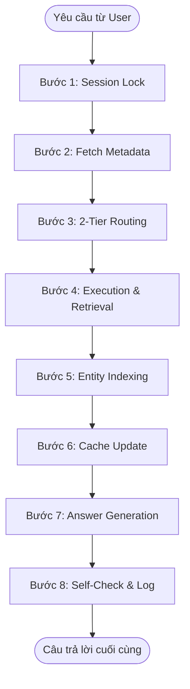

# BÁO CÁO CÔNG VIỆC: HỆ THỐNG QUẢN LÝ NGỮ CẢNH ĐA LƯỢT (JAVIS MULTI-TURN CONTEXT MANAGER V3)

Hệ thống quản lý ngữ cảnh đa lượt lưu trạng thái (**Stateful Multi-turn Context Manager v3**) đã được thiết kế và phát triển nhằm chuyển đổi trợ lý AI Javis từ kiến trúc không lưu trạng thái (Stateless) sang lưu trạng thái động (Stateful Caching). Hệ thống giải quyết các bài toán về tối ưu hóa độ trễ (Latency), tiết kiệm chi phí gọi mô hình (Cost), đồng thời bảo đảm tính nhất quán ngữ cảnh và độ tin cậy trong các hội thoại phức tạp.

---

## 1. Quy Trình Pipeline Xử Lý (8 Bước Hệ Thống)

Mỗi yêu cầu (Request) từ người dùng được xử lý tuần tự qua **8 bước** dưới sự điều phối của `IntelligentOrchestrator`:

### Bước 1: Khóa Tuần Tự Theo Phiên (Session Lock)
* **Giải pháp:** Sử dụng PostgreSQL Advisory Lock (`pg_try_advisory_xact_lock`) liên kết trực tiếp với giao dịch (Transaction) của connection hiện tại.
* **Mục tiêu:** Ngăn chặn tuyệt đối tình trạng tranh chấp dữ liệu (Race Condition) khi người dùng gửi dồn dập nhiều câu hỏi (ví dụ: nhấn Enter liên tục hoặc mạng chập chờn).
* **Kỹ thuật:** Khắc phục lỗi ngẫu nhiên hóa Hash mặc định của Python (Python Hash Randomization) bằng cách sử dụng giải thuật MD5 nhất quán để chuyển đổi `session_id` thành khóa số signed 64-bit cho PostgreSQL. Thiết lập timeout 8 giây chờ giải phóng lock trước khi ngắt tiến trình để bảo vệ tài nguyên hệ thống.

### Bước 2: Truy Vấn Lịch Sử & Metadata (Fetch Metadata)
* **Giải pháp:** Thực hiện truy vấn nhanh trên bảng dữ liệu nóng (Hot Table) `session_context_cache`, lịch sử hội thoại gần nhất trong `chat_history`, và bảng mục lục thực thể `session_entity_index`.
* **Mục tiêu:** Thu thập thông tin định danh và vector ngữ cảnh hiện tại với độ trễ cực thấp (< 5ms) do chỉ thao tác với các cột dữ liệu nhẹ.

### Bước 3: Bộ Định Tuyến 2 Tầng (2-Tier Routing)
Tối ưu hóa tài nguyên bằng cách kết hợp cơ chế lọc nhanh và suy luận thông minh:
* **Tier 1 (Fast Filter):**
  * *Heuristics:* Sử dụng Regular Expressions (Regex) phát hiện các tín hiệu chuyển đổi chủ đề cứng (Topic Shift) như *"à thôi"*, *"bỏ qua"*, *"hủy"*.
  * *Entity Lookup:* So khớp đại từ nhân xưng tiếng Việt (*"nó"*, *"ấy"*, *"lúc nãy"*, *"người đó"*) với bảng `session_entity_index` bằng câu lệnh SQL mảng (`ANY`). Nếu khớp duy nhất một thực thể, hệ thống chốt ngay Cache Hit.
  * *pgvector Similarity:* Tính cosine distance giữa query embedding và cache metadata. Nếu tương đồng cao (distance < 0.22), hệ thống tái sử dụng cache. Nếu khác biệt lớn (distance > 0.55), hệ thống chuyển hướng chạy truy vấn mới (Topic Shift).
  * *Cơ chế dự phòng:* Tích hợp hàm an toàn `_safe_embed()` khống chế timeout 1s và kiểm tra vector 0. Nếu mô hình embedding gặp sự cố, hệ thống tự động hạ cấp và chuyển luồng lên Tier 2 thay vì crash.
* **Tier 2 (LLM Router & Rewriter):**
  * Được kích hoạt khi Tier 1 ở vùng xám (mơ hồ từ 0.22 đến 0.55) hoặc embedding lỗi.
  * Gọi LLM (llama-3.3-70b-versatile) phân tích sâu lịch sử hội thoại để viết lại câu hỏi (`rewritten_query`), phân giải đại từ thay thế và chỉ định chính xác nhu cầu lấy dữ liệu (`needs_retrieval`: `none`, `partial`, `full`).

### Bước 4: Thực Thi Lấy Dữ Liệu (Execution & Retrieval)
Tùy vào quyết định của bộ định tuyến:
* **`none` (Cache Hit):** Đọc trực tiếp từ bảng lạnh (Cold Table) `session_context_payload`.
* **`partial` (Truy xuất từng phần):** Thực hiện cơ chế **Partial Fetch** để truy vấn thêm phần dữ liệu bị thiếu (bổ sung điều kiện SQL WHERE hoặc lọc document ID) rồi trộn kết quả mới vào payload cũ thay vì chạy lại toàn bộ query gốc nặng nề.
* **`full` (Topic Shift):** Kích hoạt chạy các Execution Engine tương ứng (SQL, RAG, WEB, hoặc MODEL) từ đầu. Các Engine được bảo vệ bằng Circuit Breaker chống nghẽn hệ thống.

### Bước 5: Trích Xuất & Ghi Chỉ Mục Thực Thể (Entity Indexing)
* **Giải pháp:** Sau khi Engine trả về dữ liệu thô, bộ trích xuất `EntityExtractor` nhận dạng các thực thể trọng tâm (đối với SQL là 話者/Transcript_id; đối với RAG là file_name; đối với WEB là thực thể chính qua LLM gọn nhẹ).
* **Mục tiêu:** Thực hiện `UPSERT` thực thể kèm mảng đại từ tiếng Việt vào bảng `session_entity_index` để chuẩn bị cho định tuyến nhanh ở lượt tiếp theo.

### Bước 6: Cập Nhật Trạng thái Cache (Cache Update)
* **Giải pháp:** Ghi dữ liệu thô vào bảng Cold và cập nhật metadata, timestamp (`last_accessed_at`, `refreshed_at`), vector embedding mới vào bảng Hot.
* **Tối ưu hóa:** Áp dụng thuật toán **LRU Eviction** giới hạn tối đa 3 slots cache cho mỗi phiên hội thoại để kiểm soát dung lượng lưu trữ trên database (xóa CASCADE ở bảng Cold).
* **Cơ chế Row Locking:** Khóa dòng bảng Hot bằng câu lệnh `SELECT ... FOR UPDATE` khi xử lý truy xuất từng phần (`partial`) để ngăn chặn tuyệt đối tình trạng một tiến trình song song khác kích hoạt LRU xóa mất slot dữ liệu này khi đang cập nhật.

### Bước 7: Chọn Nhánh Trả Lời (Answer Generation)
* **Direct-Answer Path (Bypass LLM):** Đi thẳng qua template định dạng sẵn nếu câu hỏi là Cache Hit (`needs_retrieval = none`) và dữ liệu thô có cấu trúc đơn giản (SQL $\le 1$ dòng và $\le 3$ cột; hoặc Web search snippet có relevance $> 0.85$). Cơ chế này giúp phản hồi gần như tức thời và tiết kiệm 100% chi phí token.
* **LLM Path:** Áp dụng khi dữ liệu phức tạp hoặc cần tổng hợp ngữ cảnh đa nguồn.

### Bước 8: Tự Kiểm Chứng & Lưu Lịch Sử (Self-Check & Log)
* **Giải pháp:** Câu trả lời sinh ra từ LLM được đưa qua bộ kiểm chứng **Self-Check Verification** đối chiếu với nguồn dữ liệu thô ban đầu để phát hiện lỗi ảo giác (Hallucination).
* **Cơ chế:** Cho phép sửa lỗi và sinh lại tối đa 2 lần. Nếu vượt quá số lần thử mà vẫn lỗi, hệ thống đính kèm thông báo cảnh báo bảo mật, hạ mức độ tin cậy (`answer_confidence = 'low'`) trước khi trả về.
* **Hoàn tất:** Lưu lịch sử tin nhắn cùng metadata định tuyến đầy đủ và giải phóng Advisory Lock khi giao dịch COMMIT/ROLLBACK kết thúc.

---

## 2. Các Hạng Mục Công Việc Đã Hoàn Thành (Accomplishments)

### 2.1. Thiết Kế Và Khởi Tạo Cơ Sở Dữ Liệu Tối Ưu
* **Tách biệt Hot/Cold Storage:** Giải quyết triệt để vấn đề phình dòng dữ liệu (Row Bloat) bằng cách chia làm 2 bảng: `session_context_cache` (bảng Hot, chỉ lưu metadata gọn nhẹ) và `session_context_payload` (bảng Cold, lưu trữ JSON dữ liệu lớn).
* **Chỉ mục hóa thông minh:** 
  * Tạo chỉ mục phức hợp B-Tree trên bảng `chat_history` (`session_id`, `created_at`) phục vụ truy vấn lịch sử nhanh.
  * Tạo chỉ mục GIN trên cột `display_names` của bảng `session_entity_index` để quét nhanh đại từ tiếng Việt.
  * Tránh tạo chỉ mục vector cồng kềnh (HNSW/IVFFlat) cho `query_embedding` vì tối đa mỗi session chỉ có 3 slots cache; việc brute-force cosine distance sau khi lọc B-Tree theo `session_id` mang lại hiệu năng tối ưu nhất.

### 2.2. Phát Triển Toàn Diện Các Module Lõi
*   **`session_lock.py`:** Hiện thực hóa `SessionLockManager` sử dụng Transactional Advisory Lock với giải thuật MD5 hash an toàn.
*   **`router.py`:** Thiết lập bộ định tuyến 2 tầng. Tích hợp giải thuật tính cosine distance bằng thư viện `numpy` trên Python. Cấu hình cơ chế xoay vòng danh sách Groq API Keys tự động khi gặp lỗi Rate Limit (HTTP 429).
*   **`cache_manager.py`:** Điều khiển cơ chế Hot/Cold split, LRU Eviction và Row locking bằng SQL khoa học.
*   **`entity_extractor.py`:** Trích xuất thực thể theo pipeline và chuẩn hóa đại từ tiếng Việt.
*   **`engines.py`:** Xây dựng hệ thống Mock Execution Engines:
    *   *SQL Engine:* Tích hợp dịch ngôn ngữ tự nhiên sang SQL, cải tiến cú pháp PostgreSQL xử lý mảng JSONB an toàn.
    *   *RAG Engine:* Đọc tài liệu và tính toán tương đồng ngữ nghĩa.
    *   *Web Engine:* Giả lập Search Engine bằng Groq LLM với thời gian sống của cache (TTL) là 1 giờ.
    *   *Circuit Breaker:* Trạng thái CLOSED/OPEN/HALF_OPEN bảo vệ các Engine.
*   **`orchestrator.py`:** Ghép nối hoàn chỉnh luồng nghiệp vụ của 8 bước pipeline, xử lý rốt ráo các ngoại lệ (bao gồm `asyncio.CancelledError` và lỗi rollback giao dịch).

### 2.3. Xây Dựng Bộ Kiểm Thử Đầy Đủ (`test_suite.py`)
* Thiết lập hệ thống kiểm thử toàn diện bao gồm:
  * **Standard Scenarios:** Kiểm nghiệm luồng trao đổi cơ bản, follow-up, switch topic và switch back.
  * **Negative Scenarios (NEG):** 19 ca kiểm thử cấu trúc lỗi, truy cập đồng thời, nhập liệu nhiễu, từ viết tắt, lỗi JSON không hợp lệ, kiểm tra cơ chế giải phóng LRU và hết hạn TTL của Web cache.
  * **Fix/Recovery Scenarios (FIX):** 10 ca kiểm thử lỗi embedding timeout, timeout khóa advisory, kiểm chứng tự động chống ảo giác quá hạn mức và cơ chế hàng đợi Advisory Lock.
* Sinh báo cáo thống kê KPI tự động (Accuracy, Latency P95/P99, Cache Hit Rate, Self-Check Pass Rate, Phân tích tỉ lệ định tuyến).

---

## 3. Chiến Lược Phòng Ngừa Rủi Ro & Khắc Phục Lỗi

| Tình huống rủi ro | Cơ chế phòng vệ tự động của hệ thống |
| :--- | :--- |
| **Lỗi Rate Limit Groq (HTTP 429)** | Xoay vòng danh sách API keys động (`GROQ_API_KEYS`). |
| **Mô hình Embedding gặp sự cố hoặc timeout** | `_safe_embed()` tự động ngắt sau 1.0 giây và hạ cấp chuyển quyền quyết định cho Tier 2. |
| **Giao dịch bị ngắt đột ngột (CancelledError)** | Toàn bộ pipeline được wrap trong khối try-except-finally chặt chẽ; đảm bảo gọi `tx.rollback()` dưới sự bảo vệ của `asyncio.shield()` và giải phóng connection về pool. |
| **Tranh chấp khóa dòng khi update dữ liệu** | Sử dụng Advisory Lock bao quanh toàn bộ request và Row Lock (`FOR UPDATE`) trên bảng Hot để đồng bộ hóa. |
