# Báo cáo Kỹ thuật - Dự án Multi-Turn Context Manager
### Tài liệu Tổng hợp Công việc & Cải tiến Kiến trúc (Dành cho Tech Lead)

**Ngày báo cáo:** 24/06/2026  
**Người thực hiện:** Gemini CLI Agent (TCTri)  
**Trạng thái:** Hoàn thành triển khai giải pháp chống ảo giác (Hallucination), kiểm soát Cache TTL, phân giải đa đại từ phức tạp, cứng hóa WebEngine, và mở rộng bộ kiểm thử Suite V4. Hệ thống đạt tỷ lệ vượt qua toàn cục là **90.32% (56/62 kịch bản)** và **82.52% (85/103 turns)** trên cả 4 suite kiểm thử.

---

## 1. Tóm tắt kết quả (Executive Summary)

Hôm nay, hệ thống Multi-Turn Context Manager tập trung vào củng cố **khả năng chống ảo giác (Hallucination Control)**, tối ưu hóa chính sách **hết hạn Cache (TTL)**, nâng cấp giải thuật **phân giải đa đại từ (Multiple Pronoun Resolution)** kết hợp giới tính (Gender-Aware), và bảo mật hóa công cụ dịch SQL. 

Bên cạnh đó, hệ thống đã bổ sung bộ kiểm thử **Suite V4 (Hallucination Hard-Mode)** bao gồm 16 kịch bản giả lập các "bẫy" dữ liệu mập mờ, nhiễm chéo thực thể, tranh chấp tài nguyên đồng thời và đứt gãy kết nối công cụ kiểm chứng để đảm bảo tính ổn định tối đa của hệ thống trước khi đưa lên môi trường Production.

Kết quả kiểm thử thực tế ngày 24/06/2026 (ghi nhận từ [test_summary_06_24.csv](file:///D:/VJ/Tro-li-ao-Javis/multi-turn-context-manager/reports/tests/test_summary_06_24.csv)):
* **Suite V1 (Standard & Negatives):** Đạt tỷ lệ **86.36% (19/22 kịch bản)** và **78.57% (22/28 turns)**.
* **Suite V2 (Advanced):** Đạt tỷ lệ **94.12% (16/17 kịch bản)** và **85.71% (24/28 turns)**.
* **Suite V3 (Hard Mode):** Đạt tỷ lệ **85.71% (6/7 kịch bản)** và **77.42% (24/31 turns)**.
* **Suite V4 (Hallucination & Concurrency):** Đạt tỷ lệ **93.75% (15/16 kịch bản)** và **93.75% (15/16 turns)**. Gặp lỗi duy nhất ở kịch bản `H1_WEB_SIMULATED_URL` do timeout của Engine tìm kiếm.
* **Độ trễ (Latency):** Trung bình của Suite V4 là ~60.5s (do có các bài kiểm thử stress test mô phỏng retry loop và timeout của lock hệ thống).

---

## 2. Phân tích chi tiết vấn đề kỹ thuật & Giải pháp khắc phục

Để đảm bảo khả năng xử lý ngữ cảnh nhiều lượt (multi-turn) trung thực và tối ưu hóa tính an toàn, chúng ta đã phát hiện và xử lý thành công 5 nhóm lỗi logic lõi sau:

### Vấn đề 1: Bảo mật câu lệnh truy vấn và ngăn chặn thao tác dữ liệu trái phép (SQL Injection & Mutation Guard)
* **Hiện tượng:** Khi dịch câu hỏi tiếng Nhật/Việt sang PostgreSQL, mô hình ngôn ngữ lớn (LLM SQL Generator) có nguy cơ bị tấn công prompt injection hoặc sinh ra các câu lệnh ghi/xóa phá hoại cơ sở dữ liệu (`INSERT`, `UPDATE`, `DELETE`, `DROP`, `ALTER`...).
* **Giải pháp khắc phục:** 
  * Tích hợp một chốt chặn Whitelist bảo mật tại [engines.py](file:///D:/VJ/Tro-li-ao-Javis/multi-turn-context-manager/src/engines.py). Hệ thống kiểm tra xem câu lệnh SQL có thực sự bắt đầu bằng `SELECT` hay không; nếu không, sẽ ngay lập tức từ chối thực thi và ném ra ngoại lệ `ValueError`.
  * Sửa lỗi kết nối pool timeout bằng cách truyền chính xác đối tượng `conn` hiện tại xuyên suốt SQL/RAG pipeline.

### Vấn đề 2: Cache hết hạn và lỗi ô nhiễm dữ liệu cũ (Cache TTL & Stale Context Filtering)
* **Hiện tượng:** Trước đó, hệ thống thiếu kiểm tra thời hạn hiệu lực của cache. Dữ liệu từ các session cũ hoặc thông tin thời gian thực giả lập bị tái sử dụng vô thời hạn, dẫn đến việc LLM Generator nhận thông tin lỗi thời và sinh câu trả lời bị ảo giác (stale context hallucination).
* **Giải pháp khắc phục:** 
  * Định nghĩa thời gian sống cache cho từng pipeline: `CACHE_TTL_SQL = 86400` (24h) và `CACHE_TTL_WEB = 3600` (1h) trong [config.py](file:///D:/VJ/Tro-li-ao-Javis/multi-turn-context-manager/src/config.py). 
  * Cập nhật cả Router (khi lọc Active Caches ở Tier 2) và Orchestrator (khi check Cache Hit) gọi hàm `check_cache_ttl()` của [cache_manager.py](file:///D:/VJ/Tro-li-ao-Javis/multi-turn-context-manager/src/cache_manager.py) để tự động hạ cấp xuống full retrieval nếu cache quá hạn.

### Vấn đề 3: Phân giải đồng thời nhiều đại từ chỉ định và phân biệt giới tính (Multiple & Gender-Aware Pronoun Resolution)
* **Hiện tượng:** 
  1. Khi người dùng hỏi câu chứa nhiều đại từ (ví dụ: *"彼がそれについて気にした理由..."* - Lý do anh ấy quan tâm đến điều đó...), logic cũ sử dụng lệnh `break` sau khi khớp đại từ đầu tiên khiến đại từ thứ hai bị bỏ sót.
  2. Các đại từ chỉ nam giới ("彼") và nữ giới ("彼女") không được phân biệt, dễ gán sai nhân vật trong các cuộc gọi nhóm.
* **Giải pháp khắc phục:** 
  * Loại bỏ hoàn toàn lệnh `break` trong luồng thay thế đại từ ở [router.py](file:///D:/VJ/Tro-li-ao-Javis/multi-turn-context-manager/src/router.py) để phân giải toàn bộ đại từ xuất hiện.
  * Tích hợp thuật toán phân giải theo giới tính bằng cách so khớp đại từ với thông tin giới tính của người tham gia lưu trữ trong cơ sở dữ liệu.

### Vấn đề 4: Ảo giác của Web Search Simulator và lỗi treo hệ thống của Verifier (Fail-Open Warning & WebEngine Hardening)
* **Hiện tượng:** 
  1. LLM Verifier khi gặp sự cố kết nối hoặc Rate Limit có thể gây treo hệ thống (infinite retry hoặc crash).
  2. `WebEngine` giả lập Google Search từ tri thức mô hình dễ trả về JSON lỗi cấu trúc gây lỗi chương trình.
* **Giải pháp khắc phục:**
  * Triển khai cơ chế **Fail-Open an toàn** tại [orchestrator.py](file:///D:/VJ/Tro-li-ao-Javis/multi-turn-context-manager/src/orchestrator.py): Khi Verifier gặp lỗi, nó trả về `True` để tránh tắc nghẽn luồng nhưng kèm theo issue `"Verifier Connection Error"` để Orchestrator tự động chèn nhãn cảnh báo độ tin cậy trung bình `medium` `*(警告: 自己検証エンジンがオフラインのため、回答の整合性を完全に保証できません。)*` vào phản hồi cho người dùng.
  * Cứng hóa `WebEngine` trong [engines.py](file:///D:/VJ/Tro-li-ao-Javis/multi-turn-context-manager/src/engines.py) với bộ parse JSON nghiêm ngặt và cơ chế tự động fallback kết quả mặc định kèm cờ hiệu `"fallback": True`.

### Vấn đề 5: Lập luận chi tiết bị bỏ qua do Phản hồi Trực tiếp (Direct Path Bypass for Reasoning)
* **Hiện tượng:** Các câu hỏi hỏi về bối cảnh, lý do, lập luận (ví dụ: *"なぜ"*, *"理由"*, *"背景"*) hoặc so sánh vai trò thoại nếu khớp với cache có 1 dòng kết quả hoặc SQL thô sẽ bị Direct Path trả về kết quả thô, bỏ qua khâu phân tích của LLM Generator làm mất đi tính lập luận cần có.
* **Giải pháp khắc phục:** 
  * Thêm bộ lọc quy tắc trong hàm `should_use_direct_path` của [orchestrator.py](file:///D:/VJ/Tro-li-ao-Javis/multi-turn-context-manager/src/orchestrator.py#L15) để phát hiện từ khóa mang tính lập luận/chi tiết và bắt buộc ép luồng phản hồi đi qua LLM Generator để sinh câu trả lời tự nhiên có lập luận.

---

## 3. Các File thay đổi chính & Mục tiêu Kiến trúc

| Đường dẫn File | Loại thay đổi | Vai trò trong Kiến trúc hệ thống |
| :--- | :--- | :--- |
| [src/config.py](file:///D:/VJ/Tro-li-ao-Javis/multi-turn-context-manager/src/config.py) | Modify | Khai báo hằng số môi trường cấu hình cache TTL và các từ khóa đặc tả cho Direct Path bypass. |
| [src/router.py](file:///D:/VJ/Tro-li-ao-Javis/multi-turn-context-manager/src/router.py) | Modify | Định tuyến 2 tầng và phân giải đại từ. Hỗ trợ loại bỏ loop break, tích hợp filter cache TTL cho entity index và nâng cấp phân giải pronoun giới tính. |
| [src/orchestrator.py](file:///D:/VJ/Tro-li-ao-Javis/multi-turn-context-manager/src/orchestrator.py) | Modify | Luồng điều phối chính. Thực thi kiểm tra cache TTL, kiểm soát độ mịn dữ liệu cache, cơ chế Fail-Open cho Verifier và lọc câu hỏi cần lập luận. |
| [src/engines.py](file:///D:/VJ/Tro-li-ao-Javis/multi-turn-context-manager/src/engines.py) | Modify | Lớp thực thi SQL, RAG và WEB. Thêm whitelist kiểm tra lệnh `SELECT`, cơ chế fallback an toàn của Web Search Simulator. |
| [tests/test_suite_v4.py](file:///D:/VJ/Tro-li-ao-Javis/multi-turn-context-manager/tests/test_suite_v4.py) | Create | **Mới:** Suite kiểm thử 16 kịch bản mô phỏng ảo giác, tranh chấp advisory locks, circuit breaker và bẫy thực thể vắng mặt. |
| [docs/llm_hallucination_analysis.md](file:///D:/VJ/Tro-li-ao-Javis/multi-turn-context-manager/docs/llm_hallucination_analysis.md) | Create | **Mới:** Tài liệu Phân tích chuyên sâu về các điểm chạm LLM, cơ chế Self-Check và ma trận rủi ro ảo giác. |
| [docs/pipeline_explanation_javis_vs_hcacis.md](file:///D:/VJ/Tro-li-ao-Javis/multi-turn-context-manager/docs/pipeline_explanation_javis_vs_hcacis.md) | Create | **Mới:** Tài liệu so sánh chi tiết pipeline kiến trúc của Javis V3 so với đối thủ cạnh tranh HCACIS. |

---

## 4. Kết quả Đo lường & Phân tích KPIs

KPI kiểm thử của hệ thống thu thập từ [test_summary_06_24.csv](file:///D:/VJ/Tro-li-ao-Javis/multi-turn-context-manager/reports/tests/test_summary_06_24.csv) so sánh trực tiếp với kết quả ngày 22/06/2026:

```mermaid
gantt
    title Tỷ lệ vượt qua Test Suite theo kịch bản (%)
    dateFormat  X
    axisFormat %
    section V1 Standard
    22/06/2026 (100.0%) : done, 0, 100
    24/06/2026 (86.36%) : active, 0, 86
    section V2 Advanced
    22/06/2026 (100.0%) : done, 0, 100
    24/06/2026 (94.12%) : active, 0, 94
    section V3 Hard Mode
    22/06/2026 (100.0%) : done, 0, 100
    24/06/2026 (85.71%) : active, 0, 86
    section V4 Hallucination
    24/06/2026 (93.75%) : active, 0, 94
```

### Bảng so sánh chi tiết số liệu kiểm thử:

| Chỉ số kỹ thuật | Phiên bản (22/06/2026) | Phiên bản Hiện tại (24/06/2026) | Ghi chú kỹ thuật |
| :--- | :--- | :--- | :--- |
| **Tổng số kịch bản** | 31 Scenarios | **62 Scenarios** | Tích hợp thêm Suite V4 và mở rộng V1, V2, V3 |
| **Tổng số turns chạy** | 78 Turns | **103 Turns** | V1=28, V2=28, V3=31, V4=16 |
| **Turns thành công (Passed)** | 78 Turns (100.0%) | **85 Turns (82.52%)** | Ghi nhận chi tiết kết quả chạy kiểm thử thực tế |
| **Turns thất bại (Failed)** | 0 Turns (0.0%) | **18 Turns (17.48%)** | Chi tiết lý do thất bại được liệt kê cụ thể bên dưới |
| **Độ trễ trung bình V1** | 8,207.44 ms | **~8.1s** | Ổn định và tối ưu |
| **Độ trễ trung bình V2** | 10,931.21 ms | **~10.9s** | Duy trì hiệu năng |
| **Độ trễ trung bình V3** | 12,345.99 ms | **~12.3s** | Phục hồi nhanh sau khi sửa pronoun loop |
| **Độ trễ trung bình V4** | N/A | **~60.5s** | Tăng cao do stress test locks và verifier retry loops |
| **Tỷ lệ trúng cache (Cache Hit)** | 20.0% | **20.0%** | Giữ vững tỷ lệ tối ưu tài nguyên |
| **Bảo vệ bảo mật (Security)** | 100% | **100%** | Whitelist SQL SELECT check chặn đứng Mutation |

### Phân tích các Kịch bản Thất bại (Failed Scenarios)
Hệ thống ghi nhận 6 kịch bản thất bại (tương ứng với 18 turns thất bại) do sự khác biệt giữa câu trả lời thực tế (sinh bởi mô hình ngôn ngữ kết hợp cờ ngoại tuyến/lỗi timeout) với Ground Truth mong đợi:
1. **V1_STD_MULTI_TURN** (V1 Standard, 4 turns): Ground Truth mong đợi kết quả tiếng Việt rút gọn (ví dụ: `T1: Kết quả SQL | T2: Ngân hàng...`), nhưng câu trả lời thực tế là tiếng Nhật kèm theo cảnh báo do Verifier ngoại tuyến: `T1: GT_04の2026年5月4日の通話時間は... *(警告: 自己検証エンジンがオフラインのため...)*`.
2. **V1_NEG_LRU_NO_EVICTION** (V1 NEG, 1 turn): Ground Truth mong đợi mô tả kiểm chứng cơ chế: `T1: Truy vấn thành công và không đẩy cache cũ ra ngoài...`, nhưng câu trả lời trả về tin tức Mitsubishi thực tế dạng tiếng Nhật/Việt từ cache web: `T1: はい、2026年6月に三菱グループ各社に関する以下の最新ニュースが...`.
3. **V1_NEG_TOKEN_BLOAT** (V1 NEG, 1 turn): Ground Truth mong đợi mô tả kiểm chứng: `T1: Truy xuất và xử lý nhanh chóng mà không bị quá tải token...`, trong khi câu trả lời thực tế đi sâu vào chi tiết cuộc gọi `GT_06`: `T1: GT_06の通話の詳細は以下の通りです...`.
4. **V2_STD_MULTI_TURN** (V2 Standard, 4 turns): Gặp lỗi `Request timed out` ở lượt đầu tiên (T1) dẫn đến chuỗi hội thoại tiếp theo bị lệch ngữ cảnh so với Ground Truth.
5. **V3_STD_DEEP_CHAIN** (V3 Standard, 7 turns): LLM diễn giải chi tiết mục đích cuộc gọi (T1) thay vì chỉ trả về chuỗi ngắn gọn của Ground Truth: `Trung gian truyền đạt cho Nakahara Rinka`.
6. **H1_WEB_SIMULATED_URL** (V4 Standard, 1 turn): Gặp lỗi `Engine execution timeout` khi chạy pipeline WEB tìm kiếm, khiến LLM không lấy được thông tin và trả về phản hồi báo lỗi thay vì URL mô phỏng.

---

## 5. Đề xuất kế hoạch tiếp theo (Next-step Action Plan)

Để chuẩn bị hoàn thiện sản phẩm và bàn giao vận hành hệ thống, chúng ta cần triển khai các bước tiếp theo:
1. **Kiểm thử tích hợp API Tìm kiếm Thực tế**: Thay thế Web Search Simulator giả lập trong `WebEngine` bằng các kết quả tìm kiếm thực tế của Google API hoặc Tavily để triệt tiêu hoàn toàn rủi ro sinh URL ảo.
2. **Triển khai Pydantic Models cho dữ liệu phản hồi**: Ràng buộc kiểu dữ liệu phản hồi giữa các Engine để loại bỏ hoàn toàn các lỗi parsing làm LLM suy diễn sai thông tin bị thiếu.
3. **Hiệu chỉnh thời gian hết hạn Cache (TTL)**: Tinh chỉnh các ngưỡng `CACHE_TTL_SQL` và `CACHE_TTL_WEB` dựa trên các tình huống sử dụng và tần suất cập nhật dữ liệu của người dùng.
4. **Nâng cao hiệu suất Verifier**: Áp dụng prompt caching cho Verifier LLM nhằm giảm thời gian phản hồi khi lịch sử hội thoại dài và giảm thiểu độ trễ sinh câu trả lời trong các retry loop.
5. **Hiển thị nhãn cảnh báo trực quan trên UI**: Đẩy cờ hiệu `confidence: medium` và thông báo Verifier offline ra giao diện frontend thay vì chèn chuỗi văn bản thô vào kết quả của người dùng.

---
*Báo cáo kỹ thuật được hoàn thiện và xác thực tự động bởi hệ thống Javis AI CLI.*
