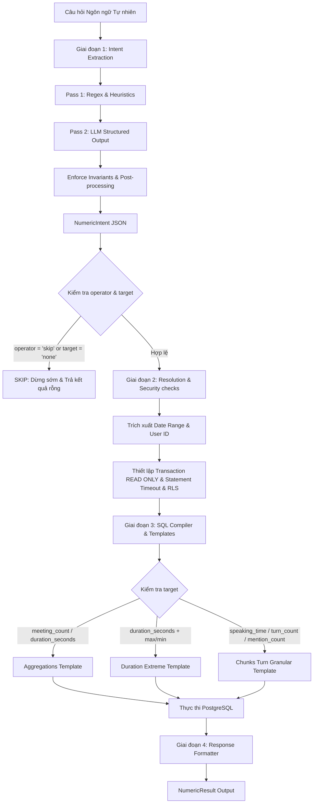

# Tài Liệu Kỹ Thuật Chuyên Sâu: Numeric SQL Tool (v2)

`numeric-sql-tool` là một thành phần chuyên biệt (pipeline) được thiết kế để xử lý các câu hỏi định lượng (quantitative/numeric) trên dữ liệu hội thoại/meeting transcript được lưu trữ trong cơ sở dữ liệu PostgreSQL. 

Điểm đặc biệt của công cụ này là **LLM không tự sinh SQL tự do (Text-to-SQL tự do)**. Thay vào đó, LLM hoặc bộ lọc Heuristic chỉ làm nhiệm vụ điền vào một form khai báo ý định (`NumericIntent` JSON schema). Dựa trên thông tin có cấu trúc này, mã nguồn Python sẽ tự động ánh xạ, lựa chọn các SQL Template an toàn và thực thi chúng dưới các ràng buộc bảo mật nghiêm ngặt. Hệ thống sẽ **từ chối (skip)** toàn bộ các câu hỏi mang tính chất tìm kiếm ngữ nghĩa hoặc thông tin định tính (qualitative/semantic) để tránh SQL Injection, lỗi cú pháp hoặc tính toán ảo (hallucinated calculations).

---

## 1. Tổng Quan Kiến Trúc & Luồng Pipeline

Sơ đồ dưới đây mô tả chi tiết luồng xử lý từ khi nhận câu hỏi của người dùng cho đến khi trả về kết quả số liệu:



### Các Giai đoạn xử lý chính:
1. **Intent Extraction (Trích xuất ý định)**:
   * **Pass 1 (Regex/Heuristic)**: Quét câu hỏi qua các bộ lọc biểu thức chính quy (Regex) viết bằng tiếng Nhật để nhanh chóng phát hiện các mẫu câu định lượng (thời lượng họp, số cuộc gọi) hoặc định tính cần bỏ qua (yêu cầu tóm tắt, trích dẫn, lý do). Nếu phát hiện lỗi logic hoặc truy vấn nằm ngoài phạm vi số liệu, intent sẽ ngay lập tức được đánh dấu `skip`.
   * **Pass 2 (LLM)**: Nếu được cấu hình (Hybrid Mode), câu hỏi được chuyển tới mô hình Groq (mặc định: `llama-3.3-70b-versatile`) để ép xuất ra JSON theo đúng định dạng của schema `NumericIntent`.
   * **Post-processing (Hậu xử lý)**: Các hàm kiểm tra ràng buộc `enforce_intent_invariants` và đối chiếu kết quả của LLM với Heuristic sẽ được chạy. Nếu có xung đột, Heuristic sẽ ghi đè để đảm bảo tính an toàn tối đa.
2. **Date Range Resolution**:
   * Ánh xạ các mốc thời gian tương đối trong câu hỏi (ví dụ: "昨日" - hôm qua, "今月" - tháng này, "5月" - tháng 5) hoặc các mốc tuyệt đối (`YYYY-MM-DD`, `YYYY年MM月DD日`) thành khoảng thời gian bắt đầu và kết thúc cụ thể (`date_start`, `date_end`) dựa trên một ngày tham chiếu (`reference_date`).
3. **SQL Compilation (Biên dịch SQL)**:
   * Điền các tham số đã trích xuất vào các template SQL định sẵn. Các tham số bao gồm: `user_id` (UUID), `date_start`, `date_end`, `context_filter` (nội dung chủ đề họp), `speaker` (tên người nói), và `keyword` (tử khóa tìm kiếm).
4. **Safe Database Execution (Thực thi DB an toàn)**:
   * Chạy câu lệnh SQL đã biên dịch trong một transaction được gắn nhãn `SET TRANSACTION READ ONLY`.
   * Áp dụng `statement_timeout` (mặc định 5000ms) để ngăn chặn các truy vấn nặng gây tắc nghẽn hệ thống.
   * Thiết lập biến cấu hình session `app.current_user_id` để mô phỏng Row-Level Security (RLS), đảm bảo người dùng thông thường chỉ được phép xem dữ liệu của chính mình.
5. **Response Formatting**:
   * Trả về kết quả dưới dạng cấu trúc `NumericResult` chuẩn hóa, bao gồm toán tử, mục tiêu tính toán, danh sách các dòng kết quả (được gom nhóm hoặc không), mã ID của cuộc họp nguồn, và metadata đi kèm.

---

## 2. Kiến Trúc Dữ Liệu & Database Schema

Hệ thống được thiết kế xung quanh cấu trúc dữ liệu cuộc gọi/cuộc họp nhiều tầng trong PostgreSQL:

```
                  transcripts (1 dòng = 1 cuộc họp)
                      │
                      ├── chunks_passage (N đoạn lớn chia theo Agenda)
                      │       │
                      │       └── chunks_turn (M lượt phát biểu cụ thể)
                      │
                      └── duration_seconds / summary / raw_text
```

### Chi tiết các bảng liên quan:
* **`transcripts`**: Lưu trữ thông tin metadata ở mức cao nhất của cuộc họp.
  * `id` (UUID, Khóa chính): ID định danh cuộc họp.
  * `session_id` (VARCHAR): ID phiên làm việc của hệ thống.
  * `user_id` (UUID): ID của người dùng sở hữu cuộc họp này (dùng để phân quyền dữ liệu).
  * `meeting_date` (DATE): Ngày diễn ra cuộc họp.
  * `participants` (JSONB): Danh sách mảng chứa tên những người tham gia họp.
  * `duration_seconds` (INT): Tổng thời lượng cuộc họp tính bằng giây.
  * `raw_text` (TEXT): Toàn văn bản transcript.
  * `summary` (TEXT): Tóm tắt nội dung cuộc họp.
* **`chunks_passage`**: Các phân đoạn nội dung lớn trong cuộc họp, thường được phân tách khi có sự thay đổi chủ đề hoặc chương trình nghị sự (agenda transition).
  * `id` (UUID, Khóa chính)
  * `transcript_id` (UUID, Khóa ngoại): Liên kết đến cuộc họp gốc.
  * `passage_index` (INT): Thứ tự phân đoạn trong cuộc họp.
  * `text` (TEXT): Nội dung phân đoạn.
* **`chunks_turn`**: Lưu trữ chi tiết từng lượt phát biểu (phục vụ tính toán thời gian nói, lượt phát biểu và từ khóa).
  * `id` (UUID, Khóa chính)
  * `transcript_id` (UUID, Khóa ngoại)
  * `speaker` (VARCHAR): Tên của người phát biểu (ví dụ: `SPEAKER 1`, `石田`, `サカモト`).
  * `time_start_sec` (INT): Thời điểm bắt đầu phát biểu trong cuộc họp (giây thứ...).
  * `time_end_sec` (INT): Thời điểm kết thúc phát biểu (giây thứ...).
  * `text` (TEXT): Nội dung chi tiết lượt nói.

### Chỉ mục tối ưu hóa hiệu năng (Indexes):
Để đảm bảo các câu lệnh aggregate chạy tức thời trên hàng triệu bản ghi, các chỉ mục sau được định nghĩa sẵn trong `schema.sql`:
* `ix_transcripts_user_date` trên `transcripts(user_id, meeting_date)`: Đảm bảo lọc cuộc họp theo quyền sở hữu và thời gian cực nhanh.
* `ix_turn_transcript` trên `chunks_turn(transcript_id)`: Đảm bảo join nhanh giữa lượt nói và cuộc họp.
* `ix_turn_speaker` trên `chunks_turn(speaker)`: Đảm bảo lọc nhanh theo tên người nói.
* `ix_turn_metadata` (GIN) trên `chunks_turn(chunk_metadata)`: Hỗ trợ tìm kiếm các metadata tùy biến.

---

## 3. Trích Xuất Ý Định: NumericIntent Schema & Heuristics

Trái tim của pipeline là lớp Pydantic `NumericIntent` định nghĩa cấu trúc của một yêu cầu số liệu:

```python
class NumericIntent(BaseModel):
    operator: Literal["sum", "avg", "max", "min", "count", "skip", "none"] = "none"
    target: Literal["duration_seconds", "meeting_count", "time_start_sec", "speaking_time", "turn_count", "mention_count", "none"] = "none"
    group_by: Literal["none", "user_id", "day", "speaker"] = "none"
    context_filter: str | None = None
    speaker: str | None = None
    keyword: str | None = None
```

### A. Các Quy Tắc Heuristics Tiếng Nhật & Phát Hiện Skip (Định Tính)
Trong `heuristics.py`, hệ thống định nghĩa các mẫu biểu thức chính quy cực kỳ chặt chẽ:
1. **`_EXISTENCE_RE`**: Nhận biết câu hỏi về sự tồn tại của cuộc họp.
2. **`_TIMESTAMP_RE`**: Nhận biết câu hỏi về mốc thời gian chi tiết (ví dụ: "何分頃" - khoảng phút thứ mấy, "いつ発言" - phát biểu lúc nào). Các câu hỏi này không phải aggregate nên sẽ bị **SKIP** để chuyển sang công cụ RAG ngữ nghĩa.
3. **`_QUALITATIVE_RE`**: Danh sách dài các từ khóa định tính tiếng Nhật yêu cầu tóm tắt, lý do, kết luận hoặc nội dung chi tiết (ví dụ: `何について`, `議題`, `要約`, `合意`, `理由`, `分析`, `アジェンダ`, `提案`, `予定日`). Khi xuất hiện các từ khóa này, hệ thống sẽ đánh dấu `skip`.
4. **`_UNSUPPORTED_OPS_RE`**: Nhận biết các phép toán hệ thống chưa hỗ trợ (ví dụ: tỷ lệ phần trăm `割合`, trung vị `中央値`, phân vị, so sánh tương đối phức tạp).

### B. Cơ chế Hậu xử lý & Ràng buộc Bất biến (`enforce_intent_invariants`)
Hàm này đảm bảo dữ liệu đầu ra của LLM không vi phạm logic hệ thống:
* **Bất biến 1 (Single-day Grouping)**: Nếu câu hỏi chỉ truy vấn trong một ngày duy nhất (được phát hiện bởi `is_single_day_query`), hệ thống sẽ tự động ép `group_by = "none"`. Việc nhóm theo ngày trong một ngày đơn lẻ là thừa và làm phức tạp định dạng kết quả.
* **Bất biến 2 (Speaking Time)**: Nếu câu hỏi chứa từ khóa "発話時間" hoặc "発言時間" (thời lượng phát biểu), hệ thống sẽ trích xuất tên speaker (bằng regex), gán `target = "speaking_time"`, và đặt toán tử tương ứng (`avg` nếu có từ "平均", ngược lại là `sum`).
* **Bất biến 3 (Turn Count)**: Nếu câu hỏi hỏi về số lượt phát biểu ("何回発言" hoặc "発言...何回"), hệ thống trích xuất tên speaker, gán `target = "turn_count"` và `operator = "count"`.
* **Bất biến 4 (Mention Count)**: Nếu câu hỏi hỏi về số lần nhắc đến một tên hoặc từ khóa ("何回言及", "言及された回数", "会社名の確認"), hệ thống trích xuất từ khóa tìm kiếm trong ngoặc kép `「...」` hoặc các chủ đề đặc biệt như `会社名` hay `折り返し`, gán `target = "mention_count"` và `operator = "count"`.

---

## 4. Cơ Chế Biên Dịch SQL (SQL Compilation & Templates)

Hệ thống sử dụng các mẫu câu lệnh SQL được định cấu trúc tối ưu. Mọi câu lệnh SQL đều sử dụng bộ lọc `WHERE` chung (`_numeric_where_clause`):

```sql
($1::uuid IS NULL OR t.user_id = $1::uuid)
AND ($2::date IS NULL OR t.meeting_date >= $2::date)
AND ($3::date IS NULL OR t.meeting_date <= $3::date)
AND ($4::text IS NULL OR t.summary ILIKE '%' || $4 || '%' OR t.raw_text ILIKE '%' || $4 || '%')
AND ($5::text IS NULL OR TRUE)
AND ($6::text IS NULL OR TRUE)
```
*Các tham số truyền vào tương ứng:*
- `$1`: `user_id`
- `$2`: `date_start`
- `$3`: `date_end`
- `$4`: `context_filter` (nội dung thảo luận)
- `$5`: `speaker`
- `$6`: `keyword`

Dưới đây là các loại SQL Template được hệ thống biên dịch động dựa trên `NumericIntent`:

### A. Dành cho `target = meeting_count`
```sql
SELECT COUNT(DISTINCT t.id) AS value
FROM transcripts t
WHERE <where_clause>
```

### B. Dành cho `target = duration_seconds` (Tính tổng hoặc trung bình thời lượng họp)
```sql
SELECT COALESCE(SUM(t.duration_seconds), 0) AS value  -- hoặc AVG(t.duration_seconds)
FROM transcripts t
WHERE <where_clause>
```

### C. Dành cho `target = duration_seconds` + toán tử `max`/`min` (Cuộc họp dài/ngắn nhất)
Nhánh này không dùng hàm gộp `MAX()` hoặc `MIN()` thông thường vì người dùng thường muốn biết chi tiết cuộc họp đó là cuộc họp nào. Hệ thống thực hiện truy vấn chi tiết kết hợp sắp xếp:
```sql
SELECT 
    t.id::text         AS transcript_id, 
    t.session_id       AS session_id, 
    t.meeting_date     AS meeting_date, 
    t.participants     AS participants, 
    t.duration_seconds AS value, 
    t.summary          AS summary 
FROM transcripts t 
WHERE <where_clause> AND t.duration_seconds IS NOT NULL 
ORDER BY t.duration_seconds DESC, t.meeting_date DESC  -- ASC đối với min
LIMIT 1
```

### D. Dành cho `target = speaking_time` (Thời lượng phát biểu của một người)
Hệ thống liên kết bảng `chunks_turn` với `transcripts` để tính toán thời lượng. Để đảm bảo khả năng tìm kiếm linh hoạt (Fuzzy Matching), hệ thống sử dụng một truy vấn con lồng nhau để phân giải tên người nói từ nội dung transcript nếu tên truyền vào viết tắt hoặc không khớp hoàn toàn:
```sql
SELECT COALESCE(SUM(ct.time_end_sec - ct.time_start_sec), 0)::float AS value  -- hoặc AVG
FROM chunks_turn ct 
JOIN transcripts t ON ct.transcript_id = t.id 
WHERE (ct.speaker = $5::text OR ct.speaker = (
    SELECT speaker FROM chunks_turn ct2 
    JOIN transcripts t2 ON ct2.transcript_id = t2.id 
    WHERE ct2.text ILIKE '%' || $5::text || '%' 
      AND ($1::uuid IS NULL OR t2.user_id = $1::uuid) 
      AND ($2::date IS NULL OR t2.meeting_date >= $2::date) 
      AND ($3::date IS NULL OR t2.meeting_date <= $3::date) 
    LIMIT 1
)) 
AND <where_clause>
```

### E. Dành cho `target = turn_count` (Số lượt phát biểu của một người)
```sql
SELECT COUNT(*)::float AS value 
FROM chunks_turn ct 
JOIN transcripts t ON ct.transcript_id = t.id 
WHERE (ct.speaker = $5::text OR ct.speaker = (
    SELECT speaker FROM chunks_turn ct2 
    JOIN transcripts t2 ON ct2.transcript_id = t2.id 
    WHERE ct2.text ILIKE '%' || $5::text || '%' 
      AND ($1::uuid IS NULL OR t2.user_id = $1::uuid) 
      AND ($2::date IS NULL OR t2.meeting_date >= $2::date) 
      AND ($3::date IS NULL OR t2.meeting_date <= $3::date) 
    LIMIT 1
)) 
AND <where_clause>
```

### F. Dành cho `target = mention_count` (Số lần một từ khóa được nhắc tới)
Hệ thống sử dụng một thuật toán xử lý chuỗi trực tiếp trên SQL để đếm số lần xuất hiện của từ khóa trong mỗi lượt nói bằng cách tính chênh lệch độ dài chuỗi trước và sau khi thay thế từ khóa:
```sql
SELECT COALESCE(SUM(
    CASE WHEN $6::text IS NULL OR $6::text = '' THEN 0 
    ELSE (LENGTH(ct.text) - LENGTH(REPLACE(ct.text, $6::text, ''))) / LENGTH($6::text) 
    END
), 0)::float AS value 
FROM chunks_turn ct 
JOIN transcripts t ON ct.transcript_id = t.id 
WHERE <where_clause>
```

---

## 5. Gom Nhóm Kết Quả (GROUP BY)

Khi intent yêu cầu gom nhóm (`group_by` khác `"none"`), hệ thống sẽ biên dịch phần SELECT và GROUP BY tương ứng để trả về danh sách giá trị gắn liền với khóa nhóm (`group_key`):

### A. Nhóm theo Ngày (`group_by = "day"`)
```sql
SELECT t.meeting_date::text AS group_key, 
       <value_expr>         AS value 
FROM transcripts t 
WHERE <where_clause> 
GROUP BY t.meeting_date 
ORDER BY group_key 
LIMIT 31
```

### B. Nhóm theo Người tham gia (`group_by = "speaker"`)
Lưu ý rằng việc nhóm theo speaker ở đây tính toán dựa trên danh sách người tham gia cuộc họp (`participants`), gom nhóm các cuộc họp mà họ cùng có mặt:
```sql
SELECT x.speaker    AS group_key, 
       <value_expr> AS value 
FROM transcripts t 
JOIN (SELECT DISTINCT transcript_id, speaker FROM chunks_turn) x ON x.transcript_id = t.id 
WHERE <where_clause> 
GROUP BY x.speaker 
ORDER BY value DESC 
LIMIT 20
```

### C. Nhóm theo Người dùng (`group_by = "user_id"`)
Chỉ cho phép thực thi nếu cờ `allow_cross_user` được đặt thành `True` (dành riêng cho quyền Quản trị viên):
```sql
SELECT t.user_id::text AS group_key, 
       <value_expr>    AS value 
FROM transcripts t 
WHERE <where_clause> 
GROUP BY t.user_id 
ORDER BY value DESC 
LIMIT 20
```

---

## 6. Định Dạng Kết Quả Đầu Ra (NumericResult Schema)

Kết quả trả về cho hệ thống chatbot luôn ở dạng JSON chuẩn hóa để các thành phần hiển thị dễ dàng xử lý:

```python
class NumericRow(BaseModel):
    group_key: str | None = None
    value: float
    metadata: dict = Field(default_factory=dict)

class NumericResult(BaseModel):
    operator: str
    target: str
    rows: list[NumericRow] = Field(default_factory=list)
    source_chunk_ids: list[str] = Field(default_factory=list)
    metadata: dict = Field(default_factory=dict)
```

### Các ví dụ Output thực tế:

#### 1. Kết quả tính tổng thời lượng (Không nhóm)
```json
{
  "operator": "sum",
  "target": "duration_seconds",
  "rows": [
    {
      "group_key": null,
      "value": 1855.0,
      "metadata": {}
    }
  ],
  "source_chunk_ids": [],
  "metadata": {
    "date_start": "2026-05-26",
    "date_end": "2026-05-26",
    "group_by": "none",
    "sql": "SELECT COALESCE(SUM(t.duration_seconds), 0) AS value FROM transcripts t WHERE ..."
  }
}
```

#### 2. Kết quả cuộc họp dài nhất (Chứa thông tin cuộc họp trong metadata)
```json
{
  "operator": "max",
  "target": "duration_seconds",
  "rows": [
    {
      "group_key": null,
      "value": 3610.0,
      "metadata": {
        "transcript_id": "4a71d6f1-...",
        "session_id": "meeting_03_20260515",
        "meeting_date": "2026-05-15",
        "participants": ["佐藤", "鈴木", "高橋", "SPEAKER 1"],
        "summary": "定例会議。AiVoice Proのローンチ準備について..."
      }
    }
  ],
  "source_chunk_ids": [],
  "metadata": {
    "date_start": null,
    "date_end": null,
    "group_by": "none",
    "sql": "SELECT t.id::text AS transcript_id, ... ORDER BY t.duration_seconds DESC LIMIT 1"
  }
}
```

#### 3. Kết quả khi yêu cầu bị bỏ qua (Skip)
```json
{
  "operator": "skip",
  "target": "none",
  "rows": [],
  "source_chunk_ids": [],
  "metadata": {
    "skipped": true,
    "sql": null
  }
}
```

---

## 7. Báo Cáo Đánh Giá Hiệu Năng Hệ Thống (Evaluation Report)

Dựa trên bộ dữ liệu kiểm thử thực tế gồm **287 câu hỏi tiếng Nhật** (kết hợp giữa các câu hỏi kiểm thử cơ bản, nâng cao, và stress test chống bẫy từ khóa), hệ thống đã đạt được độ chính xác tuyệt đối:

### A. Thống kê Kết quả:
* **Tổng số câu hỏi phân tích**: 287 câu
* **Số câu bị bỏ qua (Skipped)**: 255 câu (88.85%)
* **Số câu được biên dịch & thực thi SQL (Executed)**: 32 câu (11.15%)

### B. Chỉ số chính xác (Metrics):
* **Đúng khi Bỏ qua (True Negatives)**: 255 câu
  * Tránh hoàn toàn việc dịch sai các câu hỏi định tính sang SQL (ví dụ: yêu cầu tóm tắt cuộc họp, hỏi về lý do trì hoãn, hoặc tìm các mốc thời gian phát biểu cụ thể).
* **Đúng khi Thực thi (True Positives)**: 32 câu
  * Ánh xạ chính xác các phép toán về số cuộc họp, tổng/trung bình thời lượng họp, số lượt nói, thời gian nói của speaker và số lần nhắc đến từ khóa.
* **Dương tính giả (False Positives)**: 0 câu (Không có câu hỏi định tính nào bị chạy nhầm SQL).
* **Âm tính giả (False Negatives)**: 0 câu (Không có câu hỏi số liệu hợp lệ nào bị bỏ qua).
* **Độ chính xác phân loại Intent (Classification Accuracy)**: **100%**

---

## 8. Các Câu Hỏi Thường Gặp & Giới Hạn Hiện Tại

| Loại câu hỏi | Hành vi của Pipeline | Giải thích kỹ thuật |
|---|---|---|
| **"Sato-san đã nói gì?"** | **SKIP** (operator=`skip`, target=`none`) | Yêu cầu trích xuất nội dung hội thoại ngữ nghĩa. Cần cascade sang module Vector Search / RAG. |
| **"Nêu tóm tắt cuộc họp hôm qua?"** | **SKIP** (operator=`skip`, target=`none`) | Yêu cầu tổng hợp văn bản, không phải định lượng số liệu. |
| **"SPEAKER 1 nói bao nhiêu giây?"** | **EXECUTE** (target=`speaking_time`, operator=`sum`) | Hợp lệ. Pipeline sẽ join bảng `chunks_turn` để tính tổng thời lượng. |
| **"SPEAKER 1 đã phát biểu bao nhiêu lần?"** | **EXECUTE** (target=`turn_count`, operator=`count`) | Hợp lệ. Pipeline sẽ đếm số dòng trong `chunks_turn` khớp với SPEAKER 1. |
| **"Từ khóa 'ngân sách' được nhắc đến mấy lần?"** | **EXECUTE** (target=`mention_count`, operator=`count`) | Hợp lệ. Pipeline tính số lần xuất hiện của từ khóa bằng phép toán độ dài chuỗi SQL. |
| **"Tỷ lệ cuộc họp bị trễ là bao nhiêu?"** | **SKIP** (operator=`skip`, target=`none`) | Cần thực hiện các phép chia tỷ lệ phức tạp trên nhiều tập gộp (không hỗ trợ trong cấu trúc intent phẳng hiện tại). |
| **"Liệt kê các cuộc họp theo tuần?"** | **SKIP** (operator=`skip`, target=`none`) | Hệ thống hiện chỉ hỗ trợ gộp theo `day`, `user_id`, `speaker` và `none`. Chưa có cơ chế gộp nhóm theo tuần (`week`) hay tháng (`month`). |
